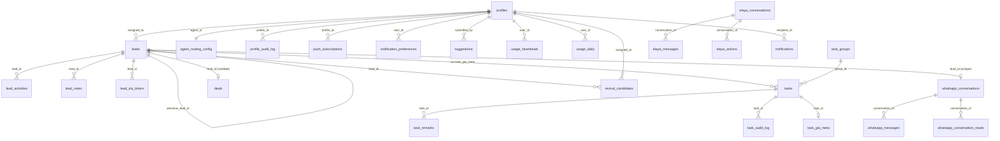
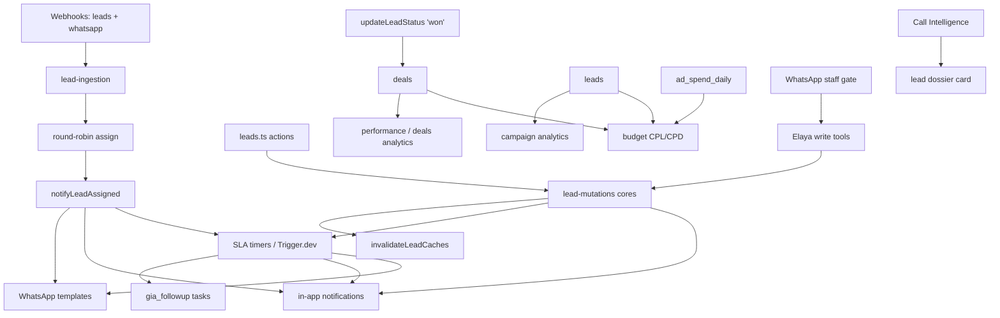

# Serene — Codebase Knowledge Document

> **A complete breakdown of the Serene codebase for engineers and LLMs.** Self-contained: a reader with no repo access can implement features, fix bugs, and refactor safely from this document alone.
>
> - **Repo:** `/Users/alam/Desktop/serene`
> - **Generated:** 2026-06-13 · **Refreshed:** 2026-06-19 against `main` (migrations through 0137) — adds Notification Preferences (per-user channel control), Suggestion box / bug-report channel, Agent usage / active-time tracking, domain-derived deal type + deal category, managers in the round-robin pool, the canonical lead-phone dedup key, and the revival silence-finder RPC. (Prior refresh 2026-06-15 / migration 0121 added Lead Revival, Web Push, PWA app-icon, voice dictation, OTP-code password reset, Call Intelligence.)
> - **Method:** direct exploration of source + the authoritative in-repo docs (`docs/`, `CLAUDE.md`, the per-area `CLAUDE.md` registries).
>
> **Authority hierarchy (when this doc and the repo disagree, the repo wins):**
>
> 1. `docs/design/DESIGN-DNA.md` — design law
> 2. `docs/rules/The_Rules.md` — engineering constitution (R/A/S/D/P/V/Q rule IDs)
> 3. `docs/changelog.md` — single source of truth for what shipped
> 4. `/CLAUDE.md` + per-directory `CLAUDE.md` — command-layer rules
> 5. `src/styles/design-tokens.css` — exact token values
>
> Every claim below is tied to a file path, function name, or migration number.

---

## Table of Contents

1. [High-Level Overview](#1-high-level-overview)
2. [Tech Stack & Conventions](#2-tech-stack--conventions)
3. [System Architecture](#3-system-architecture)
4. [Request Flow & Data Flow](#4-request-flow--data-flow)
5. [Authentication, RBAC & Authorization](#5-authentication-rbac--authorization)
6. [Database Schema](#6-database-schema)
7. [Caching Architecture](#7-caching-architecture)
8. [Feature: Gia — Lead Lifecycle & SLA Engine](#8-feature-gia--lead-lifecycle--sla-engine)
9. [Feature: OS Tasks](#9-feature-os-tasks)
10. [Feature: Dashboard](#10-feature-dashboard)
11. [Feature: Performance, Campaigns, Deals, Budget](#11-feature-performance-campaigns-deals-budget)
12. [Feature: WhatsApp Integration](#12-feature-whatsapp-integration)
13. [Feature: Elaya — The AI Subsystem](#13-feature-elaya--the-ai-subsystem)
14. [Feature: User Management & Profiles](#14-feature-user-management--profiles)
15. [Cross-Feature Interaction Map](#15-cross-feature-interaction-map)
16. [Design System Reference](#16-design-system-reference)
17. [Things You Must Know Before Changing Code (Gotchas)](#17-things-you-must-know-before-changing-code-gotchas)
18. [Technical Reference & Glossary](#18-technical-reference--glossary)
19. [Directory Map](#19-directory-map)

---

## 1. High-Level Overview

### What Serene Is

**Serene** is the internal operating system for **Indulge Global** — India's premier luxury concierge brand (based in Goa). It is a **production platform**, not a prototype: agents spend 8–12 hours a day inside it. It is the single login surface for every team member.

The architecture is deliberately **modular**: a base OS layer (Serene — shell, auth, theming, navigation, dashboard) that never changes when a domain module is added on top.

### The Name System


| Name             | What it is                                                                                                                                 | Status                                                         |
| ---------------- | ------------------------------------------------------------------------------------------------------------------------------------------ | -------------------------------------------------------------- |
| **Serene**       | The OS — the shell every team member logs into                                                                                             | Live                                                           |
| **Elaya**        | The agentic AI presence inside Serene (a "compass", not a chatbot)                                                                         | Phase 2 (agentic writes) + voice + WhatsApp staff channel live |
| **Gia**          | The CRM module for the four sales domains (leads, deals, campaigns)                                                                        | Live                                                           |
| **Lead Revival** | A thin AI-gated layer over Gia that recovers dormant-but-warm leads (daily cron → note-AI gate → "Revived" follow-up task or human review) | Phase R1 live (2026-06-14)                                     |
| **Sia**          | The Concierge module                                                                                                                       | Not started                                                    |


### Target Users (Roles)

`founder`, `admin`, `manager`, `agent`, `guest` — see [§5 RBAC](#5-authentication-rbac--authorization).

### Main Features & Their Business Purpose


| Feature                              | Business need it serves                                                                                                                                                                                                   | Doc section                                           |
| ------------------------------------ | ------------------------------------------------------------------------------------------------------------------------------------------------------------------------------------------------------------------------- | ----------------------------------------------------- |
| **Lead ingestion & lifecycle (Gia)** | Capture inbound leads (Meta/Google/website/WhatsApp), auto-assign them round-robin to on-duty agents, drive them through a sales funnel to a closed deal                                                                  | [§8](#8-feature-gia--lead-lifecycle--sla-engine)      |
| **SLA follow-up engine**             | Guarantee no lead goes cold — escalate uncalled/stale leads to agents → managers → founders on a clock; auto-create follow-up tasks                                                                                       | [§8](#8-feature-gia--lead-lifecycle--sla-engine)      |
| **OS Tasks**                         | Personal todos, collaborative group task workspaces, and system-generated lead follow-ups in one place                                                                                                                    | [§9](#9-feature-os-tasks)                             |
| **Dashboard**                        | A personalised bento-grid of live KPIs and pipeline widgets per role                                                                                                                                                      | [§10](#10-feature-dashboard)                          |
| **Performance analytics**            | Per-agent / per-team / per-domain conversion + effort metrics for management                                                                                                                                              | [§11](#11-feature-performance-campaigns-deals-budget) |
| **Campaign analytics**               | Lead funnel performance grouped by ad campaign                                                                                                                                                                            | [§11](#11-feature-performance-campaigns-deals-budget) |
| **Deals**                            | First-class record of every closed sale (membership/retail, including walk-ins)                                                                                                                                           | [§11](#11-feature-performance-campaigns-deals-budget) |
| **Budget**                           | Ad-spend vs. lead/deal cost analysis (CPL/CPD)                                                                                                                                                                            | [§11](#11-feature-performance-campaigns-deals-budget) |
| **WhatsApp**                         | Two-way conversation with leads via Gupshup; staff messaging to Elaya; templated notifications                                                                                                                            | [§12](#12-feature-whatsapp-integration)               |
| **Elaya AI**                         | An LLM presence that can read CRM data and (Phase 2) propose/execute lead mutations behind a confirmation gate; voice input (Deepgram) + WhatsApp staff channel                                                           | [§13](#13-feature-elaya--the-ai-subsystem)            |
| **Lead Revival**                     | Recover dormant-but-warm leads that silently died — a daily silence sweep + cheap-LLM suppression gate that auto-revives the warm and routes the ambiguous to human review (a layer over Gia, never mutates the lead row) | [§8.6](#86-lead-revival-phase-r1)                     |
| **Voice dictation**                  | Speech-to-text (Deepgram) on lead notes, the call modal, the Elaya composer, and inbound WhatsApp voice notes — an editable draft, never auto-sent                                                                        | [§13](#13-feature-elaya--the-ai-subsystem)            |
| **Web Push**                         | A second notification channel (VAPID) that reaches an installed PWA when Serene is closed — fanned out behind the one `createNotification` seam                                                                           | [§7](#7-caching-architecture)                         |
| **PWA install + app icon**           | Install Serene to the home screen and pick the installed-app icon (`profiles.app_icon`)                                                                                                                                   | [§14](#14-feature-user-management--profiles)          |
| **User management**                  | Admin/founder creation, role/domain assignment, agent shift/routing config                                                                                                                                                | [§14](#14-feature-user-management--profiles)          |
| **Helpdesk / Call Intelligence**     | A library of service cases + conversation hooks surfaced on the lead dossier + a standalone `/helpdesk` page (Phase 1 live — migrations 0109/0110)                                                                        | [§15](#15-cross-feature-interaction-map)              |
| **Notification preferences**         | Per-user In-app / WhatsApp on-off control for every silenceable notification category (the per-user twin of `sla_policies.channels[]`; absence = ON) — migration 0133                                                     | [§7](#7-caching-architecture)                         |
| **Suggestion box / bug reports**     | Any staff member submits a suggestion or bug report (message + ≤4 private screenshots); admin/founder triage in `/admin/suggestions` (open → resolved, sender notified) — migrations 0134–0136                            | [§14](#14-feature-user-management--profiles)          |
| **Usage / active-time tracking**     | Measures genuine active time per user/domain (visibility + interaction heartbeat → Redis → Trigger.dev snapshot/rollup) for adoption monitoring — migration 0126                                                          | [§14](#14-feature-user-management--profiles)          |


---

## 2. Tech Stack & Conventions

### Stack (final — do not propose alternatives)


| Layer                          | Tool                                             | Notes                                                      |
| ------------------------------ | ------------------------------------------------ | ---------------------------------------------------------- |
| Framework                      | **Next.js 16** App Router                        | uses `src/proxy.ts`, **not** `middleware.ts`               |
| Language                       | **TypeScript 5**                                 | strict mode, no `any` (Q-01)                               |
| Styling                        | **Tailwind CSS v4** + CSS variables              | every colour is a token (V-01)                             |
| UI primitives                  | shadcn/ui + bespoke library                      | `src/components/ui/`                                       |
| DB / Auth / Realtime / Storage | **Supabase** (PostgreSQL 17)                     |                                                            |
| Caching                        | **Upstash Redis**                                | cache-aside                                                |
| Async jobs                     | **Trigger.dev SDK v4** (imports via `/v3` entry) | SLA timers, task reminders, the daily lead-revival sweep   |
| WhatsApp                       | **Gupshup v1** (BSP)                             | Meta Cloud API path exists but is dormant                  |
| Push                           | **Web Push (VAPID, `web-push`)**                 | no SaaS; second notification channel for installed PWAs    |
| Animation                      | **Framer Motion 12**                             | transform/opacity only                                     |
| Charts                         | **Recharts 3**                                   | always via `useChartTokens()`                              |
| Forms                          | **React Hook Form + Zod 4**                      | Zod-first actions (S-01)                                   |
| Icons                          | **lucide-react**                                 | exclusive                                                  |
| Drag                           | **@dnd-kit**                                     | exclusive                                                  |
| Export                         | **xlsx** (SheetJS)                               | client-side only                                           |
| Speech-to-text                 | **Deepgram** (Nova-2, `hi-Latn` for Hinglish)    | server-only, in-memory, never persisted (3 MB / 2-min cap) |
| LLM                            | **Anthropic SDK**                                | only in `src/lib/elaya/adapters/anthropic.ts`              |
| Deploy                         | **Vercel**                                       |                                                            |
| Package manager                | **pnpm**                                         |                                                            |


**NOT dependencies (never assume them):** React Query / @tanstack, Sentry, any virtualization library. Data fetching is **Server-Components-first** with **Server-Action-in-`useEffect`** for client widgets. Logging is `[module]`-prefixed `console.warn`/`error`.

### The 12 Non-Negotiable Rules (command-layer summary)

```
01  Every colour is a CSS variable. No hex values in components. Ever.
02  Every Server Action begins with Zod validation. First line.
03  No raw Supabase calls in components or actions. All queries go through lib/services/.
04  No component imports from another feature folder. Cross-feature data flows through lib/ only.
05  One Supabase client per context. Never instantiate elsewhere.
06  sanitizeText() on every user text before DB write. normalizeToE164() on every phone field.
07  Every new table has RLS enabled in its migration.
08  Log and activity tables are append-only. No UPDATE or DELETE. Ever.
09  Authorization reads only from public.profiles. JWT claims never trusted.
10  Server Actions return { data, error }. Never throw. Never void. Components handle both branches.
11  Async work > 3s or needing retry → Trigger.dev. Post-response sends → after().
12  Every meaningful change gets an entry in docs/changelog.md.
```

The full constitution is `docs/rules/The_Rules.md`: **§0 "Reuse First" (R-01–R-04)** plus the A (architecture) / S (security) / D (data) / P (performance) / V (visual) / Q (quality) tables.

### Layering Convention

```
Components (display only, 'use client' or RSC)
   │  (mutations)                    │  (RSC reads call services directly)
   ▼                                 ▼
Server Actions (src/lib/actions/)    │
   │  Zod → requireProfile → service │
   ▼                                 ▼
Services (src/lib/services/)  ←──────┘   ALL DB access lives here
   │
   ▼
Supabase clients (3 only: client.ts / server.ts / admin.ts)
```

- **A-15:** Never import a *value* symbol from `lib/services/` in a `'use client'` component — it pulls `next/headers` into the client bundle and hard-errors. Use a Server Action instead.
- **R-01:** Before building anything, search for an existing implementation by *behaviour*, not name. Duplicating a component/hook/util/service that exists is a violation.

---

## 3. System Architecture

```text
                         ┌─────────────────────────────┐
  Meta / Pabbly ────────▶│  Vercel — Next.js 16         │◀──────── Browser (agents)
  (lead webhooks)        │  ├ src/proxy.ts (sessions)   │
  Gupshup ──────────────▶│  ├ RSC pages + Server Actions│
  (WhatsApp webhooks)    │  ├ api/webhooks/* (2)        │
                         │  ├ api/elaya/chat (SSE)      │
                         │  └ api/manifest (PWA)        │
                         └──┬─────┬─────┬─────┬─────┬───┘
                            │     │     │     │     │
        ┌───────────────────┤     │     │     │     ├──────────────┬──────────────┐
        ▼                   ▼     ▼     ▼     ▼     ▼              ▼              ▼
 Supabase (Postgres 17, Upstash  Trigger.dev v4  Gupshup v1   Anthropic API  Deepgram    Web Push
 Auth, Realtime,        Redis    (SLA timers,    API (out-    (Elaya, via    (voice      (VAPID,
 Storage)               (cache-  task reminders, bound WA,    adapter)       trans-      installed
                        aside +  revival sweep,  in after())                 cription)   PWAs)
                        live     usage snapshot
                        presence)+ rollup)
```

**Core invariants:**

- **One direction of truth:** Postgres is the source of truth. Redis only caches reads. Realtime pushes inserts/updates to subscribed clients. Trigger.dev calls back into Server Actions.
- **No API routes** except the two webhooks (`/api/webhooks/leads`, `/api/webhooks/whatsapp`), the auth callback (`/api/auth/callback`), the sanctioned Elaya SSE route (`/api/elaya/chat`), and the dynamic per-icon PWA manifest (`/api/manifest`) — both `/api/elaya/chat` and `/api/manifest` are documented P-02 carve-outs; all other mutations are Server Actions.
- **Outward sends run inside `after()`** from `next/server` with the send awaited — never `void fetch().catch()` (A-16; Vercel freezes the lambda on response flush). See [§17](#17-things-you-must-know-before-changing-code-gotchas).

### Route Map


| Path                                                 | Purpose                                                                            | Access                                      |
| ---------------------------------------------------- | ---------------------------------------------------------------------------------- | ------------------------------------------- |
| `(auth)/login`, `forgot-password`, `update-password` | Auth flows (canvas-dark shell)                                                     | public                                      |
| `(dashboard)/dashboard`                              | Bento-grid widget canvas                                                           | all except guest                            |
| `(dashboard)/leads`, `leads/[id]`                    | Lead list + dossier                                                                | Gia domains, b2b; manager+ for some actions |
| `(dashboard)/deals`                                  | Closed deals list                                                                  | Gia domains, b2b                            |
| `(dashboard)/campaigns`, `campaigns/[id]`            | Campaign analytics                                                                 | manager/admin/founder                       |
| `(dashboard)/performance`                            | Agent/team/domain analytics                                                        | all except guest (role-specific views)      |
| `(dashboard)/tasks`, `tasks/[id]`                    | Task tabs + group workspace                                                        | all except guest                            |
| `(dashboard)/whatsapp`                               | Two-panel conversation shell                                                       | all except guest                            |
| `(dashboard)/helpdesk`                               | Call Intelligence library                                                          | all roles                                   |
| `(dashboard)/escalations`                            | SLA breach surface (live, uncached)                                                | manager+                                    |
| `(dashboard)/elaya`                                  | Elaya chat (SSE)                                                                   | all roles                                   |
| `(dashboard)/budget`                                 | Ad-spend / CPL / CPD                                                               | admin/founder (manager via widget)          |
| `(dashboard)/profile`                                | Self profile + theme + password + PWA app-icon picker + push-notification settings | all                                         |
| `(dashboard)/error-log`                              | Errored webhook payloads                                                           | admin/founder                               |
| `(dashboard)/admin/users`, `users/new`, `users/[id]` | User management                                                                    | admin/founder                               |
| `(dashboard)/admin/ad-creatives`                     | Campaign video assets                                                              | admin/founder                               |
| `(dashboard)/admin/suggestions`                      | Suggestion / bug-report triage inbox (open → resolved)                             | admin/founder                               |
| `(dashboard)/settings`                               | SLA policies, agent routing/shifts                                                 | admin/founder + manager                     |
| `api/webhooks/leads`, `api/webhooks/whatsapp`        | Inbound webhooks                                                                   | secret-authed                               |
| `api/elaya/chat`                                     | Elaya SSE streaming                                                                | authed                                      |
| `api/manifest`                                       | Dynamic per-icon PWA manifest (`?icon=`)                                           | public (proxy-bypassed)                     |
| `api/auth/callback`                                  | Supabase auth callback (invite / PKCE only — **not** password reset)               | —                                           |


---

## 4. Request Flow & Data Flow

### One Navigation (RSC page)

1. **Proxy** (`src/proxy.ts`): webhook paths (`/api/webhooks`) bypass immediately; everything else runs `updateSession(request)` (Supabase session refresh) and sets an `x-pathname` header. Uses `auth.getClaims()` (local CPU, JWKS-cached) — **never `getUser()`** (a 50–150ms round trip).
2. **Dashboard layout** (`src/app/(dashboard)/layout.tsx`): server guard — `getCurrentProfile()` (cache()-memoised; null → `redirect('/login')`); `is_active` false → `redirect('/login')`; `canAccessRoute(profile, pathname)` domain gate → `redirect('/dashboard')`. Then renders `<ThemeInitializer>` + `<Sidebar>` + `<ToastProvider>` + children inside the responsive `.serene-shell`.
3. **Page (RSC):** thin orchestrator. List pages render a client filter bar + a `<Suspense>`-wrapped async server child that calls `lib/services/` (Redis-first where cached). The dossier/dashboard use page-level `Promise.all` + streamed `<Suspense>` sections.
4. **Interaction:** client components mutate via Server Actions (`Zod → requireProfile → service → invalidate caches → revalidatePath`), returning `{ data, error }` (Q-03).
5. **Live updates:** Realtime subscriptions merge inserts into local state.

### Realtime Registry

Every subscription includes a filter and a mount-scoped `useId()` nonce in the channel name (Strict Mode double-mounts collide on bare names), and cleans up via `supabase.removeChannel(channel)` — **never bare `unsubscribe()`** (P-06).


| Surface                                | Table                                         | Channel pattern                            |
| -------------------------------------- | --------------------------------------------- | ------------------------------------------ |
| Notification bell (`useNotifications`) | `notifications`                               | recipient-filtered                         |
| Task remarks panel                     | `task_remarks`                                | `task-remarks-${taskId}-${mountId}`        |
| Group workspace                        | `tasks` (group subtasks)                      | `workspace-subtasks-${groupId}-${mountId}` |
| WhatsApp list + open thread            | `whatsapp_conversations`, `whatsapp_messages` | conversation-filtered                      |
| Agent activity widget                  | `lead_activities` (role-filtered)             | `agent-activity:${userId}:${mountId}`      |


---

## 5. Authentication, RBAC & Authorization

### Core Principle (Rule A-01 / Rule 09)

Authorization reads from **one place only: `public.profiles`**. Never from JWT claims, session metadata, or any other table. JWT claims go stale; reading `profiles` live means a role change is effective on the next request.

### Roles & Domains

**Roles** (`user_role` enum, migration 0001): `founder`, `admin`, `manager`, `agent`, `guest`.


| Role                | Scope                                                                                                                                                                            |
| ------------------- | -------------------------------------------------------------------------------------------------------------------------------------------------------------------------------- |
| `founder` / `admin` | Full access, all domains, all actions. Deliberately two distinct roles (S-15: no role both performs a sensitive action and audits it; S-16: privileged ops need a second actor). |
| `manager`           | Manages their own domain. Full access within it.                                                                                                                                 |
| `agent`             | Works within their own domain; sees only their own assigned leads.                                                                                                               |
| `guest`             | Read-only, scoped. Reserved — not used in any flow today.                                                                                                                        |


**Domains** (`app_domain` enum, migration 0001) — **two registries in `src/lib/constants/domains.ts`, never mixed (Q-17):**


| Registry          | Members                                                                                     | Used for                                                              |
| ----------------- | ------------------------------------------------------------------------------------------- | --------------------------------------------------------------------- |
| `APP_DOMAINS` (9) | `concierge`, `onboarding`, `finance`, `marketing`, `tech`, `shop`, `b2b`, `house`, `legacy` | User management, profiles, authorization                              |
| `GIA_DOMAINS` (4) | `onboarding`, `house`, `shop`, `legacy`                                                     | Gia module pickers — leads, campaigns, performance, dashboard widgets |


**One domain per user. There is no grants table.** Cross-domain visibility is handled operationally: an admin temporarily changes the user's domain (audited via `profile_audit_log`). `DEFAULT_GIA_DOMAIN = 'onboarding'`.

### The Two RLS Helper Functions

```sql
CREATE OR REPLACE FUNCTION get_user_role()  RETURNS user_role
LANGUAGE sql STABLE SECURITY DEFINER SET search_path = public AS $$
  SELECT role FROM profiles WHERE id = auth.uid();
$$;
CREATE OR REPLACE FUNCTION get_user_domain() RETURNS app_domain  /* same shape */
```

- `SECURITY DEFINER` breaks the circular dependency (RLS on `profiles` would otherwise block the helper's own query).
- `SET search_path = public` is mandatory on every SECURITY DEFINER function (A-10) — prevents search-path injection.
- **Cast rule:** comparing `get_user_domain()` (enum) to a `text` column requires `get_user_domain()::text` (PostgreSQL never implicitly casts enum↔text → error 42883).
- **InitPlan rule (migrations 0088 + 0095):** inside RLS policies, wrap helpers as uncorrelated scalar subqueries — `(SELECT get_user_role())` — so a STABLE function evaluates once per statement, not per row.

### Three-Layer Route Protection (A-13)


| Layer             | Where                               | What                                                                   |
| ----------------- | ----------------------------------- | ---------------------------------------------------------------------- |
| 1. Proxy          | `src/proxy.ts`                      | Session refresh on every matched request                               |
| 2. Layout guard   | `src/app/(dashboard)/layout.tsx`    | No session → `/login`; domain gate via `canAccessRoute` → `/dashboard` |
| 3. Sidebar filter | `src/components/layout/Sidebar.tsx` | Never renders links the profile cannot access                          |


`canAccessRoute(profile, pathname)` (`src/lib/utils/route-access.ts` — pure, client-safe):

1. admin/founder → always `true`.
2. `ALWAYS_ALLOWED_PREFIXES` (`/dashboard`, `/profile`, `/helpdesk`, `/elaya`) → `true`.
3. `DOMAIN_ROUTE_MAP[profile.domain]` prefix match → `true`.
4. else `false`.

The three layers are independent — none trusts the others (defense-in-depth).

### Application-Layer Gate — `requireProfile()`

**Two-layer security (A-09):** RLS enforces at the DB level **and** every Server Action enforces at the app level. Neither trusts the other.

`requireProfile(roles?)` in `src/lib/actions/_auth.ts` is THE session/role guard every session-based action starts with:

```ts
const auth = await requireProfile(['manager', 'admin', 'founder']); // roles optional
if (!auth.ok) return auth.result;   // { data: null, error: formErrors.unauthorized }
const caller = auth.profile;
```

Both failure modes (no session, role denied) return the same `formErrors.unauthorized` copy — never reveal which check failed. Per-resource checks (lead `hasAccess`, `canMutateTask`) stay in the action *after* the guard.

**Documented exceptions (do NOT migrate onto requireProfile):** `sla.ts` (Trigger.dev, no session → admin client); `auth.ts` `loginAction` (reads profile for `is_active`, not authorization); four `tasks.ts` update actions that fetch profile + task in one parallel `Promise.all`.

### Three Supabase Client Contexts (Rule 05)


| File                             | Client                                                      | Use                                                        |
| -------------------------------- | ----------------------------------------------------------- | ---------------------------------------------------------- |
| `src/lib/supabase/client.ts`     | Browser **singleton** (`createClient() === createClient()`) | One WebSocket, one channel registry, all client components |
| `src/lib/supabase/server.ts`     | Per-request session client (reads `cookies()`)              | All RSC/service reads; RLS under caller identity           |
| `src/lib/supabase/admin.ts`      | Service-role client (bypasses RLS)                          | Webhooks, user creation, scope-param RPCs, system writes   |
| `src/lib/supabase/middleware.ts` | Session refresh helper                                      | Only used by `proxy.ts`                                    |


### SECURITY DEFINER RPC Policy (post-F-1, migration 0102)

SECURITY DEFINER functions bypass RLS — they run as the function owner. Two sanctioned tiers:

- **Self-scoped:** derive scope from `auth.uid()`/`get_user_role()`/`get_user_domain()` inside the body; keeps `GRANT EXECUTE TO authenticated`; called on the session client. (e.g. `get_leads_status_counts`, `get_agent_performance`, `get_group_task_summaries`.)
- **Revoked:** takes scope params (`p_role`/`p_domain`/`p_user_id`); EXECUTE revoked from `authenticated`/`anon`; the service calls it via `createAdminClient()` with **session-derived args only** — the calling page/action is the trust boundary. (e.g. `get_dashboard_summary`, `get_budget_summary`.)

A scope-param RPC with a live `authenticated` GRANT is a Q-13 violation.

### Webhook Ingress Auth (S-12)

Webhooks authenticate **before reading the body**: `/api/webhooks/leads` = Bearer token (`PABBLY_WEBHOOK_SECRET`); `/api/webhooks/whatsapp` = `x-gupshup-secret` header (`GUPSHUP_WEBHOOK_SECRET`). Both via timing-safe `safeSecretCompare()`; both rate-limited before body read.

---

## 6. Database Schema

> Enums via migration 0001. Other "enums" (lead/task statuses, deal types, deal categories, notification types, notification-preference keys) are `text` + CHECK constraints, mirrored as typed constants in `src/lib/constants/`. ~40 SECURITY DEFINER RPC functions exist. Migrations run **0001–0137**.

### Entity-Relationship Overview




### Identity & Team (3 tables)

- `**profiles**` — one row per team member, `id` = `auth.users.id`. The root of all authorization. Key columns: `role user_role` (default `agent`), `domain app_domain` (default `concierge`), `is_active` (soft-deactivate — never delete), `is_on_leave`, `theme` (5-value CHECK, DB-stored so it follows the user across devices), `app_icon` (migration 0121 — CHECK `'icon-1'..'icon-4'`, default `'icon-1'`; the chosen PWA install icon, mirrors `theme` exactly; no new RLS — the existing self-update policy covers it), `timezone` (default `Asia/Kolkata`), `reports_to` (self-FK), `phone` (E.164), `last_seen_at` (**dormant** — no code writes it). Rows created **only** by the `on_auth_user_created` trigger; `email` not editable after creation.
- `**profile_audit_log`** — append-only audit of `role`, `domain`, `is_active`, `is_on_leave`, `full_name`, `email`, `username` (not theme/timezone). `ON DELETE RESTRICT` on `profile_id` — profiles with history cannot be hard-deleted.
- `**agent_routing_config**` — round-robin on-duty switch, one row per pool member, auto-created by trigger when a profile gets `role IN ('agent','manager')` (migration 0124 — **managers now carry and call leads alongside agents**, so they joined the pool; `get_next_round_robin_agent` assigns to both). `is_active = false` removes from the pool instantly. `shift_start`/`shift_end` (time) + `shift_days integer[]` are advisory (read by ingestion, not DB-enforced).

### Leads (5 tables)

- `**leads**` — the Gia lead record. Identity (`first_name`, `last_name`, `email`, `phone` E.164, `city`, `personal_details jsonb`), routing (`domain`, `assigned_to`, `assigned_at`), lifecycle (`status` text: `new → touched → in_discussion → nurturing → won|lost|junk`; `status_changed_at`, `last_activity_at`, `resolution_reason`, `archived_at`), attribution (`source` + `medium` + `utm_campaign`; `attribution jsonb` immutable snapshot, `{}` means "captured, nothing present", never SQL NULL), call telemetry (`call_count`, `last_call_outcome`, `last_call_outcome_at`), dedup (`previous_lead_id` self-FK), `slug` (unique human-readable `priya-sharma-9182`, trigger-generated, immutable), `search_text` (migration 0098 — STORED generated column over name/email/city/phone, pg_trgm GIN-indexed), `service_interests text[]` (migration 0109 — per-domain Call-Intelligence interest tags, partial GIN; unknown values dropped at ingestion, never an enum).
- `**lead_activities**` / `**lead_notes**` — append-only (A-11). Every status change, assignment, note, call log lands in `lead_activities`; `lead_notes` holds note bodies (all team-visible — no private tier; scratchpad removed in 0061).
- `**lead_raw_payloads**` — immutable log of every inbound webhook payload, including failed ingestions (`ingestion_error`). Admin/founder SELECT only — surfaced on `/error-log`. Retains full PII by design.
- `**lead_sla_timers**` — SLA engine state (`status pending|fired|cancelled`, `rule_code`, `scheduled_fire_at`, `trigger_run_id`). Service-role only — no user RLS write policies.

### Tasks (5 tables)

One `tasks` table for all three categories, discriminated by `task_category` (`personal` | `group_subtask` | `gia_followup`):

- `**tasks**` — `status`: `to_do | in_progress | in_review | completed | error | cancelled` (default `to_do`); `priority`: `urgent | high | normal`; `task_type`: `call | whatsapp_message | other`; `attachments jsonb` = checklist array; `tags text[]` + GIN; `group_id` → task_groups; `due_at`, `completed_at`, `overdue_at` (stamped exactly once by the overdue job).
- `**task_groups**` — domain-scoped containers. Visibility is **flat** (migration 0058b): creator OR assigned a subtask within.
- `**task_remarks`** — append-only progress timeline. `status_change` nullable column whose CHECK is **coupled** to `tasks.status` (a new status requires a migration on both). Only permitted mutation: suppression columns (`is_suppressed`/`suppressed_by`/`suppressed_at`), admin/founder, via `suppressTaskRemarkAction`.
- `**task_audit_log`** — append-only; logs exactly six fields (title, description, status, priority, due_at, assigned_to — `attachments`/`tags` excluded). `ON DELETE CASCADE`.
- `**task_gia_meta**` — one row per Gia follow-up task: `task_id` + `lead_id` + `call_outcome`. Created atomically via `create_lead_gia_task` RPC.

### WhatsApp (4 tables)

- `**whatsapp_conversations**` — one per phone/lead; `wa_id` (E.164 without `+`) and `lead_id` both UNIQUE; `last_message_at` drives list ordering. Realtime enabled.
- `**whatsapp_messages**` — append-only with one documented exception (delivery-receipt status UPDATE, admin client). `wa_message_id` has a **partial** unique index (`WHERE NOT NULL`) so optimistic pre-confirm inserts can hold NULL. `direction` (inbound/outbound), `sender_type` (lead/agent/bot), `message_type` (text/image/video/document/audio/template). Realtime enabled.
- `**whatsapp_conversation_reads`** — per-user read position; UNIQUE(conversation_id, agent_id); UPSERT on read.
- `**whatsapp_notification_logs**` — one row per template-send attempt (delivered or failed). Stores **last-4 phone digits only** — full numbers never stored.

### Commerce & Content (2 tables)

- `**deals`** — first-class closed-deal record (0072–0074). `lead_id` **nullable** (walk-in sales have no lead). `contact_name`/`contact_phone` denormalised at close. `deal_type`: `membership | retail | sale` — **domain-derived server-side**, never client-supplied (migration 0122 `deal_category_and_domain_type`): `onboarding → membership`, `shop → retail`, `house/legacy → sale` (the one source is `DOMAIN_DEAL_CONFIG` in `src/lib/constants/deal-types.ts`). `membership` requires `deal_duration` (`3_months | 6_months | 1_year`); `deal_category` (added 0122) is **required iff `deal_type = 'retail'` and NULL otherwise** (CHECK-coupled, the `deal_duration` precedent). `deal_amount numeric(12,2)` CHECK 0–100M. `won_at` immutable after insert. `source` carries attribution. **No INSERT/UPDATE/DELETE RLS policies by design** — all writes via the admin client in `recordDeal`/`createWalkInDeal`.
- `**ad_creatives`** — campaign video assets keyed by `campaign_key` (UNIQUE dropped in 0058a — multiple videos per campaign). Files in the `ad-creatives` Storage bucket.

### Notifications (2 tables)

- `**notifications**` — in-app inbox: `recipient_id`, `type` CHECK (`lead_assigned`, `lead_won`, `task_due`, `task_assigned`, `mention`, `system`, `sla_breach_agent`, `sla_breach_manager`, `sla_breach_founder`, `task_overdue_manager` — the last two added in 0113 — and `suggestion_resolved`, added in 0136), `title`, `body`, `action_url` (relative paths only — CHECK rejects `http%`), `read_at`. Realtime enabled — drives the bell badge live. **The in-app row is the source of truth**; Web Push (below) is a best-effort second channel fanned out behind `createNotification`.
- `**notification_preferences**` (migration 0133) — per-user channel mute table: `(user_id, notification_key)` PK, `in_app`/`whatsapp` booleans. **Sparse: a row exists only once a user has opted out of something — absence = both channels ON** (re-checking both boxes DELETEs the row). The gate **fails OPEN** (missing/malformed/thrown → send). `notification_key` CHECK whitelist of 9 keys (`lead_assigned`, `new_lead_founder_alert`, `lead_won`, `deal_created`, `task_assigned`, `task_due`, `task_overdue_manager`, `sla_breach`, `sla_escalation`) mirrors `src/lib/constants/notification-categories.ts`. **`lead_initiation`/`elaya_reply` are deliberately ABSENT — transactional sends, never silenceable.** Owner-only RLS (the `push_subscriptions` posture); the cross-user fan-out read runs service-role. See [§7](#7-caching-architecture).
- `**push_subscriptions`** (migration 0120) — per-device Web Push endpoints: `(id, profile_id FK, endpoint UNIQUE, p256dh, auth, user_agent, created_at)` + `idx_push_subscriptions_profile`. **One row per device, many per user** (re-subscribe upserts on `endpoint`). Owner-only RLS (`profile_id = auth.uid()`, SELECT/INSERT/DELETE, **no UPDATE policy**). The cross-user read + the 404/410 dead-endpoint prune in `dispatchPush` run service-role.

### Call Intelligence (2 tables — migration 0110)

- `**service_cases`** / `**conversation_hooks**` — the helpdesk "brag library": curated service cases + conversation hooks, surfaced on the lead dossier (`ServiceInterestCard`, ≤6 rows, un-cached) and the standalone `/helpdesk` page (full library, Redis 1hr `{cases,hooks}` envelope, **client-side filtering**). RLS: all-authenticated read / admin+founder write. Weighted FTS + tags GIN indexes; a dormant `embedding vector(1536)` column (no HNSW until Phase 2). Writes via `lib/actions/intelligence.ts` (each awaits the helpdesk-key `del` before `revalidatePath('/helpdesk')`).

### SLA Policies & Lead Revival (3 tables — migrations 0111 / 0119)

- `**sla_policies`** (migration 0111) — one row per follow-up rule (the engine now reads these instead of a hard-coded constant): `trigger_kind` (status/outcome/task_due), threshold, recipient_role, auto_task, channels, hours_mode, active. RLS admin/founder SELECT, service-role writes. **Read per run, never module-cached** — an edit applies on the next fire. Seeded with the 8 live SLA rules + the CAD (cadence) + TASK (task-due) families.
- `**revival_policies`** (migration 0119) — config for Lead Revival: per-status silence thresholds + a daily cap. Admin/founder edit from `/settings`; the sweep reads them per run (the `sla_policies` pattern).
- `**revival_candidates**` (migration 0119) — the per-lead revival ledger: `open → actioned | dismissed`. The silence finder anti-joins any lead that already holds a candidate of any status (judge-once). See [§8.6](#86-lead-revival-phase-r1).

### Elaya (5 tables — migrations 0116/0117/0118)

- `**elaya_conversations**` — one row per session; `channel` (`in_app` | `whatsapp`); 24h expiry.
- `**elaya_messages**` — append-only transcript; `sender_id` denormalised for the daily cap count.
- `**user_context**` — durable per-user context injected into the persona prompt.
- `**elaya_actions**` — the agentic-write ledger (0118): proposed → executed/failed/dismissed + before/after snapshots.
- `**llm_providers**` (config: `routing` → claude-haiku, `reasoning` → claude-sonnet) + `**elaya_settings**` (`daily_message_cap` 200, `pii_masking_depth` 'light', `session_expiry_hours` 24).

### Suggestions & Usage (3 tables — migrations 0126 / 0134)

- `**suggestions**` (migration 0134) — staff suggestion / bug-report channel: `category` CHECK (`bug | idea | other`), `message`, `image_paths text[]` (≤4, CHECK mirrors `MAX_SUGGESTION_IMAGES` in `src/lib/constants/suggestions.ts`), `status` CHECK (`open | resolved` default `open`), `submitted_by`, `resolved_by`/`resolved_at`. Append-mostly: the only permitted UPDATE flips `status`/`resolved_by`/`resolved_at` (admin/founder). Submitted via `submitSuggestionAction`; triaged in `/admin/suggestions` (`getSuggestionsForInbox`, open-first newest-first; `resolveSuggestionAction` → `createNotification` type `suggestion_resolved` to the sender). Screenshots live in a **private** bucket (0135).
- `**usage_heartbeats**` (migration 0126) — raw append-only tick log (A-11), one row per active user per snapshot: `(id, user_id, domain, captured_at)`. **Never read by the dashboard**; pruned after 30 days by the rollup job (admin client). "Active" = tab visible AND a real interaction in the last ~2 min — the gate lives in the client `UsagePresence` heartbeat, which SETs a `presence:{userId}` Redis key every 60s (the request path never inserts here).
- `**usage_daily**` (migration 0126) — the per-(user, day) rollup the dashboard reads via a SECURITY DEFINER RPC (`getAgentUsage`). Idempotent UPSERT (recompute distinct minute-ticks, never accumulate). Two Trigger.dev jobs feed it: a 1-min snapshot job (live presence keys → `usage_heartbeats`) + a rollup job (re-rolls today every 15 min, prior IST day nightly). See [§14](#14-feature-user-management--profiles).

### Storage Buckets


| Bucket         | Access      | RLS                                                   |
| -------------- | ----------- | ----------------------------------------------------- |
| `avatars`      | public read | own insert/update/delete                              |
| `ad-creatives` | public read | INSERT/DELETE admin/founder only                      |
| `suggestions`  | **private** | owner insert; admin/founder read (signed URLs) — 0135 |


### Load-Bearing RPCs

`get_user_role`/`get_user_domain` (RLS helpers) · `get_next_round_robin_agent` (0007/0124 — pool is now `role IN ('agent','manager')`) · `lead_phone_key` (0137 — canonical digits-only dedup key, IMMUTABLE) · `get_active_lead_by_phone` (0008/0090) · `add_lead_call_note` (0030) · `update_lead_status` (0031) · `add_lead_plain_note` (0040) · `get_dashboard_summary` (0029/0062/0115) · `get_leads_status_counts` (0080/0099) · `get_recent_lead_activity` (0132 — "recent leads worked" rollup) · `get_campaign_metrics`/`_detail_metrics`/`_agent_distribution` (0014–0015) · `get_personal_tasks` (0026) · `get_group_task_summaries` (0020) · `add_task_remark_with_status` (0035/0051) · `create_lead_gia_task` (0054) · `get_gia_tasks` (0055) · `get_deals_summary` (0052/0074) · `get_wa_unread_count` (0036/0085) · `get_agent_performance`/`get_agent_roster_performance` (0101/0129 — full domain roster) · `get_agent_first_touch_pairs` (0123) · `get_budget_summary` (0106) · `get_agent_today_pulse` (0108/0122 — `+notes_today`) · `get_silent_leads_for_revival` (0128 — pushes the revival judge-once anti-join into Postgres).

---

## 7. Caching Architecture

Three layers: **Upstash Redis cache-aside**, **React `cache()`** (per-request memoisation), and `**unstable_cache**` (cross-request, tag-revalidated).

### Cache-Aside Pattern

Read services check Redis first; on a miss they query Postgres, write back with a TTL, and return. **Postgres is always the source of truth** — a cold cache is correct, just slower. Every Redis call is wrapped so an outage degrades to direct Postgres reads, never a user-facing error. Single client: `src/lib/redis.ts` (`Redis.fromEnv()`). Keys + TTLs **only** in `src/lib/constants/redis-keys.ts`.

### Key Registry


| Namespace                        | Service                                              | TTL     | Invalidation                                                                                                                                                                                                         |
| -------------------------------- | ---------------------------------------------------- | ------- | -------------------------------------------------------------------------------------------------------------------------------------------------------------------------------------------------------------------- |
| `lead:list:*`                    | `getLeadsByRole`                                     | 30s     | **Version counter** — `INCR lead:list:v:{role}:{domain}` voids all pages (no SCAN). Key = `role + callerDomain + userId + filterHash + v{N}`. List read is **ONE MGET** (version + entry as `{v, result}` envelope). |
| `lead:row:slug` / `lead:row:id`  | `getLeadBySlug` / `getLeadById`                      | 120s    | **Explicit `del` of BOTH keys** on every row mutation when slug is non-null (dual-key invariant)                                                                                                                     |
| `lead:notes` / `lead:activities` | `getLeadNotesFull` / `getLeadActivitiesFull`         | 120s    | Explicit `del` on write                                                                                                                                                                                              |
| `lead:filter-options`            | `getLeadFilterOptions`                               | 300s    | TTL-only                                                                                                                                                                                                             |
| `dashboard:*`                    | dashboard status/volume/campaigns                    | 30–120s | TTL-only (keys are `from:to`-namespaced — a del cannot enumerate them)                                                                                                                                               |
| `task:*`                         | tasks gia/group-list/personal-page1/subtasks/remarks | 30–120s | Explicit `del`; `task:group-list` is **user-scoped**                                                                                                                                                                 |
| `helpdesk:cases:{domain}`        | `getHelpdeskLibrary`                                 | 3600s   | `del` before `revalidatePath('/helpdesk')`                                                                                                                                                                           |
| `presence:{userId}`              | `recordPresence` / `listLivePresence`               | ~120s   | TTL-only — the usage-tracking live-presence flag (SET on the client heartbeat, read by the snapshot job). Not a read cache; the source of truth for "active now."                                                     |


**No `campaign:*`, `perf:*`, or `ad-creatives:*` namespaces** — campaign/budget/performance RPCs and ad-creatives are **always live**; freshness via `revalidatePath`. (Doc claims of these caches are stale corrections — do not re-add.)

### The Non-Negotiable Cache Rules

- **P-08 — await the `del` before revalidating.** Every `redis.del` in a Server Action is `await`-ed inside a `try/catch` that logs a `[module-action]`-prefixed warning, **before** `revalidatePath`. `void redis.del().catch()` races the revalidation and can evict a *fresh* entry. The try/catch keeps Redis failure non-fatal.
- **Lead dual-key invariant.** Lead rows are cached under `leadRowSlug(slug)` (primary) and `leadRowId(leadId)` (UUID fallback). Mutations must delete **both** when slug is non-null.
- **Both are structural — `invalidateLeadCaches(site, {leadId, slug, domain}, scope)`** in `src/lib/services/lead-cache.ts`. Scope flags: `row`, `notes`, `activities`, `lists`, `dashboard`. Never hand-assemble a `redis.del` block in a lead action.
- **Q-16 — domain in every scoped key.** A manager in `concierge` must never get a `finance` cache hit. List keys use the **session-verified `callerDomain`**, never `filters.domain`. User-scoped queries include `userId`.

### React `cache()` vs `unstable_cache` (P-09)

`unstable_cache` closures **cannot** call `cookies()`/`headers()` (Next.js throws). Since `createClient()` (server) reads `cookies()`, any service calling it **cannot** use `unstable_cache` — use React `cache()` instead (per-request memoisation, no dynamic-API restriction). Reference: `getAgentPerformanceSummary` (cache()) vs `getGroupTasks` (unstable_cache, tag `'group-tasks'`, revalidated via `revalidateTag('group-tasks', { expire: 0 })`).

### Notification Fan-Out & Web Push (`createNotification` + `push-service.ts`)

`createNotification` (`notifications-service.ts`) is the single chokepoint every event site routes through (lead-assignment-notify, lead-mutations, sla, tasks, task-reminders). After the in-app row insert it calls `**dispatchPush(recipient_id, {title, body, url})`** — so **every** trigger gets Web Push with **zero call-site edits**. `dispatchPush` (`src/lib/services/push-service.ts`, **server + Node only** — `web-push` throws on Edge) reads the recipient's `push_subscriptions` via the admin client, sends to all devices in parallel, and **prunes endpoints answering 404/410** in one batched delete (mandatory — else the table fills with corpses). It is **non-fatal**: it never throws, and the in-app row stands regardless. iOS Web Push works only inside the installed PWA (standalone); `usePushSubscription` reports `'ios-needs-install'` otherwise and shows an install nudge. VAPID keys are server-only (`VAPID_PUBLIC_KEY`/`PRIVATE_KEY`/`SUBJECT`); the browser gets only `NEXT_PUBLIC_VAPID_PUBLIC_KEY`. `push_subscriptions` itself is not Redis-cached. Full doc: `docs/modules/web-push.md`.

### Notification Preferences Gate (`notification-prefs-service.ts`, migration 0133)

The per-user channel control layer that sits **inside** the fan-out, between an event and the send. Two seams:

- **Seam A — `createNotification`'s optional `notificationKey`**: when present, it gates the in-app row **and** the push together (one decision).
- **Seam B — the broadcast WhatsApp wrappers** (`whatsapp-api.ts`): `resolveChannels`/`isChannelEnabled` for a single recipient; `filterRecipientsByPref(ids, key, channel)` for a fan-out (ONE batched `.in` query).

The model is **sparse / absence = ON**: a `notification_preferences` row exists only once a user opts out; no row = both channels on. The gate **fails OPEN** — missing, malformed, or thrown → send. `getNotificationPrefs` is React `cache()`-memoised per request; the cross-user fan-out read runs on the **admin client** (the `dispatchPush` posture). Owner edits via `actions/notification-prefs.ts` (session client); `getMyNotificationPrefs` seeds the `/profile` UI. **Never gate `lead_initiation`/`elaya_reply`** — they have no key and are hard-skipped (transactional). The 9 silenceable keys live in `src/lib/constants/notification-categories.ts` (one entry per event × recipient-role-that-differs); adding one = an entry there + a CHECK-extending migration.

---

## 8. Feature: Gia — Lead Lifecycle & SLA Engine

### 8.1 Lead Lifecycle State Machine

```
new ──► touched ──► in_discussion ──► won
          │              │
          ▼              ▼
       nurturing      lost / junk
```


| Status          | Meaning                 | Auto-actions on entry                                                                                                                         |
| --------------- | ----------------------- | --------------------------------------------------------------------------------------------------------------------------------------------- |
| `new`           | Arrived, not yet called | Set on lead creation; SLA-01 timers scheduled                                                                                                 |
| `touched`       | First call attempt made | Auto-set on first `add_lead_call_note`; SLA-02 scheduled                                                                                      |
| `in_discussion` | Active conversation     | SLA-03 + CAD-02A status-cadence scheduled                                                                                                     |
| `nurturing`     | Follow up later         | Auto-creates a Gia follow-up task; cancels SLA-01/02/03, schedules SLA-04                                                                     |
| `won`           | Converted               | Inserts a `deals` row **before** the status flip; notifies all active managers/admins/founders in domain (`lead_won`); cancels all SLA timers |
| `lost` / `junk` | Terminal                | Requires `resolution_reason`; cancels all SLA timers                                                                                          |


All transitions run through the atomic `update_lead_status` RPC (migration 0031), called by `updateLeadStatus()` in `src/lib/actions/leads.ts`. A terminal lead re-enquiring spawns a **new** lead with `previous_lead_id` linking the chain.

### 8.2 Ingestion Pipeline

**Endpoint:** `POST /api/webhooks/leads?source=meta|google|website|whatsapp` (`src/app/api/webhooks/leads/route.ts`, `maxDuration = 60`).

**Order of operations:**

1. Resolve & validate `source` param (default `website`).
2. **Rate limit** (`createRateLimiter({ windowMs: 60_000, max: 100 })`) per IP — **before body read**.
3. Parse JSON via `readJsonBody()` (400 on failure).
4. **Log raw payload** to `lead_raw_payloads` **before auth** (so auth failures are auditable); `sanitizeRawPayload()` strips the Meta page token, not PII.
5. **Bearer token check** (`PABBLY_WEBHOOK_SECRET` via `safeSecretCompare`). On failure: mark raw row `ingestion_error: 'unauthorized'`, return 401.
6. `ingestLead(rawPayload, source, rawPayloadId)`.
7. On success: `after(notifyLeadAssigned({...}))` then return `201 { leadId }`.

`**ingestLead()` (`src/lib/services/lead-ingestion.ts`) — 9 steps:**

1. Normalize via source adapter (`adaptMeta` / `adaptGoogle` / `adaptWebsite`). `adaptMeta` tries native `field_data` → Pabbly `raw_meta_fields` → flat keys. `sanitizeText()` on every text field; phone normalization in try/catch (webhook leads **never rejected** for unparseable phone).
2. Zod validate.
3. **Domain resolution:** explicit `domain` → `resolveDomainFromCampaign()` (prefix map: `TG_Global→onboarding`, `TG_Shop→shop`, `TG_Legacy→legacy`, `TG_House→house`) → `DEFAULT_LEAD_DOMAIN` (`onboarding`).
4. **Phone dedup** via `get_active_lead_by_phone()` RPC: active lead → log `duplicate_submission` activity, no new row, `is_duplicate: true`; terminal lead → create new with `previous_lead_id`. Migration 0137 hardens this against the SELECT-then-INSERT race: `lead_phone_key(phone)` (canonical digits-only, IMMUTABLE) backs a **partial UNIQUE index on ACTIVE leads only** (status set matches `get_active_lead_by_phone` exactly, so terminal/archived predecessors never block a re-enquiry) — two concurrent submissions can no longer both win.
5. **Round-robin assign** via `get_next_round_robin_agent()` RPC (migration 0007) — `SELECT FOR UPDATE SKIP LOCKED`, race-free; pool = active agents with `agent_routing_config.is_active = true`. Empty pool → unassigned (founder alert still fires).
6. INSERT lead (`status='new'`, attribution snapshot written once).
7. INSERT `lead_created` + `agent_assigned` activities.
8. `extractServiceInterests(formData, domain)` (best-effort, never throws, drops unknowns).
9. Return `IngestionResult`.

SLA + notifications are **not** in `ingestLead` — the route's `after(notifyLeadAssigned(...))` owns all assignment side-effects.

### 8.3 SLA Follow-Up Engine

Config-driven since migration 0111. Every rule is a row in `sla_policies` (`code`, `trigger_kind` status|outcome|task_due, `trigger_value`, `threshold_minutes`, `recipient_role`, `auto_task`, `channels` text[], `hours_mode`, `active`). Policies are read **per job run** via `getSlaPolicies()` (admin client) — never module-cached, so an edit applies on the next fire with no deploy. Business hours: IST, Mon–Sat 09:00–19:00, with per-agent shift overrides.

**Rules:**


| Code        | Trigger                                         | Threshold        | Recipient                 | Auto-task                  | Cadence |
| ----------- | ----------------------------------------------- | ---------------- | ------------------------- | -------------------------- | ------- |
| SLA-01A/B/C | status `new`                                    | 15 / 30 / 45 min | agent / manager / founder | A only (urgent)            | no      |
| SLA-02A/B   | status `touched`                                | 24h / 36h        | agent / manager           | A only (high)              | no      |
| SLA-03A/B   | status `in_discussion`                          | 24h / 36h        | agent / manager           | A only (high)              | no      |
| SLA-04A/B   | status `nurturing`                              | 4 biz-days       | agent / manager           | A only (high)              | no      |
| CAD-01A/B/C | outcome `rnr` / `switched_off` / `wrong_number` | daily            | agent                     | the cadence task           | yes     |
| CAD-02A     | status `in_discussion`                          | 48 biz-h         | agent                     | the cadence task           | yes     |
| TASK-01A    | gia task due                                    | at due           | agent                     | in-app + WhatsApp reminder | no      |
| TASK-01B    | gia task due                                    | +30 clock-min    | manager                   | overdue escalation         | no      |


**Trigger.dev jobs** (`src/trigger/lead-sla.ts`):

- `scheduleLeadSlasTask(leadId, ruleCode, fireAt, agentId, managerIds, opts?)` — one delayed job per (leadId, ruleCode). Idempotency key `lead-sla-${leadId}-${ruleCode}` (+ IST-date suffix for cadence ticks). Tag `lead-sla-${leadId}`.
- `cancelLeadSlasByLeadTask(leadId)` — cancels all DELAYED/QUEUED runs for the tag, then `cancelSlaTimersForLeadInDb`.
- `fireLeadSlaTask` — calls `fireSlaBreachHandler` in `src/lib/actions/sla.ts`. **Stale-fire guard:** re-reads the lead; if status no longer matches `trigger_value`, exits cleanly.

**Cadence specifics:** unreached outcomes (`rnr`/`switched_off`/`wrong_number`) arm a daily tick that fires at the **start of the agent's next shift day**, re-arms daily, stops on outcome/status change or a 7-day freshness window (`last_call_outcome_at`). Triple duplicate-storm protection: date-scoped idempotency key + `getOpenGiaFollowupTask()` open-task guard + 7-day freshness. CAD-02A re-arms while the lead stays `in_discussion`.

**Three hook points in `src/lib/actions/leads.ts`:**

1. `assignLead` + `createManualLead` → `scheduleSlaTimersForLead({ status: 'new' })`.
2. `updateLeadStatus` → terminal: `cancelSlaTimersForLead`; else cancel-then-reschedule.
3. `addLeadCallNote` → auto-advanced new→touched: schedule "touched" timers; else `refreshActivitySlaTimers` (SLA-02/03 only). `armCadenceForOutcome` is chained `.then()` **after** schedule/refresh settles (the cancel-all would otherwise sweep the fresh tick).

### 8.4 Shared Mutation Cores (`src/lib/services/lead-mutations.ts`)

Context-free bodies of the four action-shaped lead writes — called by **both** the session actions in `leads.ts` AND Elaya's write tools (so a tool-driven write inherits cache/activity/SLA/notify identically, R-01):

- `addLeadNoteCore` (→ `add_lead_plain_note` RPC)
- `createLeadTaskCore` (→ `create_lead_gia_task` RPC + Trigger.dev reminder)
- `updateLeadStatusCore` (→ `update_lead_status` RPC + won-notify + SLA branch)
- `assignLeadCore` (direct UPDATE + activity + returns `notifyLeadAssigned` input)

Each takes an explicit `MutationActor` (principal-derived identity, never a session). `revalidatePath`/`after()` stay in the caller. `addLeadCallNote` is **not** cored (its cadence chain stays bespoke).

### 8.5 Lead Dossier (`/leads/[id]`)

`src/app/(dashboard)/leads/[id]/page.tsx` — streaming RSC. **Wave 1 (blocking):** `Promise.all(getCurrentProfile(), getLeadBySlug(id) ?? getLeadById(id))` → renders header, `StatusActionPanel`, `PersonalDetailsCard`, notes input. **Wave 2+ (each in its own `<Suspense>`):** `LeadInfoCardAsync` (ad creatives + reassign agents), `LeadDealCardAsync`, `LeadTasksAsync`, `LeadWhatsAppCardAsync`, `ServiceInterestCardAsync` (Call Intelligence cases + hooks), `LeadNotesSectionAsync`, `LeadActivitiesAsync` (journey + activity log). Access flags (`canReassign`, `canEditLeadFields`, `canEditDomain`, `canEditPersonalDetails`) computed in wave 1, passed as props.

The note input (`LeadNotesInput`) and the call modal (`CalledModal`) both carry an inline **voice-dictation** mic (`<DictationButton variant="inline">`) — the transcript lands in the textarea as an **editable draft**, saved through the same `addLeadNote`/`addLeadCallNote` path as a typed note (never auto-sent). See [§13 voice](#13-feature-elaya--the-ai-subsystem).

### 8.6 Lead Revival (Phase R1)

> Recover dormant-but-warm leads that silently died. **A thin layer over Gia — it NEVER mutates the lead's own `status` or columns**; the only lead-facing write is a follow-up task. Shipped 2026-06-14 (migration 0119). Full contract: `docs/modules/revival.md`.

- **The sweep** (`src/trigger/lead-revival.ts`, `sweepRevivalCandidatesTask`) — the project's **first scheduled (cron) Trigger.dev task**: `schedules.task`, cron `0 2 * * *` timezone `Asia/Kolkata` = **07:30 IST daily** (gate runs at shift-open). Reads `revival_policies` per run (admin client) → finds leads silent past the per-status threshold **with no open candidate** (judge-once anti-join) → the note-AI gate → confident revive under the daily cap → `reviveLeadCore`; unsure/overflow → an **open** candidate for review.
- **The note-AI gate** (`src/lib/services/revival-gate.ts`) — ONE structured **three-verdict** call (`revive` / `dismiss` / `unsure`) that **reuses the Elaya `routing` provider (Haiku) + `maskPii`** — no tools, no new SDK import. `judgeNotesForRevival()` is the re-testable model core; `judgeLeadForRevival()` the DB-read wrapper. Confident junk → `dismiss` (a `dismissed` candidate row = audit log, never surfaces for review); warm-but-stalled → `unsure` (review tab). **Fails CLOSED to `unsure`** — a bad verdict never auto-revives AND never auto-dismisses.
- **A confident revive** → `reviveLeadCore` (`lead-mutations.ts`) = a "Revived"-marked follow-up task through the **same E2 `createLeadTaskCore` path** (inherits cache/activity/SLA/reminder), so the revive is an ordinary assigned task — the lead row is untouched.
- **The review surface** — `/leads?revival=true`: `RevivalReviewBanner` (per-candidate AI reasoning) above the **reused** `LeadsTable`; `ReviveLeadButton` (one component, two mounts: review tab + dossier). Read via `getOpenCandidatesForCaller` (session-client RLS).

---

## 9. Feature: OS Tasks

### Data Model

One `tasks` table, three categories (see [§6](#6-database-schema)). Group visibility is flat (creator OR subtask assignee).

### Read Paths (`src/lib/services/tasks-service.ts`, read-only)

- `getPersonalTasks(userId, filters)` → `{ tasks, hasMore, nextCursor }`. RPC `get_personal_tasks` (0026). Sort: `due_at ASC NULLS LAST → priority CASE (urgent=1,high=2,normal=3) → id ASC` on every page. **Composite cursor** `{ due_at, id }` (a single-column cursor on a nullable column silently drops NULL rows). Page 1 Redis 30s. **Never JS `.sort()`.**
- `getGroupTasks(filters?)` → `TaskGroupRow[]`. RPC `get_group_task_summaries` (pre-aggregated counts + max-4 assignee avatars), then one batch profile fetch. React `cache()` + Redis 120s + `unstable_cache` tag `group-tasks`.
- `getGroupSubtasks(groupId, userId)` — Redis 30s, userId-scoped.
- `getTaskRemarks(taskId)` — ASC (oldest first), Redis 30s.
- `getGiaTasksForUser(userId, role, domain)` → RPC `get_gia_tasks` (0055), Redis 60s.
- `getAllLeadTasks(leadId)` — for the dossier task card.

### Write Paths (`src/lib/actions/tasks.ts`)

All use `adminClient`. `canMutateTask` (A-09): admin/founder always; assignee OR creator; manager + group in own domain.


| Category        | Write path                                         | RLS note                            |
| --------------- | -------------------------------------------------- | ----------------------------------- |
| `personal`      | `createPersonalTaskAction`                         | user-scoped insert allowed          |
| `group_subtask` | `createSubtaskAction`                              | adminClient only — no INSERT policy |
| `gia_followup`  | `create_lead_gia_task` / `update_lead_status` RPCs | SECURITY DEFINER only               |


- `addTaskRemarkAction` — the ONLY path inserting into `task_remarks`; calls `add_task_remark_with_status` RPC (atomic status UPDATE + remark INSERT in one round-trip). "View = post": if the user-scoped `tasks` SELECT returns the row, the remark is allowed.
- `suppressTaskRemarkAction` — the ONLY path setting `is_suppressed`; admin/founder; writes only the three suppression columns.
- `deleteTaskAction` — cancels the Trigger.dev reminder **before** the DB delete; if cancel throws, delete aborts.

### Pages & Components

- `**/tasks`** (`src/app/(dashboard)/tasks/page.tsx`) — fetches only the active tab's data per load (`?tab=gia|personal|group`). `TasksShell` (client) owns per-tab filter state (`task-client-filters.ts`, all client-side). Tabs: `GiaTasksTab` · `MyTasksCalendarView` (the only personal view — `PersonalTasksTab` was deleted) · `GroupTasksTab`.
- `**/tasks/[id]**` (`GroupTaskWorkspace`) — List (priority DESC, due ASC NULLS LAST) or Board (5 columns: To Do · In Progress · In Review · Completed · Error/Cancelled — last two share a column). View persisted to `localStorage`. Realtime channel `workspace-subtasks-${groupId}-${mountId}`. FAB adds a subtask.
- `**SubTaskModal**` — two-zone (left details/checklist, right embedded `TaskRemarksPanel`).

### Trigger.dev (`src/trigger/task-reminders.ts`)

- `sendTaskReminderTask` (at `due_at`): in-app `task_due` for all categories; TASK-01A WhatsApp + overdue-check arming for gia tasks.
- `checkTaskOverdueTask` (due+30 clock-min): clearing events checked → exactly-once `overdue_at` stamp → domain managers in-app + WhatsApp (`GUPSHUP_TASK_OVERDUE_MANAGER_TEMPLATE_ID`).
- `scheduleTaskReminder` is a no-op when `dueAt <= now()`. Tags (`task-reminder-${taskId}`) locate/cancel runs — no run IDs stored.

---

## 10. Feature: Dashboard

A personalised **bento-grid widget canvas**. One server-side `get_dashboard_summary` RPC (React `cache()`-memoised) seeds all summary widgets on first paint.

### The RPC (`get_dashboard_summary`, migration 0115)

Signature: `(p_role text, p_domain app_domain, p_user_id uuid, p_initial_domain app_domain DEFAULT NULL, p_date_from timestamptz DEFAULT NULL, p_date_to timestamptz DEFAULT NULL)` → `jsonb`. EXECUTE revoked from `authenticated` (Q-13) → admin client only; the page is the trust boundary.

Returns 7 keys: `agent_tasks`, `agent_activity`, `lead_status` ({totals, byAgent}), `campaigns`, `cold_leads_count`, `pending_calls_count`, `new_leads_count`.

- **Agent early-return:** only `agent_tasks` + `agent_activity` + counts computed; `lead_status`/`campaigns` are empty stubs.
- **Manager:** all CTEs scoped to `p_domain`.
- **Admin/founder:** page always passes `p_initial_domain='onboarding'` for first paint; "All" tab passes no domain.
- **Date filter** applies only to `lead_status` + `campaigns` (cohort by `leads.created_at`). The counts and activity ignore it (live snapshots).
- `**initialData` null-coercion (invariant):** `page.tsx` coerces `agent_tasks ?? []`, `agent_activity ?? []`, `campaigns ?? []` (jsonb_agg returns NULL on zero rows; a widget's `seed !== null` guard would otherwise fire a POST on load). On RPC error the page renders zeroed `initialData` — never throws, never redirects.

### Widget Registry (`src/lib/constants/dashboard-widgets.ts`, pure data)


| id                    | label                | roles                   | size |
| --------------------- | -------------------- | ----------------------- | ---- |
| `agent-tasks`         | My Tasks             | all except guest        | md   |
| `agent-activity`      | Recent Leads         | all except guest        | lg   |
| `agent-pending-calls` | Pending Calls        | agent                   | sm   |
| `agent-new-leads`     | New Leads            | agent                   | sm   |
| `elaya-presence`      | Elaya                | agent                   | md   |
| `manager-lead-status` | Lead Pipeline        | manager, admin, founder | lg   |
| `manager-lead-volume` | Lead Volume          | manager, admin, founder | lg   |
| `manager-campaigns`   | Campaign Performance | manager, admin, founder | xl   |
| `manager-cold-leads`  | Going Cold           | manager, admin, founder | sm   |
| `manager-budget`      | Campaign Budget      | manager, admin, founder | sm   |


> **Recent Leads rollup (migration 0132, 2026-06-17):** the `agent-activity` widget (id unchanged) was reframed from a raw event stream (one row per `lead_activities` insert — the same lead repeating) into a **"recent leads worked" rollup** via `get_recent_lead_activity`, rendered as a sliding-deck card feed with a Mine/Team toggle for managers. The widget id and registry slot are the same; only the data shape and the label ("Recent Activity" → "Recent Leads") changed.

### Architecture

```
dashboard/page.tsx (RSC orchestrator)
  → DashboardCanvas ('use client'; useDashboardLayout; dnd-kit reorder; 12-col grid)
    → SortableWidget → DashboardWidgetSlot (Suspense; min-150ms skeleton; React.lazy per widget)
      → <WidgetComponent> ('use client'; useWidgetData lifecycle)
```

- **RSC rule (perf-01):** summary widgets skip mount fetch when `initialData` is present; only `ManagerLeadVolumeWidget` (period toggle, excluded from the RPC) and refresh buttons call server actions.
- `**DashboardWidgetSlot`** uses a **static** `React.lazy()` map — never `require()` from a string, never a dynamic import path.
- `**useDashboardLayout`** (`src/hooks/useDashboardLayout.ts`): localStorage key `serene:dashboard:layout:${userId}:v2`. Initialises `stored` synchronously with role defaults (no empty canvas); post-mount `useEffect` reconciles only if different (no unmount/remount). `sanitizeStored()` drops invalid IDs and role-disallowed widgets.
- All client fetches go through `src/lib/actions/dashboard.ts`; managers always pinned to their own domain via `effectiveWidgetDomain()` server-side.

---

## 11. Feature: Performance, Campaigns, Deals, Budget

### Performance (`/performance`)

One URL, three role layouts (`src/lib/services/performance-service.ts`):


| Role          | View                                                | Data                                                                                                                                 |
| ------------- | --------------------------------------------------- | ------------------------------------------------------------------------------------------------------------------------------------ |
| agent         | Self-view: period tabs + Overview/Today             | `getAgentPerformanceSummary(period, from?, to?)` → RPC `get_agent_performance` (0101, self-scoped via `auth.uid()`, React `cache()`) |
| manager       | Team roster (left) + agent detail (right)           | `getAgentRosterPerformance(domain, from, to)` → RPC `get_agent_roster_performance` (0101)                                            |
| admin/founder | Agents tab + Domains tab (health cards + bar chart) | `getDomainHealthMetrics` (RPC 0066)                                                                                                  |
| guest         | redirect `/dashboard`                               | —                                                                                                                                    |


**Core-four metrics:** Leads Won (count `status='won'`, by `status_changed_at`), Touch Rate (% past `new`, by `created_at` cohort — intentional asymmetry), Avg Response Time (lateral join on `lead_activities`), Conversion Rate (`won / (won+lost)`, null when zero). **No Redis** — `cache()` only. `getAgentTodayPulse` uses IST day boundaries from `lib/utils/ist` and (since migration 0122) reports `notes_today` alongside `calls_today`. The agent detail breakdown carries a **first-touch speed scorecard** (bucketed lead→first-call latency) backed by `get_agent_first_touch_pairs` (0123). `getAgentLeadActivityPage` uses a composite `(created_at, id)` cursor.

The **manager view's Lead Pipeline shows the full domain roster** (migration 0129) — every agent/manager in the domain, including those with zero leads in the period — not just rows that happen to have activity.

### Campaigns (`/campaigns`)

Campaigns are distinct non-null `leads.utm_campaign` values — **no dedicated table**. Access: manager/admin/founder only. Three RPCs (in `leads-service.ts`, **always live, no Redis**): `get_campaign_metrics` (one row per `(utm_campaign, domain)`), `get_campaign_detail_metrics` (+ avg hours to first touch), `get_campaign_agent_distribution`. `beautifyCampaignTitle()` is **display-only** — DB lookups always use the raw `utm_campaign` string. URL encoding: spaces → `+` only (not `%20`). Detail page reuses `LeadsTable`. Ad creatives via `getAdCreativesForCampaign(s)` (multi-video, newest first).

### Deals (`/deals`)

A deal is any `public.deals` row (first-class since 0072 — not a "won lead" view). **`deal_type` is derived from the domain server-side**, never client-supplied (migration 0122): `onboarding → membership`, `shop → retail`, `house/legacy → sale` (the one source is `DOMAIN_DEAL_CONFIG` in `src/lib/constants/deal-types.ts`; the form auto-sets it). `deal_category` is required only for `retail` (the `shop` domain) and NULL otherwise — a forged client type can't bypass the DB CHECK. Two creation paths:

- `recordDeal` (from dossier Won flow): insert deals row (must succeed first) → delegate `updateLeadStatus('won')`. Type/category resolved from the lead's domain.
- `createWalkInDeal`: standalone, `lead_id=null`, `won_at` may be back-dated; the form picks a Gia domain and the type/category follow from it.

`getDealsByRole(role, userId, domain, filters)` → `{ deals, totalCount }`. RPC `get_deals_summary` (0074): `{ total_deals, total_revenue, membership_count, retail_count }`. **Date filters apply to `won_at`**, never `created_at`. `p_caller_domain` (manager gate) is separate from `p_filter_domain` (admin/founder URL filter). All writes via adminClient (no deals write RLS). Deal has no detail page — `DealCard` links to the source lead.

### Budget (`/budget`)

RPC `get_budget_summary` (0106, admin client). One row per campaign: spend (period) + lead count (by `created_at`) + deal count/revenue (by `won_at`), joined on normalised campaign key. CPL = spend/leads, CPD = spend/deals — render `"—"` at zero denominators, never `₹0`. Manager budget widget pre-filtered to manager domain server-side via `filterBudgetRowsByDomain`. Upload via `uploadAdSpendAction` (client-side parse in `ad-spend-parse.ts`, idempotent upsert on `(campaign_key, spend_date, source)`).

---

## 12. Feature: WhatsApp Integration

### Inbound Webhook (`src/app/api/webhooks/whatsapp/route.ts`, `maxDuration = 60`)

- **Dual-format:** `x-gupshup-secret` header → Gupshup v2 path (active); `x-hub-signature-256` → Meta v3 path (dormant). Rate limit 300/60s, before body read. **Always returns 200** after auth (prevents Gupshup retry-storms). Silent 200 for `type: 'message-event'` / `billing-event`.
- **Gupshup v2 fields:** `messageId ← payload.id`, `waId ← payload.source` (no `+`), `phone ← +${payload.source}`, text ← `payload.payload.text`.
- Processing runs inside `after()`.

### Routing Gate — Staff → Elaya, Unknown → Lead (2026-06-12)

Every inbound message passes through `tryHandleElayaWhatsAppMessage(phone, message)` (`src/lib/services/elaya-whatsapp.ts`) **before** `processInboundMessage`:

- `normalizeWaPhone()` (the shared normalizer) → `getActiveProfileByPhone()` match → **Elaya staff channel** (full brain turn to completion, one reply via `sendElayaWhatsAppReply`, audit row `type 'elaya_reply'`). Once a profile matches, the gate returns `true` on **every** path including failures — a staff message never mints a lead.
- No match → `processInboundMessage` runs unchanged (lead pipeline byte-identical).
- Collision (staff number also on a lead): profile wins, warn-logged.

### Inbound Lead Pipeline — `processInboundMessage()` (`whatsapp-ingestion.ts`)

`normalizeWaPhone` → idempotency dedup on `wa_message_id` → `resolveLeadByPhone` → if no lead, `createLeadFromWhatsApp` (round-robin assigns; domain defaults `onboarding`) + `await notifyLeadAssigned()` (inside the route's `after()`) → get/create conversation (SELECT → INSERT ON CONFLICT DO NOTHING → re-SELECT) → resolve media URL → insert inbound message (sanitized) → update `last_message_at` → Realtime broadcast.

### Outbound — Seven Notification Templates (`whatsapp-api.ts`, server-only)

All seven are thin wrappers over the internal `sendGupshupTemplate()` core (owns the `/template/msg` fetch, status/delivered capture, and the one-log-row-per-attempt `finally { await logNotification }`). The **broadcast** wrappers (assignment, founder alert, SLA agent/manager, task due/overdue) are **Seam B** of the notification-preferences gate (migration 0133) — each filters recipients through `filterRecipientsByPref(ids, key, 'whatsapp')` before sending; `sendLeadInitiationMessage`/`sendElayaWhatsAppReply` are **never gated** (transactional). See [§7 Notification Preferences Gate](#7-caching-architecture). Templates: `sendLeadAssignmentNotification`, `sendFounderLeadNotification`, `sendSlaAgentNotification`, `sendSlaManagerNotification`, `sendLeadInitiationMessage` (**the only one that throws** — action layer catches), `sendTaskDueReminderNotification`, `sendTaskOverdueManagerNotification`. Plus `sendElayaWhatsAppReply` (free-form session reply, `type 'elaya_reply'`). `logNotification` stores **last-4 phone digits only**. Gupshup POSTs to `https://api.gupshup.io/wa/api/v1/msg` as form-urlencoded with `apikey` header (not Bearer). Required env: `GUPSHUP_API_KEY`, `GUPSHUP_APP_NAME`, `GUPSHUP_PARTNER_NUMBER`, `GUPSHUP_WEBHOOK_SECRET`.

### Assignment Orchestrator — `notifyLeadAssigned()` (`lead-assignment-notify.ts`)

THE single entry point for all assignment side-effects (never call sends directly). Awaits agent + founder WhatsApp sends in parallel (`Promise.allSettled`); fires in-app `lead_assigned` (fire-and-forget, suppressed on self-assign); schedules SLA timers (when `scheduleSla` + `assignedTo`). Founder alert fires on **every** non-duplicate, even unassigned (`agentName ?? 'Unassigned'`). Four call sites all route through it (`after()` for webhook/assignLead/createManualLead; plain `await` for WhatsApp ingestion inside the route's `after()`).

### `/whatsapp` Page

Full-bleed two-panel shell (`height: calc(100dvh - 56px)`, no `p-8`). `WhatsAppShell` owns conversation list + `activeConversationId`; `ConversationList` (debounced search, period filter, load-more); `ConversationPanel` (message list + composer). Client reads via `src/lib/actions/whatsapp.ts` (`getConversationsAction`, `getMessagesAction`, `searchConversationsAction`) — never import `whatsapp-service.ts` directly. Unread badge via `get_wa_unread_count` RPC. Realtime on both tables.

---

## 13. Feature: Elaya — The AI Subsystem

> Elaya is **not a chatbot — she is a presence**. Her glyph (`elaya-glyph.tsx`) ALWAYS breathes when present. One AI, `--theme-accent` colour. Foundation shipped 2026-06-12; agentic writes (Phase 2 / E3) 2026-06-13.

### Provider-Neutral Architecture

- `**src/lib/elaya/provider.ts`** — the ONE provider-neutral `complete()` contract (`LlmCompleteRequest` {model, maxTokens, system, messages, tools?, onTextDelta?} → `LlmCompleteResult` {text, toolCalls, stopReason, usage}). Every provider's request/response shape normalizes **inside** the adapter and never leaks past `complete()`.
- `**src/lib/elaya/adapters/anthropic.ts`** — the ONLY file allowed to import `@anthropic-ai/sdk`. Gemini/OpenAI would be sibling adapters with zero brain changes.
- `**src/lib/elaya/registry.ts**` — resolves the `llm_providers` config row → adapter, read **per turn** (a model switch is a DB edit, no deploy).
- `**src/lib/services/llm-providers-service.ts`** — reads `llm_providers` + `elaya_settings` per request, never module-cached.

### Principal, Persona, PII

- `**principal.ts**` — `resolveStaffPrincipal(profile)` → `{ kind, persona, userId, role, domain, displayName, toolset }` derived from the VERIFIED session profile (A-01), never model output. `toolset` from `TOOLSET_BY_ROLE[role]`. Identity args to services are always principal-derived; the model supplies filter values only. `resolveCustomerPrincipal()` is a deliberate STUB (throws).
- `**pii.ts**` — `maskPii(value, depth)` is THE PII gateway every tool result passes before reaching a model. Depth from `elaya_settings.pii_masking_depth`: `off` (debug), `light` (default — phone last-4, email first-char+domain, names visible for staff), `strict`. The mount point for the future reversible-pseudonymisation vault (D-01).
- `**persona.ts**` — `buildElayaSystemPrompt(principal, userContext, channel)`. The `whatsapp` channel appends a short-reply block.

### The Brain (`src/lib/elaya/brain.ts`)

`runElayaTurn({ principal, conversationId, emit, channel })`:

1. Parallel-loads LLM config, masking depth, user context, and last-10-message history.
2. **Confirmation resolver pre-step** (`resolvePendingAction`) — THE ONLY place a state-change executes. If a write was proposed on a prior turn, classify the human's latest user-role message via `classifyConfirmation`: `affirmative` → `executeProposedAction` (re-checks access + before-snapshot); anything else → `markActionResolved(..., 'dismissed')` and process fresh. **The verdict is computed from the human message only — never tool/lead text (prompt-injection defence).**
3. Tool-calling loop (max 5 iterations): `complete()` → on `tool_use`, run `executeTool(principal, name, input, maskingDepth, ctx)` for each call, append results, repeat.

### Tools

- **Read-only (6, `tools/registry.ts`):** `search_leads`, `get_lead_details`, `get_my_tasks`, `search_deals`, `get_performance_snapshot`, `get_helpdesk_content`. All wrap existing `lib/services` functions, execute as the principal, re-check access. `executeTool` is the single dispatch (read ∪ write).
- **Write (4, `tools/write-registry.ts`, Phase 2):**


| Tool                 | Tier           | Roles                 | Execution                                                       |
| -------------------- | -------------- | --------------------- | --------------------------------------------------------------- |
| `add_lead_note`      | low-risk       | all staff             | executes inline (→ `addLeadNoteCore`)                           |
| `create_lead_task`   | low-risk       | all staff             | executes inline (→ `createLeadTaskCore`)                        |
| `update_lead_status` | state-changing | all staff             | **propose only** → INSERT proposed row, "awaiting confirmation" |
| `reassign_lead`      | state-changing | manager/admin/founder | **propose only**                                                |


State tools never mutate in their proposal turn — they INSERT into `elaya_actions` (after `supersedePriorProposals`) and wait. `executeProposedAction` (resolver-only) is the sole executor.

### Confirmation Gate (`confirmation.ts`)

`classifyConfirmation(humanMessage)` — pure, deterministic, English+Hinglish affirmation allow-list, tokenized whole-string match, **default `'other'` = cancel** (safety bias). Never trusts the model.

### Ledger & Services

- `**elaya-actions-service.ts`** — the `elaya_actions` access layer (admin client): `insertExecutedAction`, `insertProposedAction`, `getLatestProposedAction` (resolver read), `markActionResolved`, `supersedePriorProposals` (one live proposal per conversation). Trust + rollback ledger with before/after snapshots.
- `**elaya-service.ts**` — conversation/message access. `getOrCreateActiveConversation(userId, expiryHours, originChannel?)` — ONE active 24h session per user **across in-app + WhatsApp** (channel-agnostic on read). Append-only inserts (A-11). `countUserMessagesToday` (IST midnight; **fails CLOSED** — a broken count never grants unlimited). `hasProcessedWaMessage` (WhatsApp idempotency, fails open).

### SSE Route (`src/app/api/elaya/chat/route.ts`)

The sanctioned non-webhook API exception (Server Actions can't stream). Order: `getCurrentProfile()` + `is_active` (401) → burst limit 20/60s (429) → Zod `ElayaChatRequestSchema` (400) → daily cap (429) — **all before any model call**. SSE events: `meta`, `delta`, `tool`, `done`, `error`. Conversation id (if supplied) must belong to caller (S-06).

### WhatsApp Staff Channel (`elaya-whatsapp.ts`)

`tryHandleElayaWhatsAppMessage(phone, message)` — see [§12 routing gate](#12-feature-whatsapp-integration). Writes ONLY `elaya_messages` (+ audit row), never lead-pipeline tables. Shares the cap + session with in-app. Reply failures logged, never retried. Inbound **voice notes** are transcribed (`transcribeWhatsAppAudio`) before the brain turn — an input transform only; an empty transcript is a graceful no-op.

### Voice Input (Deepgram — shared substrate)

Speech-to-text is one reusable seam, not an Elaya-only feature:

- `**src/lib/services/transcription-service.ts`** — THE only Deepgram call site (`import server-only`). **Nova-2, `hi-Latn`** (Hinglish / Roman-script Hindi). Client entry: `transcribeAudioAction` (`lib/actions/transcription.ts`); schema `transcription-schema.ts` (`MAX_VOICE_NOTE_BYTES = 3 MB`).
- `**src/hooks/useAudioRecorder.ts**` — THE MediaRecorder plumbing (codec negotiation, 2-min auto-stop, mic-track release, unmount discard).
- `**src/components/ui/DictationButton.tsx**` — THE mic→transcribe→`onTranscript(draft)` cluster. `variant="composer"` (Elaya + WhatsApp composers) or `variant="inline"` (lead note input + call modal). **Never auto-sends** — the transcript is an editable draft submitted through the consumer's existing write path (D-01 carve-out: voice is an input transform, audio transcribed in-memory and discarded, never stored). Renders `null` when MediaRecorder is unsupported.
- **Four surfaces:** `ElayaChatShell`, `ConversationPanel` (WhatsApp), `LeadNotesInput`, `CalledModal` + the inbound WhatsApp voice-note path above. Full doc: `docs/modules/voice-dictation.md`.

---

## 14. Feature: User Management & Profiles

### Auth Flows (`src/lib/actions/auth.ts`)

- `**loginAction`** — Zod → `signInWithPassword` → fetch profile → if `is_active = false`, sign out + return `formErrors.accountDeactivated` → redirect `/dashboard`.
- **Password reset is an OTP-code flow (2026-06-13), not magic-link** — three actions:
  - `**requestPasswordResetAction`** — `resetPasswordForEmail(email)` with **no `redirectTo`**. The recovery email renders `{{ .Token }}` = a **6-digit code**, not a link. **Always returns success** (S-09 — never reveal whether the email exists). The user then opens `/update-password?email=<email>` manually.
  - `**verifyResetOtpAction`** — `verifyOtp({ email, token, type: 'recovery' })`; **this is the step that establishes the recovery session.** `verifyResetOtpSchema` validates a 6-digit code; invalid **and** expired both map to `formErrors.otpInvalid` (never reveal which).
  - `**updatePasswordAction`** — Zod (password + confirm match) → `updateUser({ password })`; reachable only after the code verified.
  - `/update-password` is a **two-step client component** (`CodeStep → PasswordStep`) gated only on the `?email` param (`MissingEmailCard` if absent) — there is **no session at arrival**. `**/api/auth/callback` is now dead code for reset** (only PKCE / magic-link invite uses it). Rationale: a 6-digit code can't be pre-burned by corporate link-scanners (Google Safe Links et al.) the way a single-use reset link can.

### PWA Install & Home-Screen Icon (`profiles.app_icon`, migration 0121)

- `**src/lib/constants/app-icons.ts`** (built via `defineEnum`, like `themes.ts`): `ICON_KEYS`/`ICON_OPTIONS`/`ICON_ENUM`, `DEFAULT_ICON = 'icon-1'`, `isIconKey()`, `**iconSrc(value)**` (THE only key→path resolver — validates, falls back to `DEFAULT_ICON`, so a raw param never becomes an arbitrary src), and the SSR mirror `APP_ICON_COOKIE = 'serene-app-icon'`.
- `**src/app/manifest.ts**` exports `buildManifest(icon)`; the async default `manifest()` reads the cookie → `buildManifest(saved)`. `**src/app/api/manifest/route.ts**` is the dynamic `/api/manifest?icon=` twin sharing `buildManifest`. The root layout's `generateMetadata()` stamps `<link rel="manifest">` + `apple-touch-icon` from the cookie (zero-flash); `IconInitializer` (a `ThemeInitializer` twin) re-syncs the cookie from `profiles.app_icon` each load.
- **UI (`/profile`):** `IconSelector` is the ONE persistent picker (rides the existing `updateProfile` action — no new persist action; honest that an installed icon is OS-owned and needs a remove+re-add). `InstallPrompt` (separate "Add to Home Screen" card) reads the saved icon and swaps the live manifest `<link>` + apple-touch-icon **before** `prompt()` (Chromium `beforeinstallprompt`; iOS = Add-to-Home-Screen nudge); it does **not** own icon state. `PushNotificationSettings` lives in a "Notifications" card (see [§7 Web Push](#7-caching-architecture)).

### User Creation — Two Paths (both fire `on_auth_user_created`)

- **Set password (`createUser`):** `createAdminClient().auth.admin.createUser({ email, password, email_confirm: true, user_metadata: {...} })`. Trigger inserts profile with `id/email/full_name/role/domain`; if `phone`/`job_title` provided, a second `updateProfileFields` write follows.
- **Magic-link invite (`inviteUser`):** `auth.admin.inviteUserByEmail(email, { data: {...} })`. **Profile row does not exist until first sign-in** — created by the trigger from invite metadata.

`**handle_new_user()` trigger (migration 0001, SECURITY DEFINER; extended 0125):** inserts `(id, email, full_name, role, domain)` with COALESCE fallbacks `'Unknown'` / `'agent'` / `'concierge'`. Migration 0125 also persists `job_title` from the invite metadata, so an invited user lands with their title already set (no second `updateProfileFields` write needed on the invite path).

### `profiles` RLS

- `profiles_select`: any authenticated user.
- `profiles_update`: `auth.uid() = id OR get_user_role() IN ('admin','founder')`. **WITH CHECK self-elevation guard:** admin/founder branch passes unconditionally; the self-edit branch requires new `role`/`domain` to **exactly equal** the caller's current values (via subselect) — a user cannot promote themselves.

### Agent Routing (`agent_routing_config`)

Auto-created via `handle_agent_routing_config()` trigger on `role IN ('agent','manager')` (migration 0124 — managers joined the pool; ON CONFLICT DO NOTHING — idempotent for promotions, so an agent→manager keeps its row). `is_active` is the round-robin on-duty switch; `shift_start`/`shift_end`/`shift_days` are advisory shift hints read by ingestion. Managed via `toggleAgentRouting` / `setAgentShiftAction` (`src/lib/actions/agent-routing.ts`) — managers can set their own pool membership and shift. The assignable-users read is `getAssignableUsersAction(domain?)` → `getAssignableUsers({ domain?, agentsOnly? })` (the ONE pipeline — never fork another agents list).

### Suggestion Box / Bug Reports (migrations 0134–0136)

Any staff member submits a suggestion or bug report (a message + up to **4 screenshots** in the **private** `suggestions` storage bucket) via `submitSuggestionAction` (`src/lib/actions/suggestions.ts` → `createSuggestion` in `suggestions-service.ts`). `category` is `bug | idea | other`; rows start `open`. Admin/founder triage them in `/admin/suggestions` (`getSuggestionsForInbox` — open-first, newest-first within a status; screenshots served via signed URLs). `resolveSuggestionAction` flips `status → resolved` (+ `resolved_by`/`resolved_at`, the only permitted UPDATE) and fires `createNotification` type `**suggestion_resolved**` (0136) back to the original sender — a transactional notification with **no preference key**, never silenceable.

### Usage / Active-Time Tracking (migration 0126)

Measures **genuine active time** per user/domain for adoption monitoring — "active" = tab visible **AND** a real interaction in the last ~2 min (agents stay logged in 24/7, so login spans are meaningless). The visibility+interaction gate lives entirely in the client `**UsagePresence**` heartbeat (`src/components/layout/UsagePresence.tsx`, mounted once in the dashboard layout), which calls `recordPresenceAction` → `recordPresence` to **SET a `presence:{userId}` Redis key every 60s** — the request path never writes the DB. Two Trigger.dev jobs do the DB work: `**usage-snapshot.ts`** (1-min) reads live presence keys and appends to `usage_heartbeats` (raw append-only ticks, A-11, admin client); `**usage-rollup.ts`** re-rolls today every 15 min + the prior IST day nightly into `usage_daily` (idempotent UPSERT on distinct minute-ticks; also prunes heartbeats >30 days). The dashboard reads **only** `usage_daily` via `getAgentUsageAction` → `getAgentUsage` (SECURITY DEFINER RPC). `istDateString()` in `usage-service.ts` does the IST day bucketing.

---

## 15. Cross-Feature Interaction Map




**Key shared seams:**

- `**lead-mutations.ts` cores** are the single seam where session actions and Elaya's tools converge — a mutation behaves identically whichever path triggers it (R-01).
- `**notifyLeadAssigned`** is the single seam for all assignment side-effects (WhatsApp + in-app + SLA).
- `**invalidateLeadCaches**` is the single seam for lead Redis invalidation.
- `**createNotification** + the broadcast WhatsApp wrappers` are the two seams the **notification-preferences gate** (migration 0133) lives inside — Seam A gates in-app + push together via `notificationKey`, Seam B filters WhatsApp recipients. `lead_initiation`/`elaya_reply` bypass both (transactional).
- **Tasks** are produced by three features: users (personal/group), the SLA engine (gia_followup auto-tasks), and the dossier (lead-linked tasks).
- **Deals** are produced by the lead Won flow and by walk-in creation; consumed by performance, deals, and budget analytics.
- **Call Intelligence / Helpdesk** (`intelligence-service.ts`, tables `service_cases` + `conversation_hooks`, migration 0110) is read on `/helpdesk` (full library, Redis 1hr, client-side filter) and on the dossier `ServiceInterestCard` (≤6 cases for the lead).

---

## 16. Design System Reference

> Full law: `docs/design/DESIGN-DNA.md`. Implementation: `docs/design/design-system.md`. Token values: `src/styles/design-tokens.css`.

### The Two-Layer World

- **Canvas** (`--theme-canvas`): the dark, atmospheric, mostly-static shell (sidebar lives here).
- **Paper** (`--theme-paper`): the floating work surface (lists, forms, charts, dossiers). Cards sit *on* paper.

> "The canvas is the world. The world does not change when you walk from room to room. Only the paper changes."

### Three Type Voices (strict roles)


| Voice     | Family                     | Role                                                       |
| --------- | -------------------------- | ---------------------------------------------------------- |
| Editorial | `--font-serif` (Playfair)  | Page titles, empty states, Elaya's welcome — once per view |
| UI        | `--font-sans` (Geist Sans) | Everything operational                                     |
| Technical | `--font-mono` (Geist Mono) | IDs, phones, timestamps, metrics                           |


Never mix Playfair and Geist on a line. Never italicize Geist (italic is Playfair's mood). `**--weight-semibold` (600) is the maximum — `font-bold`/700 is forbidden.**

### Five Themes (`data-theme` on `<html>`, default Earth)

`earth` (champagne gold #c9a553, warm canvas), `air` (slate blue), `water` (deep teal), `fire` (ember sienna), `cosmos` (nebula amethyst). `--theme-accent-fg` is `#201808` on Earth (dark on gold), `#ffffff` elsewhere. Zero-flash: root layout SSRs `data-theme` from the `serene-theme` cookie; `ThemeInitializer` corrects against the DB.

### The Surface Contract (text colour by surface)


| Surface                                  | Text token                                             |
| ---------------------------------------- | ------------------------------------------------------ |
| `--theme-paper` / `--theme-paper-subtle` | `--theme-text-primary`                                 |
| `--theme-canvas`                         | `--theme-canvas-text`                                  |
| `--theme-accent` fills                   | `**--theme-accent-fg`** (never `--theme-text-inverse`) |
| semantic fills                           | matching `*-text` token                                |
| secondary labels                         | `--theme-text-secondary`                               |
| placeholders/muted                       | `--theme-text-tertiary`                                |


### Z-Index Scale (named tokens only)

`--z-base` 0 · `--z-raised` 10 · `--z-dropdown` 20 · `--z-sticky` 30 · `--z-sidebar` 40 · `--z-overlay` 50 · `--z-modal` 60 · `--z-modal-overlay` 61 · `--z-modal-nested` 62 · `--z-toast` 70 · `--z-cursor` 80.

### Motion Rules (M-01–M-06)

Entrances one axis (y + opacity, no scale); exits faster than entrances; one motion per interaction; data transitions not flashes; respect `prefers-reduced-motion`; **only `transform` and `opacity` animate — never width/height/padding/margin** (M-06). Constants in `src/lib/constants/motion.ts` (`ENTER_DURATION` 0.4, `EXIT_DURATION` 0.25, `EASE_OUT_EXPO`, `SPRING_CONFIG`, etc.) — never redeclare inline. Framer import: `import { m as motion } from 'framer-motion'` (the `<MotionProvider>` LazyMotion strict mode throws on the full namespace, A-17).

### Sanctioned `backdrop-filter` surfaces (only three)

TopBar, mobile sidebar overlay, command palette. **Never** on cards, dropdowns, or modals.

### Standard Page Layouts

- **List page:** `<main className="flex-1 p-8">` → title row (`flex justify-between`, `.type-page-title` + `.page-title-dot` + CTA) → filter bar (rounded `--theme-paper` strip, `--shadow-1`, `mb-4`) → `<Suspense>`-wrapped async content. The leads list is the canonical template.
- **Detail page:** grid `minmax(0,1fr) 340px`, max-width 1280px; `BackButton` + title (no dot/eyebrow); left stacked `SectionCard`s, right sticky identity.
- **Full-bleed:** no `p-8` (`/whatsapp`).
- **Auth pages:** the one canvas-dark surface — no sidebar, no paper; `.serene-auth-card`, `.serene-input-auth`, dark-surface semantic tokens.

### Core Component Library (`src/components/ui/`)

`Button` (CSS hover, for form submits/modal actions) + `MotionButton` (Framer tap, standalone CTAs — never merge the two). `modal.tsx` (lowercase; `Modal`/`ModalType` `'standard'|'elaya'`; wraps `Dialog`; elaya type = exactly two actions Approve/Dismiss + breathing glyph). `FilterBar` + `FilterDropdown` + `useUrlFilters`. `FloatingPanel` + `usePortalAnchor` (THE anchored-panel mechanism — escapes Framer `transform` containing-block traps). `ConfirmDialog` (never `window.confirm`; owns the `--z-overlay`/`--z-modal` contract). `EmptyState` (Playfair italic, never "No data available"). `CollapseReveal` (grid-template-rows, never height 0↔auto). Charts via `useChartTokens()` + `resolveColorMap()` (resolves `var(--…)` → hex; MutationObserver re-resolves on theme change). Empty-state copy is **always** a Playfair italic sentence ending in `.`

### Never-Do List (visual subset)

No hardcoded colours; no `text-gray-*`/`bg-gray-*`/`bg-white`; no raw z-index; no animating layout properties; no `backdrop-blur` outside the three surfaces; no `font-bold`; no fetch+render in one component; no raw Zod errors; never clear a form field on validation error; no "No data available"; ≤3 colours per chart; no skeleton flash <150ms; no coloured single-edge category borders.

---

## 17. Things You Must Know Before Changing Code (Gotchas)

1. `**void fetch().catch()` for outward sends is a Vercel bug (A-16).** The lambda freezes the instant the response flushes, orphaning in-flight sends silently. Use `after()` from `next/server` with the send **awaited** inside, and `export const maxDuration = 60` on routes whose `after()` does network work. This bit the WhatsApp pipeline (2026-06-08 outage — missing log rows, not error rows).
2. `**void redis.del().catch()` in a Server Action is a bug (P-08).** It races `revalidatePath` and can evict a fresh cache entry. Always `await` the del inside a `try/catch` that warns, before revalidating. Use `invalidateLeadCaches` for lead actions — never hand-roll.
3. **Lead rows have TWO cache keys (dual-key invariant).** Deleting only `leadRowId` is a silent no-op on normal slug-based dossier traffic. Always delete both when slug is non-null.
4. `**unstable_cache` cannot wrap a service that calls `createClient()` (server)** — it reads `cookies()` and Next.js throws (P-09). Use React `cache()` instead. Scoped `unstable_cache` keys must include domain + userId (Q-16).
5. **Scope-param RPCs are not client-callable (Q-13, migration 0102).** They have EXECUTE revoked from `authenticated`; call them via the admin client with session-derived args only. Never trust a model- or client-supplied `p_role`/`p_domain`/`p_user_id`.
6. **Authorization reads only `public.profiles` — never JWT claims (A-01).** Never weaken `getCurrentProfile()` to claims-only.
7. `**getPersonalTasks` is fully RPC-backed with a single sort.** No JS `.sort()`, no PostgREST `.order()/.or()` chains, no split cursor/non-cursor path. Keyset cursors on nullable columns must be **composite** (`{due_at, id}`) — a single-column `.gt()` silently drops NULL rows.
8. **Realtime teardown must use `supabase.removeChannel(channel)`**, never bare `unsubscribe()` (leaks channels on the singleton client). Channel names need a `useId()` mount suffix (Strict Mode double-mount).
9. `**sla_policies` / `llm_providers` are read per run, never module-cached** — an edit applies on the next fire/message with no deploy. Don't add a module-level cache.
10. **Elaya state-changes execute ONLY in the brain's resolver pre-step**, only on a clear affirmative classified from the **human's** message (never tool/lead text). Write tools propose; they never mutate in the proposal turn. The confirmation default is `'other'` = cancel (safety bias).
11. `**beautifyCampaignTitle()` is display-only.** Never pass a beautified title to a service/RPC — DB lookups use the raw `utm_campaign` string. Campaign URLs encode spaces as `+`, not `%20`.
12. **The cadence chain order matters.** `armCadenceForOutcome` must be chained `.then()` after schedule/refresh settles — running it in parallel lets the cancel-all sweep the fresh tick.
13. **Append-only tables have no UPDATE/DELETE (A-11).** The two documented exceptions: `task_remarks` suppression columns (admin/founder only) and the WhatsApp delivery-receipt status UPDATE (admin client).
14. **Deals have no write RLS by design** — all writes via the admin client in `recordDeal`/`createWalkInDeal`. `recordDeal` must insert the deal row **before** flipping the lead to won.
15. **There is no `src/middleware.ts`** — Next.js 16 uses `src/proxy.ts` (A-13). Never recreate middleware.ts. The proxy uses `auth.getClaims()`, not `getUser()`.
16. `**last_seen_at` is dormant** — the column exists but no code writes it. Don't assume presence tracking works.
17. **Token-check gate:** `pnpm build` runs `scripts/check-tokens.mjs` first — hardcoded colours fail the build. Every colour must be a CSS variable.

---

## 18. Technical Reference & Glossary

### Glossary


| Term                           | Meaning                                                                                  |
| ------------------------------ | ---------------------------------------------------------------------------------------- |
| **Serene / Elaya / Gia / Sia** | The OS / the AI / the CRM module / the (unbuilt) Concierge module                        |
| **Canvas / Paper**             | Dark shell surface / floating work surface (the two-layer design model)                  |
| **Domain**                     | A business unit (`app_domain`); one per user; scopes data access                         |
| **Round-robin**                | Atomic agent assignment via `get_next_round_robin_agent` (SKIP LOCKED)                   |
| **SLA timer**                  | A Trigger.dev delayed job that escalates a stale lead (rule codes SLA-/CAD-/TASK-)       |
| **Cadence**                    | A daily-repeating SLA tick (CAD-*) for unreached outcomes / live `in_discussion`         |
| **Dossier**                    | The lead detail page `/leads/[id]`                                                       |
| **Principal**                  | Elaya's resolved identity (role + persona + permitted toolset) from the verified profile |
| **Core (mutation)**            | A context-free lead-write body in `lead-mutations.ts`, shared by actions + Elaya         |
| **cache-aside**                | Read Redis first, on miss query Postgres + write back with TTL                           |
| `**after()`**                  | `next/server` API to run awaited work after the response flushes (Vercel-safe)           |


### Key Files Quick Index


| Concern                 | File                                                                                                                 |
| ----------------------- | -------------------------------------------------------------------------------------------------------------------- |
| Session/role guard      | `src/lib/actions/_auth.ts` (`requireProfile`)                                                                        |
| Route gating            | `src/lib/utils/route-access.ts`, `src/lib/constants/route-permissions.ts`                                            |
| Lead ingestion          | `src/lib/services/lead-ingestion.ts`                                                                                 |
| Lead actions            | `src/lib/actions/leads.ts`                                                                                           |
| Lead mutation cores     | `src/lib/services/lead-mutations.ts`                                                                                 |
| Lead Redis invalidation | `src/lib/services/lead-cache.ts`                                                                                     |
| SLA engine              | `src/lib/actions/sla.ts`, `src/lib/services/sla-service.ts`, `src/trigger/lead-sla.ts`                               |
| Tasks                   | `src/lib/services/tasks-service.ts`, `src/lib/actions/tasks.ts`, `src/trigger/task-reminders.ts`                     |
| Dashboard               | `src/lib/services/dashboard-service.ts`, `src/lib/constants/dashboard-widgets.ts`, `src/hooks/useDashboardLayout.ts` |
| Performance             | `src/lib/services/performance-service.ts`                                                                            |
| Deals / Budget          | `src/lib/services/deals-service.ts`, `ad-spend-service.ts`, `src/lib/constants/deal-types.ts` (`DOMAIN_DEAL_CONFIG`) |
| Notification prefs gate | `src/lib/services/notification-prefs-service.ts`, `actions/notification-prefs.ts`, `constants/notification-categories.ts` |
| Suggestions / bug reports | `src/lib/services/suggestions-service.ts`, `actions/suggestions.ts`, `app/(dashboard)/admin/suggestions/`          |
| Usage tracking          | `src/lib/services/usage-service.ts`, `actions/usage.ts`, `components/layout/UsagePresence.tsx`, `src/trigger/usage-{snapshot,rollup}.ts` |
| WhatsApp                | `src/lib/services/whatsapp-{api,ingestion,service}.ts`, `lead-assignment-notify.ts`                                  |
| Elaya                   | `src/lib/elaya/*` + `src/lib/services/elaya-*.ts` + `src/app/api/elaya/chat/route.ts`                                |
| Design tokens           | `src/styles/design-tokens.css`, `src/lib/constants/motion.ts`                                                        |
| Constants               | `src/lib/constants/` (domains, roles, lead/task statuses, whatsapp, themes)                                          |


### Environment Variables

`PABBLY_WEBHOOK_SECRET`, `GUPSHUP_API_KEY`, `GUPSHUP_APP_NAME`, `GUPSHUP_PARTNER_NUMBER`, `GUPSHUP_WEBHOOK_SECRET`, `SUPABASE_SERVICE_ROLE_KEY`, `NEXT_PUBLIC_SUPABASE_*`, `DEEPGRAM_API_KEY` (voice transcription), `ANTHROPIC_API_KEY` (Elaya LLM), **Web Push:** `VAPID_PUBLIC_KEY` / `VAPID_PRIVATE_KEY` / `VAPID_SUBJECT` (server-only, S-11) + `NEXT_PUBLIC_VAPID_PUBLIC_KEY` (the only client-exposed one), plus Upstash + Trigger.dev keys. (`WHATSAPP_PHONE_NUMBER_ID`/`WHATSAPP_ACCESS_TOKEN` optional — dormant Meta path.) Full list: `.env.example`.

---

## 19. Directory Map

```text
serene/
├── CLAUDE.md / .cursorrules         ← command-layer rules (identical)
├── docs/
│   ├── README.md                    ← documentation index
│   ├── changelog.md                 ← single source of truth for changes
│   ├── architecture/                ← overview · database · auth-and-rbac · caching · migrations
│   ├── design/                      ← DESIGN-DNA (law) · design-system · decision-log
│   ├── rules/The_Rules.md           ← the constitution (R/A/S/D/P/V/Q)
│   ├── pages/ · modules/ · integrations/ · operations/ · audits/
├── src/
│   ├── app/
│   │   ├── (auth)/                  ← login, forgot-password, update-password
│   │   ├── (dashboard)/             ← all authenticated pages (+ per-area CLAUDE.md)
│   │   ├── api/webhooks/{leads,whatsapp}/ · api/elaya/chat/ · api/manifest/ · api/auth/callback/
│   │   ├── layout.tsx · globals.css · manifest.ts (PWA)
│   ├── components/                  ← ui/ (primitives) + layout/ + per-feature folders
│   ├── lib/
│   │   ├── supabase/{client,server,admin,middleware}.ts   ← the only 3 client contexts
│   │   ├── actions/                 ← all Server Actions (+ _auth.ts guard)
│   │   ├── services/                ← all DB queries
│   │   ├── elaya/                   ← the AI subsystem (provider, adapters, tools, brain)
│   │   ├── validations/ · constants/ · utils/ · types/
│   ├── hooks/                       ← 16 shared hooks
│   ├── styles/design-tokens.css     ← ALL CSS variables, 5 themes
│   └── proxy.ts                     ← Next.js 16 proxy (replaces middleware.ts)
├── supabase/migrations/             ← 0001–0137 (RLS-enabled, never edited after run)
└── src/trigger/{lead-sla,task-reminders,lead-revival,usage-snapshot,usage-rollup}.ts ← Trigger.dev jobs (lead-revival = daily 07:30 IST cron; usage-snapshot = 1-min presence → heartbeats; usage-rollup = 15-min/nightly → usage_daily)
```

---

*End of Codebase Knowledge Document. For exact token values consult `src/styles/design-tokens.css`; for the latest shipped state consult `docs/changelog.md`; for engineering rule IDs consult `docs/rules/The_Rules.md`.*