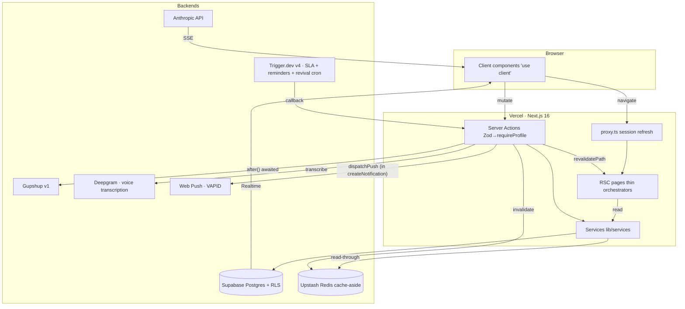
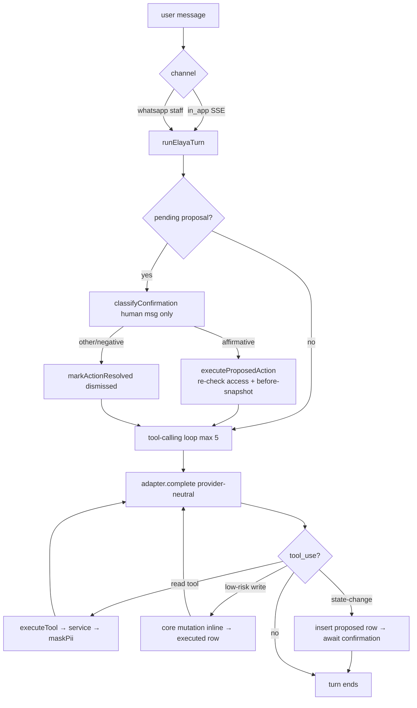
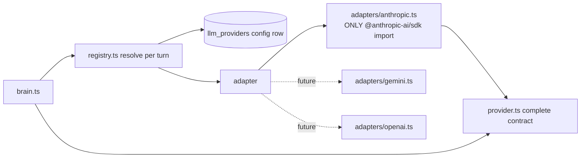

# Supplemental Diagrams — Architecture, Layering & Elaya

> Companion assets to [`../CODEBASE_KNOWLEDGE.md`](../CODEBASE_KNOWLEDGE.md) §3, §4, §13.

## Layered Request/Data Flow

## Elaya Turn — Confirmation Gate

**Security invariants:** identity always principal-derived (never model output); every tool result passes `maskPii()`; the confirmation verdict is computed from the human message only (prompt-injection defence); state-changes execute only in the resolver pre-step, never in the proposal turn.

## Provider-Neutral LLM Stack

A model/provider switch is a DB edit (`llm_providers` row), read per turn — no deploy.
