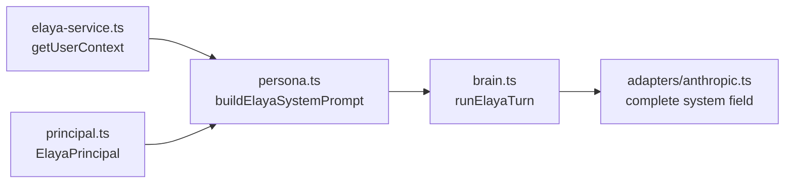

# Elaya — Currency / AED grep + system-prompt assembler

> Grep run: 2026-06-15. Commands:
>
> ```bash
> grep -rni 'AED\|currency\|د\.إ' src/ --include='*.ts' --include='*.tsx' | grep -i 'elaya\|ai\|prompt\|tool'
> grep -rln 'system' src/lib/elaya src/lib/services/elaya* src/lib/types/elaya* src/lib/validations/elaya* src/lib/constants/elaya*
> ```

## Currency / AED — summary

| Pattern | In `src/` (all files) | In Elaya / AI / prompt / tool paths |
| --- | --- | --- |
| `AED` | **0 hits** | — |
| `د.إ` (dirham symbol) | **0 hits** | — |
| `currency` (monetary) | INR / USD only (`lib/utils/numbers.ts`) | **0 monetary hits** in Elaya |

**Elaya-specific `currency` hits are false positives** — substring `ai` in the second grep also matched unrelated files (`Dom**ai**nOverviewPanel`, `AgentDet**ai**lPanel`, day-gr**ai**n). The only real Elaya hit:

```text
src/lib/elaya/tools/write-registry.ts — "optimistic-concurrency" (not money)
```

### Where deal amounts surface in Elaya tools

`search_deals` returns raw numeric `amount: d.deal_amount` with **no currency symbol or code** — the model sees bare numbers. UI elsewhere formats as **INR (₹)** via `formatCurrency()` default.

```270:274:src/lib/elaya/tools/registry.ts
      deals: result.deals.map((d) => ({
        leadName: d.lead_name,
        amount: d.deal_amount,
        dealType: d.deal_type,
```

App-wide currency formatter supports only `'INR' | 'USD'` — no AED path:

```114:125:src/lib/utils/numbers.ts
export function formatCurrency(
  value: number | null | undefined,
  currency: 'INR' | 'USD' = 'INR',
): string {
  // ...
}
```

---

## System-prompt assembler — files containing `system`

```text
src/lib/elaya/adapters/anthropic.ts   # passes req.system to Anthropic API
src/lib/elaya/brain.ts                # builds + passes system each turn
src/lib/elaya/persona.ts              # THE prompt builder (buildElayaSystemPrompt)
src/lib/elaya/provider.ts             # LlmCompleteRequest.system type
src/lib/elaya/tools/write-registry.ts # user-facing copy mentions "the system"
src/lib/services/elaya-actions-service.ts
src/lib/services/elaya-whatsapp.ts
```

**No `src/lib/**/ai*` paths exist** — all AI/Elaya code lives under `src/lib/elaya/` + `src/lib/services/elaya*`.

### Assembly chain



1. **`src/lib/elaya/persona.ts`** — `buildElayaSystemPrompt(principal, userContext, channel)` — staff persona, voice, data rules, write/confirmation contract, WhatsApp channel addendum, durable `user_context` JSON block.
2. **`src/lib/elaya/brain.ts`** — line 56: `const system = buildElayaSystemPrompt(...)`; passed to `llm.adapter.complete({ system, messages, tools })`.
3. **`src/lib/elaya/adapters/anthropic.ts`** — forwards `system` to `@anthropic-ai/sdk`.

Related (not Elaya chat): **`src/lib/services/revival-gate.ts`** has its own `GATE_SYSTEM_PROMPT` for the note-AI revival verdict — separate one-shot call, no tools.

### Prompt does NOT mention currency

`persona.ts` instructs: factual data from tools only; never invent numbers. It does **not** specify INR, AED, ₹, or how to format `deal_amount`.
