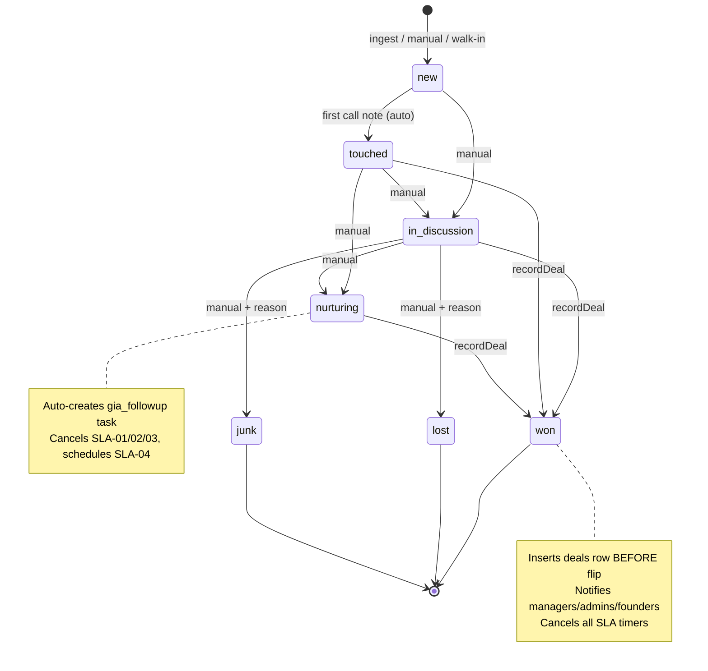
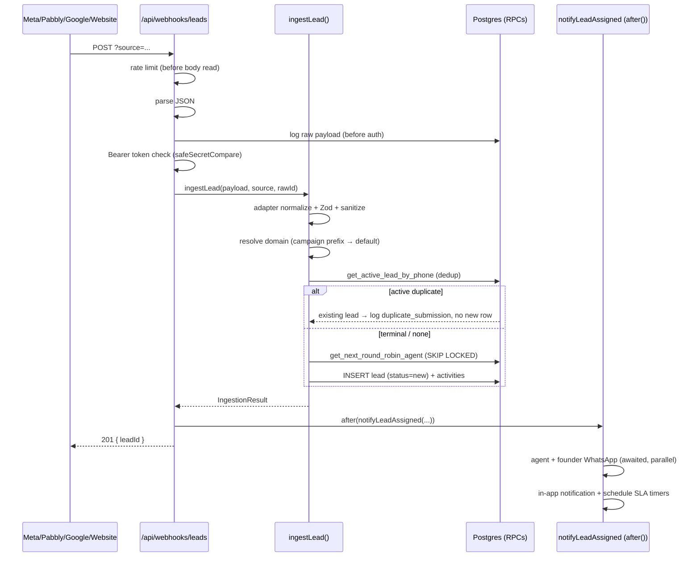
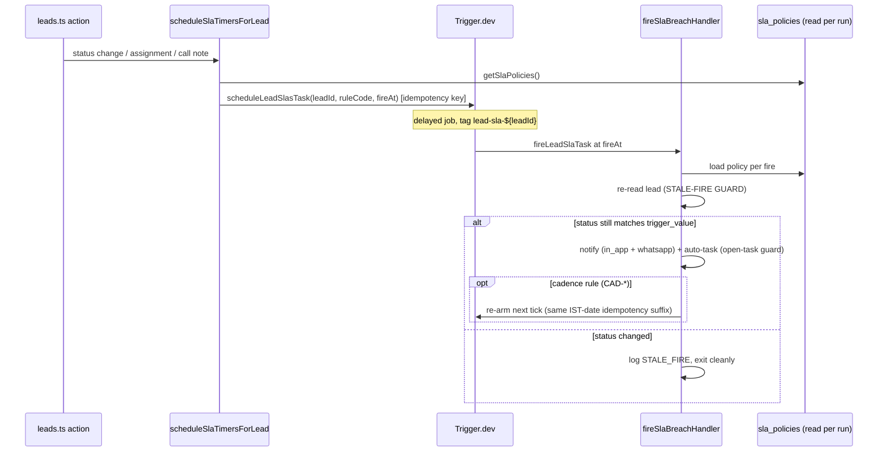

# Supplemental Diagrams — Lead Lifecycle, SLA & Ingestion

> Companion assets to [`../CODEBASE_KNOWLEDGE.md`](../CODEBASE_KNOWLEDGE.md) §8.

## Lead Status State Machine

A terminal lead (`won`/`lost`/`junk`) re-enquiring spawns a **new** lead row with `previous_lead_id` linking the chain.

## Ingestion Pipeline Sequence

## SLA Timer Lifecycle

