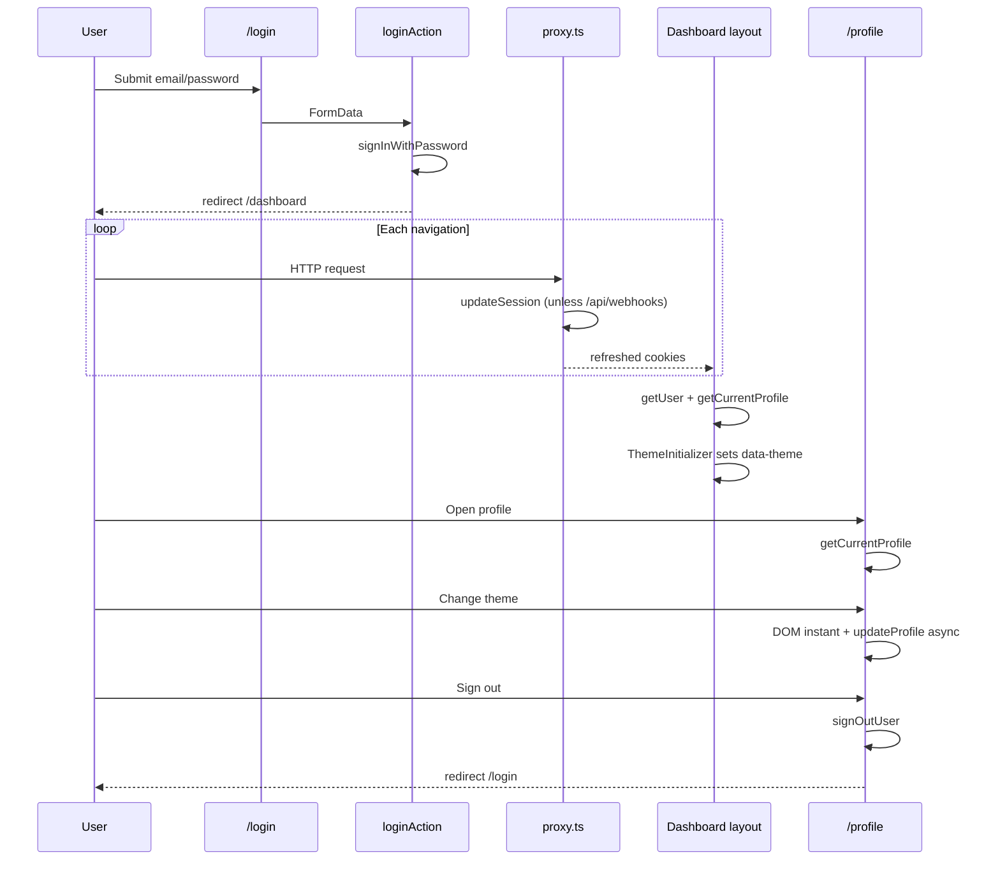

# Auth, Session & Profile — Full Intelligence Document

Last verified: 2026-06-09

---

## 1. Module Overview

Three distinct layers make up how users enter, stay in, and manage their identity inside Eia:

1. **Pre-auth pages** — unauthenticated surfaces (`/login`, `/forgot-password`, `/update-password`) inside the `(auth)` route group. No sidebar, no dashboard shell, canvas background with ambient motion layers.
2. **Session infrastructure** — `src/proxy.ts` (Next.js 16 proxy), `src/lib/supabase/middleware.ts` (`updateSession()`), and the two Supabase client factories (`client.ts` / `server.ts`). Keeps the Supabase session cookie fresh on navigations.
3. **Profile self-management** — `/profile` inside `(dashboard)`. Any authenticated user edits **only their own** `profiles` row. Admins edit other users at `/admin/users/[id]`, not here.

### Route group structure

| Group | Path prefix | Layout | Session behaviour |
| ----- | ----------- | ------ | ----------------- |
| `(auth)` | `/login`, `/forgot-password`, `/update-password` | `src/app/(auth)/layout.tsx` — centered card on canvas, no app chrome | No session gate in layout; pages are public |
| `(dashboard)` | `/dashboard`, `/profile`, `/leads`, … | `src/app/(dashboard)/layout.tsx` — sidebar + floating paper surface | **Hard gate (4 stages):** `getUser()` null → `/login`; `getCurrentProfile()` null → `/login`; `!is_active` → `/login`; `!canAccessRoute(profile, pathname)` → `/dashboard` |

Root layout (`src/app/layout.tsx`) sets default `data-theme="earth"`, font variables on `<html>`, and global CSS. Dashboard layout applies the user’s saved theme before paint via `ThemeInitializer`.

---

## 2. Root Route — `src/app/page.tsx`

```ts
export default async function RootPage() {
  const supabase = await createClient();
  const { data: { user } } = await supabase.auth.getUser();

  if (user) redirect("/dashboard");
  redirect("/login");
}
```

**What it checks:** `getUser()` — a real session probe on `/` using the server Supabase client.

**Redirect target:** `/dashboard` when a session exists; `/login` otherwise.

**Implication:** A user with a valid cookie who visits `/` is sent straight to `/dashboard`. Only unauthenticated visitors land on `/login`. The deeper session/profile/route protection for authenticated work still happens in `(dashboard)/layout.tsx`; `/` is just a fast top-level gate.

---

## 3. The Three Supabase Client Files

### 3a. `src/lib/supabase/client.ts`

- **Purpose:** Singleton browser Supabase client (`createBrowserClient` from `@supabase/ssr`, typed with `Database`).
- **When to use:** Client components that need direct Supabase access — e.g. `PasswordChangeForm` (`signInWithPassword`, `updateUser`), `ProfileAvatarSection` (Storage upload), `useNotifications` (Realtime).
- **Why only here (Rule 05):** One WebSocket connection, one channel registry, no duplicate clients across remounts. `_resetClientForTests()` exists for tests only (`NODE_ENV === 'test'`).

### 3b. `src/lib/supabase/server.ts`

- **Purpose:** Server Supabase client — reads/writes session cookies via `cookies()` from `next/headers`.
- **When to use:** Server components, server actions, and all `lib/services/*` functions.
- **Why only here:** Cookie bridging must happen in one place; `setAll` swallows errors when called from a Server Component that cannot set cookies (expected in some RSC paths).

### 3c. `src/lib/supabase/middleware.ts`

- **Exports:** `updateSession(request: NextRequest)`.
- **What it does:** Instantiates a cookie-aware `createServerClient`, calls `await supabase.auth.getUser()` (refreshes the session if needed), returns `NextResponse.next` with updated cookies on the response.
- **Called by:** `src/proxy.ts` for all matched routes except webhook early-return paths.
- **Does not do:** Profile queries, `last_seen_at` writes, or redirects. Session refresh only.

---

## 4. `src/proxy.ts` — Session Layer

### What it is

Next.js 16 **proxy** entry (replaces the conventional root `middleware.ts` pattern for this app). Exports `proxy` and `config.matcher`.

### Per-request behaviour

1. **Webhook early return** — if `pathname.startsWith("/api/webhooks")`, return `NextResponse.next({ request })` immediately. **No** `updateSession()`.
2. **All other matched paths** — delegate to `updateSession(request)`, then **set the `x-pathname` response header** to the current pathname before returning.

```ts
const response = await updateSession(request);
response.headers.set("x-pathname", request.nextUrl.pathname);
return response;
```

**Why `x-pathname`:** Server Components cannot read the request URL directly. The dashboard layout reads this header (`headers().get("x-pathname")`) to run `canAccessRoute(profile, pathname)` — the per-request domain route guard. Without this header set in the proxy, the layout's route authorization would have no pathname to evaluate.

### `/api/webhooks/*` early return — rule and reason

```ts
const WEBHOOK_PREFIX = "/api/webhooks";
if (request.nextUrl.pathname.startsWith(WEBHOOK_PREFIX)) {
  return NextResponse.next({ request });
}
```

Inbound webhooks (Meta leads, WhatsApp, etc.) carry **no session cookie**. Running `updateSession()` would be wasteful and can attach spurious auth side effects to machine-to-machine POSTs. The matcher also excludes `api/webhooks` via negative lookahead (defence in depth).

### `last_seen_at` — spec vs implementation

| Source | Claim |
| ------ | ----- |
| `docs/The_Profile.md` §15 | Middleware should update `profiles.last_seen_at` on authenticated requests, **max once per minute per user** |
| `profiles.last_seen_at` column | Exists (`timestamptz`, nullable) |
| **`src/proxy.ts` / `updateSession()`** | **Does not write `last_seen_at` as of 2026-06-09** |

Treat online-presence / `last_seen_at` as **schema-ready, not wired** until a future proxy or action implements rate-limited updates.

### Matcher config

```ts
matcher: [
  "/((?!_next/static|_next/image|favicon.ico|api/webhooks).*)",
],
```

| Included | Excluded |
| -------- | -------- |
| App pages, API routes other than webhooks | `_next/static`, `_next/image`, `favicon.ico`, `api/webhooks` |

---

## 5. Pre-Auth Pages

> **Visual language is canvas-dark, not paper.** All three auth pages render *on the canvas*
> (`--theme-canvas`), never on the paper surface. Cards, inputs, links, and text all draw from the
> **canvas/sidebar palette** — never `--theme-paper`, `.eia-paper-surface`, or `.eia-input`. The full
> token-level spec lives in **`DESIGN-DNA.md` → "Auth Surface (canvas-dark)"**; §5e below is the
> module summary. Established 2026-06-02; brand-header dot added thereafter.

### 5a. `(auth)` layout — `src/app/(auth)/layout.tsx`

**Provides:**

- Full-viewport centered shell (`relative min-h-dvh flex items-center justify-center overflow-hidden`, background `var(--theme-canvas)` set inline to prevent a white flash before CSS loads).
- Two off-centre radial glows using `--theme-canvas-glow` (primary `ellipse 80% 60% at 62% 38%`, transparent at 70%; secondary `ellipse 55% 45% at 18% 78%`, transparent at 68%, `opacity: 0.55`). Centred glow is a spotlight; off-centre is a window.
- Two CSS orb animations (`globals.css`) — `.eia-auth-orb-a` (680px, upper-right `top:-20% right:-18%`, `eia-orb-float-a` 24s) and `.eia-auth-orb-b` (560px, lower-left `bottom:-22% left:-16%`, `opacity:0.7`, `eia-orb-float-b` 30s). Both are accent-tinted radial gradients (`color-mix(--theme-accent 9%)` / `6%`), `will-change: transform`, transform-only — M-06 compliant.
- **No** sidebar, top bar, or paper content card from the dashboard shell.

**Removed 2026-06-02** (see `(auth)/CLAUDE.md`): the SVG noise-texture div and the two diagonal accent lines (`.eia-auth-line-1/2`) — parse cost not worth the subtle effect. The two radial glows and two orbs are **kept**.

**If session already present:** The auth layout does **not** redirect. A logged-in user can still open `/login`. Successful login always `redirect("/dashboard")` from the action; visiting `/login` manually while authenticated shows the login form unless the user navigates away.

### 5b. `/login`

| Item | Detail |
| ---- | ------ |
| **Page** | `src/app/(auth)/login/page.tsx` → `LoginForm` (`login-form.tsx`) |
| **Fields** | `email`, `password` — password field **has** an Eye/EyeOff visibility toggle (`showPassword` state, `lucide-react` `Eye`/`EyeOff`, **15px / strokeWidth 1.5**, `type="button"`, `tabIndex={-1}`, absolute-right, colour `--theme-sidebar-text`) |
| **Submit copy** | "Sign In" / "Signing in…" (pending). `Button variant="primary"` full-width + `--shadow-accent-glow` |
| **Action** | `loginAction` in `src/lib/actions/auth.ts` via `useActionState` |
| **Supabase** | `signInWithPassword({ email, password })` using **server** client (`createClient()` from `server.ts`) |
| **Deactivation gate** | After a successful `signInWithPassword`, the action calls `getCurrentProfile()`; if `profile.is_active === false` it immediately `signOut()`s and returns `formErrors.accountDeactivated` ("Your account has been deactivated. Please contact your administrator.") — a deactivated user can never establish a usable session at the login step |
| **Success** | `redirect("/dashboard")` |
| **Errors** | Bad email/password or Supabase auth failure → `formErrors.invalidCredentials` ("The email or password you entered is incorrect."); deactivated account → `formErrors.accountDeactivated`. No separate "unconfirmed email" branch in code |
| **Remember me** | None — Supabase cookie persistence handles session length |
| **Forgot link** | `/forgot-password` |

**Validation:** the action uses a **local** `loginSchema` defined inline in `auth.ts` — `email` required + format (`email_invalid`), `password` **min 1 char** (`required`). Any parse failure collapses to `formErrors.invalidCredentials` (it never tells the user which field failed). The exported `loginSchema` in `src/lib/validations/auth.ts` (password min 8) is **not** the one `loginAction` uses — the action has its own min-1 schema so existing short passwords can still sign in.

### 5c. `/forgot-password`

| Item | Detail |
| ---- | ------ |
| **Page** | `forgot-password/page.tsx` → `ForgotPasswordForm` |
| **Field** | `email` |
| **Action** | `requestPasswordResetAction` |
| **Supabase** | `resetPasswordForEmail(email, { redirectTo: \`${siteUrl}/api/auth/callback?next=/update-password\` })` where `siteUrl = process.env.NEXT_PUBLIC_SITE_URL ?? <localhost:3000 fallback>` |
| **Success UX** | Inline success copy — **no redirect**. User must check email. |
| **Email enumeration** | **Always returns success** after valid email format — never reveals whether the address exists (Rule S-09). |
| **Invalid email format** | `formErrors.email` |

**What the user receives:** Supabase recovery email linking to `/api/auth/callback` with `token_hash` + `type=recovery` (or PKCE `code` in same-browser case). Callback verifies and redirects to `/update-password`.

### 5d. `/update-password`

| Item | Detail |
| ---- | ------ |
| **Arrival** | User clicked reset link → `/api/auth/callback` establishes session → redirect `next=/update-password` |
| **Session gate (page)** | Server component calls `getUser()`; if no user → `InvalidLinkCard` (request new link). `?error=link_expired` from failed callback → expired copy |
| **Fields** | `password`, `confirmPassword` |
| **Action** | `updatePasswordAction` (server) — `updateUser({ password })` after Zod |
| **Success** | Success panel + link to **`/login`** (not auto-redirect to dashboard) |
| **Strength bar** | **Present** — `update-password-form.tsx` renders `<PasswordStrengthBar password={newPassword} />` under the new-password field. (The `/profile` `PasswordChangeForm` also uses it; this page is **not** an exception.) |
| **Schemas** | `updatePasswordSchema` (`src/lib/validations/auth.ts`) — `password` min 8 / max 72, `confirmPassword` min 1, `passwordMismatch` refine on `confirmPassword`. On parse failure the action maps `passwordMismatch` → `formErrors.passwordMismatch`, everything else → `formErrors.passwordTooShort`; a Supabase `updateUser` error → `formErrors.generic` |

**Auth callback** (`src/app/api/auth/callback/route.ts`):

1. `token_hash` + `type` → `verifyOtp` (recovery emails, any device).
2. Else `code` → `exchangeCodeForSession` (PKCE / same-browser magic links).
3. Failure → `/update-password?error=link_expired`.

### 5e. Auth visual language (canvas-dark) — module summary

All three forms + `InvalidLinkCard` share one shell. Canonical token spec: **`DESIGN-DNA.md` →
"Auth Surface (canvas-dark)"**. CSS classes live in `src/app/globals.css`.

**Outer wrapper (every form):** `relative w-full mx-4`, `maxWidth: 26rem`, `zIndex: var(--z-raised)`
— lifts the card above the layout's glows/orbs.

**Card — `.eia-auth-card`:**

| Property | Value |
| -------- | ----- |
| Background | `var(--theme-sidebar-hover-bg)` (dark, not paper) |
| Border | `1px solid var(--theme-sidebar-border)` |
| Radius | `var(--radius-xl)` |
| Shadow | `var(--shadow-3)` |
| Padding (inline) | `var(--space-10) var(--space-8)` |

**Unified brand header** (identical on all three forms + `InvalidLinkCard`):

- `next/image` `/logo.webp` at `48×48`, `borderRadius: var(--radius-sm)`, `priority`.
- `<h1>`: `--font-serif`, `--text-3xl`, **`--weight-light`**, `--tracking-tighter`, `--leading-tight`,
  colour `--theme-canvas-text`, centred — text **`Indulge OS`** followed by
  `<span className="page-title-dot">.</span>` (the accent blink dot).
- Container `flex flex-col items-center gap-3`, `mb-10` on forms / `mb-8` on `InvalidLinkCard`.
- **No subtitle.**

> ⚠️ The brand-header **`page-title-dot`** is the one place the dot appears off a primary nav page.
> It post-dates the 2026-06-02 `(auth)/CLAUDE.md` note that shows the header without it — code is the
> source of truth here.

**Inputs — `.eia-input-auth`:** `--theme-canvas` bg, `1px solid --theme-sidebar-border`,
`--theme-canvas-text` text, `--radius-sm`, `--space-3/--space-4` padding, `--text-sm`. Placeholder
`--theme-sidebar-text`. Focus: border `--theme-accent` + `box-shadow: 0 0 0 3px var(--theme-accent-surface)`.
Password fields add `paddingRight: var(--space-10)` for the toggle.

**Labels:** `className="label-micro"` **with an inline override** `color: var(--theme-sidebar-text)` —
`label-micro` renders dark (paper-tuned) by default and must be lightened on the dark card.

**Links — `.eia-auth-link`:** `--text-xs`, `color-mix(--theme-accent 65%, transparent)` at rest →
full `--theme-accent` on hover. Used for "Forgot your password?" and "Back to sign in".

**Error banners (dark-surface tokens — never the light `-light` variants):**

```text
color:           var(--color-danger-dark-text)
backgroundColor: var(--color-danger-dark-fill)
border:          1px solid var(--color-danger-dark-border)
radius:          var(--radius-xs)
padding:         var(--space-2) var(--space-3)
fontSize:        var(--text-xs)
role:            "alert"
```

**Primary "result" links** (success panels + `InvalidLinkCard` "Request New Link"): full-width block
`var(--theme-accent)` bg / `var(--theme-accent-fg)` text, `--radius-sm`, `--space-3/--space-4` padding,
`--weight-semibold`, `--tracking-wide` — styled inline (not a `<Button>`) because they are `<Link>`s.

**Submit buttons:** `Button variant="primary"` full-width with `boxShadow: var(--shadow-accent-glow)`,
`loading={isPending}`. Per-page copy: Login "Sign In/Signing in…"; Forgot "Send Reset Link/Sending…";
Update "Update Password/Updating…".

**Eye/EyeOff toggle (login + update-password):** absolute-right, `translateY(-50%)`, transparent
`<button type="button" tabIndex={-1}>`, icon `15px` / `strokeWidth 1.5`, colour `--theme-sidebar-text`.
On `/update-password` a shared `<EyeToggle>` helper drives both new + confirm fields off one `showNew`
state.

**Forbidden on auth forms:** `.eia-paper-surface`, `.eia-input`, `--theme-paper*` text/bg tokens, and
the light `--color-danger-light/-text` error variants. Those are paper-surface tokens.

---

## 6. `(dashboard)` Layout — `src/app/(dashboard)/layout.tsx`

### Session gate

The layout runs a **four-stage gate** in order:

```ts
const { data: { user } } = await supabase.auth.getUser();
if (!user) redirect("/login");

const profile = await getCurrentProfile();
if (!profile) redirect("/login");
if (!profile.is_active) redirect("/login");

const pathname = (await headers()).get("x-pathname") ?? "/";
if (!canAccessRoute(profile, pathname)) redirect("/dashboard");

const initialNotifications = await getNotifications(profile.id);
```

| Failure mode | Behaviour |
| ------------ | --------- |
| No auth user | `redirect("/login")` |
| Auth user but no `profiles` row (or RLS blocks read) | `redirect("/login")` |
| Deactivated user (`is_active = false`) | `redirect("/login")` — the layout **does** enforce `is_active`, as a second line of defence behind the login-action deactivation gate |
| Authenticated + active, but route not permitted for the user's domain | `redirect("/dashboard")` (not `/login`) — `canAccessRoute(profile, pathname)` evaluated against the `x-pathname` header the proxy set |

`getCurrentProfile()` → `getUser()` then `getProfileById(user.id)`. RLS `profiles_select` allows any authenticated user to read all profiles.

`canAccessRoute` is a pure function (`src/lib/utils/route-access.ts`) reading `ALWAYS_ALLOWED_PREFIXES` + `DOMAIN_ROUTE_MAP` from `src/lib/constants/route-permissions.ts`. The pathname comes from the `x-pathname` response header set in `src/proxy.ts` — without that header the guard would default to `"/"`.

Also prefetches `getNotifications(profile.id)` for the sidebar bell.

### Zero-flash theme — `ThemeInitializer`

**Current implementation:** `src/components/layout/ThemeInitializer.tsx` — a **client** component rendered at the top of the dashboard layout:

```tsx
const safeTheme = ["earth", "air", "water", "fire", "cosmos"].includes(profile.theme)
  ? profile.theme
  : "earth";

<ThemeInitializer theme={safeTheme} />
```

```ts
useLayoutEffect(() => {
  document.documentElement.setAttribute("data-theme", theme);
}, [theme]);
```

| Topic | Detail |
| ----- | ------ |
| **Reads** | `profile.theme` from server-rendered `getCurrentProfile()` |
| **Writes** | `data-theme` on `<html>` |
| **Fallback** | Invalid or missing theme → `"earth"` |
| **Why not a deferred client-only effect** | `useLayoutEffect` runs synchronously after DOM commit, **before** the browser paints — avoids one frame of wrong tokens |
| **Historical note** | Older builds used an inline `<script>` in this layout; the behaviour goal is unchanged (paint-free theme), the mechanism is now `ThemeInitializer` |

**Source of truth for theme:** `profiles.theme` in Postgres — **not** localStorage. `ThemeSelector` updates DB via `updateProfile`; layout + initializer apply on every navigation.

### Font variables — root layout

`src/app/layout.tsx`:

- `Inter` → CSS variable `--font-geist-sans`
- `Playfair_Display` → `--font-playfair`
- Applied as `className` on `<html>` alongside default `data-theme="earth"`
- Consumed in `src/styles/design-tokens.css` as `--font-sans` / `--font-serif`

### Dashboard chrome

- `ThemeInitializer` rendered first (sets `data-theme` before paint), then the shell.
- Outer shell: `<div className="layout-shell flex">` with inline `gap: var(--space-3)`, `height: 100dvh`, `overflow: hidden`.
- `Sidebar` with `profile` + `initialNotifications`, followed by `ToastProvider` at shell root.
- Canvas gutter column (`flex: 1`, `var(--theme-canvas)` background, `padding: 12px 12px 12px 0`) wraps the inner paper column.
- Inner paper column: `var(--theme-paper)`, `var(--radius-xl)`, `var(--shadow-paper)`, `overflowY: auto` / `overflowX: hidden` scrollable content holding `{children}`.

---

## 7. `/profile` — Self-Management Page

### 7a. Page structure

**File:** `src/app/(dashboard)/profile/page.tsx` — async server component.

| Item | Detail |
| ---- | ------ |
| **Access** | `getCurrentProfile()`; redirect `/login` if null. Own record only — no `id` param; admins use `/admin/users/[id]` for others |
| **Layout** | `gridTemplateColumns: minmax(0, 1fr) 340px`, `maxWidth: 1280px`, `padding: var(--space-8)` |
| **Eyebrow** | `"Account"` — `className="type-eyebrow"` |
| **Title** | `Profile Settings` + `page-title-dot` |

**Left column** (`SectionCard` stack — three sections only):

1. Personal Details → `ProfileDetailsForm`
2. Appearance → `ThemeSelector`
3. Security → `PasswordChangeForm`

> There is **no Notifications section on `/profile`.** `NotificationPreferences` is not a real component in `src/components/profile/` — the folder contains exactly `ProfileDetailsForm`, `ThemeSelector`, `PasswordChangeForm`, `ProfileAvatarSection`. Notification **sound** is toggled elsewhere (via the `useNotificationSound` hook surfaced from the notifications UI), not on this page. See §7f.

**Right column** (sticky `aside`, `top: var(--space-6)`):

1. Identity → avatar upload + name/email/job + role/domain `status-pill`s + member-since strip
2. Session → sign-out form

### 7b. `ProfileDetailsForm`

| Field | Editable | Notes |
| ----- | -------- | ----- |
| `full_name` | Yes | Required on submit |
| `phone` | Yes | Normalized server-side |
| `job_title` | Yes | Optional |
| `username` | Yes | Lowercase/alphanumeric/underscore; uniqueness checked in action |
| `email` | **Read-only** | `value={profile.email}`, `readOnly`, hint: contact administrator |

- **Action:** `updateProfile` via `useActionState`
- **Schema:** `updateProfileSchema` — partial fields allowed (theme-only updates use same action from `ThemeSelector`)
- **Phone:** `normalizeToE164(phone, "IN")` in action; invalid → `formErrors.phoneInvalid`
- **Success/error:** Inline banners; `revalidatePath("/profile")` in action

### 7c. `ThemeSelector`

- **Swatches:** Earth, Air, Water, Fire, Cosmos
- **Preview trick:** Each swatch wraps a `div` with `data-theme={theme.key}` so `var(--theme-*)` resolve to that theme without hardcoded hex
- **On select:**
  1. `document.documentElement.setAttribute("data-theme", theme)` — instant
  2. `startTransition` → `updateProfile` with `FormData { id, theme }` only
- **Active ring:** Uses **current page** theme accent for selection outline; checkmark inside preview uses preview theme’s `--theme-accent-fg`

### 7d. `PasswordChangeForm`

| Step | Detail |
| ---- | ------ |
| **Re-auth** | `getUser()` → `signInWithPassword({ email: user.email, password: current })` **before** `updateUser({ password: next })` |
| **Why re-auth** | Supabase requires proving knowledge of the current password for sensitive session changes; server actions cannot replace this flow |
| **Client** | `createClient()` from `src/lib/supabase/client.ts` only — **no** server action for password change |
| **Fields** | Current, new, confirm — Eye/EyeOff toggles (`lucide-react`, 15×15 stroke 1.5) |
| **Strength** | Renders the shared `<PasswordStrengthBar password={next} />` (`src/components/ui/PasswordStrengthBar.tsx`) under the new-password field — the **same** component used on `/update-password`. Not a bespoke scorer |
| **Errors** | Wrong current → "Current password is incorrect."; mismatch, too short, same-as-current — inline messages; Supabase update errors surfaced as generic or message text |

### 7e. `ProfileAvatarSection`

| Item | Detail |
| ---- | ------ |
| **Tile** | 96×96, `--radius-md`, `--shadow-1`, hover camera overlay, `Spinner` while uploading |
| **Flow** | `createClient()` → Storage `avatars` bucket → `upload(profile.id, file, { upsert: true })` → `getPublicUrl` → cache-bust `?t=${Date.now()}` → `updateProfileAvatar` action |
| **Validation** | Client: `image/*` only, **max 2 MB** before upload starts |
| **Fallback** | Initials from `full_name` on `--theme-accent-surface` when `avatar_url` null |
| **Storage contract** | Bucket `avatars`; path = `{user_id}`; public read + authenticated write (project RLS) |

**Action validation:** `updateProfileAvatarSchema` — `avatar_url` must be valid URL. **No** explicit Supabase bucket-prefix check in the action layer as of 2026-06-09 (The_Profile §15 describes it as intended defence; not implemented in `profiles.ts`).

### 7f. Notification sound preference (no `/profile` component)

There is **no `NotificationPreferences` component** and **no Notifications `SectionCard` on `/profile`.** Notification sound is a device-local preference managed entirely through the `useNotificationSound` hook, surfaced from the notifications UI in the Sidebar — never from the profile page.

| Item | Detail |
| ---- | ------ |
| **Hook** | `src/hooks/useNotificationSound.ts` |
| **Storage** | `localStorage` key `eia:notifications:sound:v1` (default `true` when absent) |
| **Where sound plays** | `src/hooks/useNotifications.ts` (mounted from `NotificationBell` in the **Sidebar**). On a Realtime `INSERT` to `notifications`, calls `sound.play()` — debounced ~1500 ms, Web Audio chime, respects the persisted `enabled` flag |

**Rule:** Only `useNotifications` should call `play()` — not feature pages directly.

**Important:** The notification **sound preference** is localStorage-only — **not** a `profiles` column. Theme remains DB-backed (`profiles.theme`); sound is device-local. The two are independent.

### 7g. Identity `SectionCard` (right column)

- `ProfileAvatarSection` (upload only — identity text owned by page)
- `full_name`, `email`, optional `job_title`
- Role pill (`ROLE_LABELS`) + domain pill (`DOMAIN_LABELS`)
- Member since: `formatDate(created_at, "MMM yyyy")` on `--theme-paper-subtle` footer strip

### 7h. Session `SectionCard` (right column)

```tsx
<form action={signOutUser}>
  <Button type="submit" variant="secondary" size="sm">
    Sign out
  </Button>
</form>
```

- **Action:** `signOutUser` in `src/lib/actions/profiles.ts` — `signOut()` then `redirect("/login")`
- **No LogOut icon:** Page is a **server component**; Lucide icons cannot be passed into the server-action form boundary without a client wrapper. Text-only button is intentional.
- **Alternate:** `signOut()` exists in `src/lib/actions/auth.ts` with the same behaviour — profile page uses `signOutUser` only.

---

## 8. Actions

### `updateProfile`

| Item | Detail |
| ---- | ------ |
| **Who** | Own profile, or admin/founder editing any user (admin forms reuse this action) |
| **Fields** | `full_name`, `username`, `job_title`, `phone`, `theme`, `timezone` (all optional except `id`) |
| **Phone** | `normalizeToE164` when provided |
| **Sanitize** | `sanitizeText` on `full_name`, `job_title` |
| **revalidatePath** | `/profile`, `/admin/users`, `/admin/users/${id}` |
| **Returns** | `ActionResult<Profile>` — `{ data, error }`, never throws |

### `updateProfileAvatar`

| Item | Detail |
| ---- | ------ |
| **Who** | Own profile, or admin/founder |
| **Writes** | `avatar_url` (public URL after client upload) |
| **Validation** | Zod `.url()`; no bucket-prefix enforcement in code |
| **revalidatePath** | `/profile` |

### `signOutUser`

| Item | Detail |
| ---- | ------ |
| **Who** | Any authenticated user |
| **Supabase** | `auth.signOut()` via server client |
| **Redirect** | `/login` |

### Auth actions (`src/lib/actions/auth.ts`) — reference

| Export | Role |
| ------ | ---- |
| `loginAction` | Pre-auth sign-in |
| `signOut` | Sign out + `/login` (duplicate of profile sign-out) |
| `requestPasswordResetAction` | Forgot-password email |
| `updatePasswordAction` | Post-recovery password set |

---

## 9. Session Flow — End-to-End



**Ordered lifecycle (six steps):**

1. User visits `/login` → `loginAction` → `signInWithPassword` → deactivation check (`is_active`) → session cookie set → `redirect("/dashboard")`. (A deactivated account is signed back out here with `accountDeactivated`.)
2. Dashboard layout runs the 4-stage gate (`getUser` → `getCurrentProfile` → `is_active` → `canAccessRoute`); renders shell with `ThemeInitializer(theme)`.
3. Every subsequent matched request → `proxy.ts` → `updateSession()` refreshes session cookies **and sets `x-pathname`** (`last_seen_at` **not** updated in code today).
4. User visits `/profile` → server renders with `profile.theme` → `ThemeInitializer` applies `data-theme` before paint.
5. User changes theme → instant `setAttribute` on `<html>` + async `updateProfile({ theme })` → persisted in `profiles.theme`.
6. User clicks Sign out → `signOutUser` → cookie cleared → `/login`.

---

## 10. Known Invariants (must never be violated)

| Invariant | Source |
| --------- | ------ |
| `/api/webhooks/*` must never run `updateSession()` | `src/proxy.ts` early return + matcher exclusion |
| Proxy must set `x-pathname` on every non-webhook response — the dashboard layout's route guard depends on it | `src/proxy.ts` |
| Deactivated users (`is_active = false`) are gated **twice**: at `loginAction` (sign out + `accountDeactivated`) and in the dashboard layout (`redirect("/login")`) | `loginAction`, `(dashboard)/layout.tsx` |
| Dashboard layout must run `canAccessRoute(profile, pathname)`; a disallowed route → `redirect("/dashboard")` (never `/login`) | `(dashboard)/layout.tsx` + `route-access.ts` |
| Root `/` redirects authenticated users to `/dashboard`, unauthenticated to `/login` | `src/app/page.tsx` |
| `last_seen_at` must be rate-limited to once per minute **when implemented** — not on every request | The_Profile §15 — **not yet in proxy** |
| Theme source of truth is `profiles.theme`, not localStorage | Dashboard layout + `ThemeSelector` |
| Theme null / invalid → always `"earth"` | Dashboard layout `safeTheme` guard |
| `email` is read-only on `/profile` — source of truth is `auth.users` | `ProfileDetailsForm` |
| `PasswordChangeForm` uses browser client only — not a server action | `PasswordChangeForm.tsx` |
| Zero-flash theme must run before paint (`ThemeInitializer` / `useLayoutEffect`, not `useEffect`) | `ThemeInitializer.tsx` |
| Avatar upload: 2 MB max validated client-side before upload | `ProfileAvatarSection.tsx` |
| Forgot-password must not reveal whether email exists | `requestPasswordResetAction` |
| One browser Supabase client — `createClient()` from `client.ts` only | Rule 05 |
| One server Supabase client per request — `server.ts` only in services/actions | Rule 05 |
| Notification sound preference: `eia:notifications:sound:v1` in localStorage — separate from theme DB field; no `/profile` control | `useNotificationSound.ts` |
| Password reset completes at `/login` after success, not `/dashboard` | `UpdatePasswordForm` success link |
| `/update-password` shows `PasswordStrengthBar` under the new-password field — it is **not** an exception to the strength-bar pattern | `update-password-form.tsx` |

---

## Appendix — Self-edit validation schemas

From `src/lib/validations/profile-schema.ts`:

- **`updateProfileSchema`** — `id` (uuid); optional `full_name`, `username`, `job_title`, `phone`, `theme` enum, `timezone`
- **`updateProfileAvatarSchema`** — `id`, `avatar_url` (url)

Auth schemas in `src/lib/validations/auth.ts`: `loginSchema`, `forgotPasswordSchema`, `updatePasswordSchema` (with confirm + mismatch refine).

All user-facing errors map through `src/lib/validations/form-errors.ts` — never raw Zod strings.
