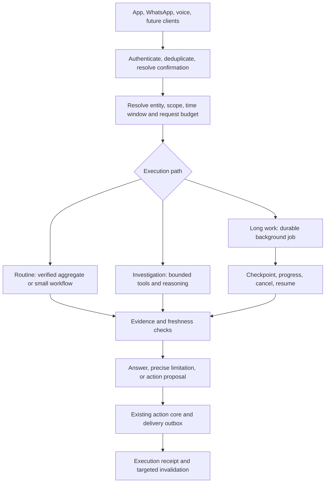

# Elaaya: reliable, efficient agent architecture

Status: proposed implementation architecture, 1 October 2026. **Delivery steps 1 and 3 landed on 2 October 2026** (the 2026-10-02 changelog entry): the provider usage ledger with exact pricing in both runtimes, reaction gating, the voice idempotency key with speculation off, the per-conversation lease, the non-progress guards and the cost envelope, evidence carried between turns, and the first two compact tools (`get_open_loops` = "who needs an update in my queendom?", `find_member_occasions`). Not yet: the shadow comparison of the open-loops read against reviewed windows, the payment-investigation capability, the canary model routing (the tier override switch exists), the background duplication work. The [cost audit](../audits/2026-10-01-elaya-cost-architecture.md) contains measured evidence and the immediate fixes; this document defines the longer-lived contracts those fixes should support. The [master plan](master-plan.md) retains ownership of company-wide sequencing; this is the focused detail for the reliability and efficiency tranche, not a restart of the historical Python migration.

The [Indulge behaviour contract](elaya-behaviour-contract.md), added 2 October after reading the complete founder tone review, defines internal voice, relevant coaching, last-mile verification, communication review and stateful follow-through. It extends the evidence/intervention contracts here; tone does not override factual uncertainty, permissions or action receipts.

The 2 October clarification makes the proactive operating teammate the primary product outcome of that contract: observe changed work, help its owner, verify the outcome and recognise earned good practice. Implement its event-to-outcome work packages on the shared projections and delivery machinery below. Emojis and supported message reactions are welcome; reactions are typed delivery actions, not a reason to run another investigation or a substitute for authorization. Personal communication preferences remain an overlay on the founder's shared character.

## Decision and confidence

Keep Supabase/Postgres as the source of business records, Python as the agent runtime, Node services/mutation cores as the shared business implementation, and the existing background workers. Add reliable incremental evidence, compact reporting tools, explicit freshness, bounded orchestration and request-level accounting. Extend the current system gradually.

Confidence is high in these boundaries because they address observed failure modes: repetitive reads, incomplete coverage, expensive routine reporting, duplicated extraction and weak usage attribution. Confidence in exact savings, model quality and latency remains provisional until measured. The original sample covers about seven days plus a partial day, with the useful activity concentrated in the initial rollout. It is not a forecast of every future workflow. Local source and selected live records were inspected; full deployed-code/schema parity and every permission edge have not been certified.

The goal is a capable company agent whose cost grows mainly with new information and useful work, rather than repeatedly reconstructing the same state. No architecture or model guarantees that every answer is correct. The system must detect missing, stale and contradictory evidence and make uncertainty actionable.

## Preserve the existing boundaries

| Existing component | Responsibility to retain | Addition |
|---|---|---|
| `gia` | Leads, domain-specific sales work, deals and official lead conversations | Compact sales reports and explicit identity links; no silent merging with member records |
| `member` | Member facts, people, events, membership and snapshots | Provenance, effective dates, contradiction handling and freshness of derived sections |
| `sia` | Recorded group evidence, concierge tickets, intake and extraction runs | Incremental request state and durable consumer checkpoints |
| `freshdesk` | Mirror of the external system where much of the team works | Explicit sync coverage and links to corresponding Sia work |
| `public` | Profiles, permissions, shared tasks, AI configuration, messages/jobs and media readings | Shared usage and request contracts, not duplicated business tables |
| `elaya_read` | Restricted reporting views and database catalog | Verified aggregate operations with coverage metadata; views do not replace caller authorization |
| Hands / Desks / finance services | Existing disclosure, confirmation, outbox and sending rules | Shared action receipts, idempotency and evidence-aware preconditions |
| Python brain + Node bridge | Tool orchestration + existing service execution | Three execution paths, shared tool contracts and per-request tracing |
| Trigger.dev / existing queues | Scheduled and incremental work | Priority classes, budget reservations, independent checkpoints and reconciliation |

Use `src/lib/elaya/principal.ts`, `access.ts`, the existing member/queendom service gates and their SQL counterparts. Tool schemas may guide the model but never grant authority. Cached rows must still pass current access checks; a person's seat can change after the cache was populated.

Do not start a wholesale backend rewrite, a new graph database, a second mutation layer, or an always-running collection of model agents. They are not prerequisites for the measured problems. Keep extension points for future models and retrieval without paying their operational cost now.

## The request path



**Routine path.** Resolve familiar questions into validated operations: today's pending work, member occasions, request counts, member facts, a vendor search, a known task update. Use deterministic parsing where unambiguous and a small structured model call where language/context needs interpretation. Do not install another obligatory model router ahead of every call. Execute a compact tool or a known workflow; an exact count can use a template, while a nuanced explanation uses a small bounded synthesis.

**Investigation path.** Sonnet is the target default for cross-source reasoning. The planner receives relevant evidence and has explicit limits on calls, bytes, time and estimated cost. Escalate to the stronger model for demonstrated difficulty, not merely a SQL request or an “analytics” label. Return reasons for escalation in internal telemetry. Repeated empty results, identical reads and repeated SQL errors trigger a change of approach or a useful limitation.

**Long-work path.** Use existing Elaya jobs/deep reads for full-history scans, bulk comparisons and work that exceeds synchronous budgets. Persist scope, source cutoff, plan/version, checkpoints, spend and results. A background job has a stable ID and explicit delivery state; a chat reply must never promise “I will keep doing this” unless a job or schedule was actually registered. Polling progress must not call the model again. Cancellation stops new work and preserves completed receipts.

Confirmations precede shortcuts. A plain “yes” can confirm a pending state change; “continue” can resume a known job. Greetings and reactions must not accidentally replay the prior investigation. Identify entities with stable IDs, aliases and scoped search; ambiguous names require clarification rather than guessing. Preserve the distinction between one person and their separate leads/domains.

## A contract for every read tool

Introduce a common internal result envelope. This is an illustrative contract, not a deployed type or a requirement to send verbose metadata to every model call:

```text
data: compact fields needed by the operation
scope: verified viewer scope plus explicitly resolved filters
window: from/to/timezone, or effective point in time
source_versions: source IDs/revisions or a reproducible watermark
source_synced_through: per-source successful sync coverage
derived_through: per-projection processed coverage
computed_at: when this result was assembled
coverage: complete | partial | stale | unknown
matched_count, returned_count, next_cursor, missing_sources
evidence_refs: stable pointers to supporting records
warnings: typed facts such as sync_unavailable or ambiguous_identity
```

The runtime consumes most metadata; the model receives only the concise evidence and caveats needed to answer. `computed_at=now` does not make an old mirror fresh. A timestamp for the newest observed message does not prove every earlier message was ingested. Coverage must use successful cursor/range processing and connector health.

Never report “no requests” from a failed query. Never say “all members” after a capped list. Counts and rankings must use database aggregation and an explicit denominator, not model counting over partial rows. A summary and its drill-down should use the same snapshot/version or clearly report newer changes. Use cursor pagination for large results and database indexes/execution-plan checks for new query families.

## Freshness and correctness policy

Proposed initial service objectives below are engineering targets to validate under load, not present guarantees or external-provider promises:

| Data class | Read policy | Initial target / behavior |
|---|---|---|
| Action preconditions: ticket state, owner, payment/invoice state | Read authoritative service immediately before execution | Revalidate after confirmation; refuse stale preconditions |
| Local structured state after a successful mutation | Return committed record/version and invalidate affected reads | Next user read observes the change |
| Live unresolved requests | Use projections with ingestion and extraction watermarks | Aim for p95 within two minutes of a persisted settled burst; explicit lag when behind |
| Freshdesk / external records | Report mirror sync coverage; refresh through existing bounded integrations when needed | Never claim upstream freshness beyond last successful sync |
| Durable member facts | Retrieve evidence-backed fact with observation/effective dates | Fast reads; relevant new or corrective evidence queues repair |
| Broad reports | Fixed cutoff/window plus explicit completeness | Reproducible results; refresh on request or scheduled cadence |
| Weekly assessments | Input fingerprint plus time-based expiry | Renewal proximity, aging work and inactivity can invalidate without new messages |

When freshness is inadequate, first perform a targeted refresh within the request's budget. If the source is unavailable or the work is too large, return the last known state with its age/coverage and optionally start a tracked refresh. Do not block every answer on every source. Live status must not depend on a weekly assessment being rebuilt.

Resolve “today,” “since last night” and “this month” in the user's business timezone, currently IST where applicable, then query explicit boundaries. Track observation time separately from effective business time: an imported old message is newly ingested but not a new request today. Scheduled occasion/travel computations require a date/time rule even if no new source data arrives.

## Source-of-truth and evidence rules

- A member's explicit, current preference supersedes an older inferred preference; human overrides need scope, reason and expiry where appropriate. Do not use a universal rule that every human-written field beats every source forever.
- Booking confirmation, cancellation, revised itinerary and casual discussion are different evidence states. Represent tentative versus confirmed plans. Future extraction may correct a field but must retain the prior evidence trail.
- Sia and Freshdesk can describe the same work. Maintain explicit cross-source links; avoid counting both as separate requests. Ambiguous matches remain candidates for review, especially across members or similarly named tickets.
- Financial balances/payment execution come from the existing finance integration, not inferred chat sentiment or a matching screenshot. Chat and receipts may locate candidates but do not prove ledger reconciliation.
- Model confidence alone does not authorize a write or establish correctness. Validate identifiers, enums, dates and amounts, and record unsupported or conflicting claims.
- Retrieved messages, PDFs, notes and vendor replies are untrusted business data. They may contain instructions addressed to an assistant; those instructions cannot alter access, tool policy or action confirmation.
- Evidence links returned to the user must go through normal access controls. Sharing a report must not expose the broader scope of its original author.

## The first tools to extend or add

Names below are proposed capabilities, not assertions that these functions already exist. Final naming follows the existing registry and reuse rules. Start with the first three based on observed cost; instrument later demand rather than guessing dozens of new tools.

| Capability | Existing foundation | Result and main constraint |
|---|---|---|
| Operational exceptions / updates since a cutoff | `get_live_pulse`, verified metrics, intake, Sia/Freshdesk data | Ranked unresolved requests, missing tracked work and changed items, with evidence and coverage |
| Member finder by occasion/trip/renewal/interest | `member` facts/people/events, `member_coming_up`, existing member reads | Filtered IDs and relevant fields; confirmed/tentative distinction; missing-data count |
| Verified reporting | `elaya_read`, catalog and `elaya-metrics.ts` | SQL counts/rankings by member, queendom, category, date; exact denominator |
| Targeted member context | Existing `get_member_360` and narrower profile/message tools | Sections/field selection and compact summary; preserve full detail for justified drill-down |
| Bounded reconciliation candidates | Existing books services and permitted reporting views | Amount/date/reference candidates with source evidence; no automatic financial allocation |
| Draft from captured request | `draftTicketCore`, intake proposal/evidence links | One versioned draft when requested, cache/reuse by evidence revision |
| Work status / resume | `elaya_jobs`, labels, current job services | Progress, scope, spend and resumable checkpoint without another planning run |

Expose broad multi-member operations only where the viewer can perform their equivalent scoped reads. Founder reporting views do not become a shortcut for a queen or genie. Prefer row-level authorization before retrieval; do not fetch company-wide data and ask the model to filter it.

## Shared processing and minimal data additions

The existing member/intake/media queues remain useful. Introduce or extend only the missing contracts after comparing existing schemas:

| Logical record | Required contents | Ownership |
|---|---|---|
| Source change / dirty work | Source record + revision, operation, business time, scope, next attempt, lease | Ingestion service owning that source |
| Extraction receipt | Input version/hash, schema/prompt/model version, coverage, output refs, attempt and usage | Existing extraction ledger extended where suitable |
| Unresolved request projection | Request/evidence IDs, owner, status, linked work, deadline, revisions and freshness | Sia/concierge service, with existing permission rules |
| Consumer checkpoint | Consumer + source partition + committed watermark, retry/dead-letter state | Worker owning that projection |
| Model request usage | Turn/job/attempt, model, all token categories, cost version, stop reason | Shared provider boundary in both runtimes |
| Action execution receipt | Principal, proposal/confirmation, inputs/version, idempotency key, result/outbox reference | Existing mutation/action services |

Persist source writes and change notification in the same database transaction where possible, using a durable outbox/change record. For externally mirrored updates, commit the mirror change and its dirty marker together. Redis can accelerate reads and coalesce work, but cannot be the only record of an unprocessed event. Reuse the existing Postgres lease/claim patterns (`claim_sentinel_wakes`, media claims); do not add a distributed event platform before scale justifies it.

Workers provide at-least-once delivery with idempotent commits, not a promise of global exactly-once execution. Avoid advancing a partition watermark past failed work. Use revision checks or compare-and-set when committing results; a slow old extraction cannot overwrite a newer correction. Keep separate checkpoints for consumers so a failed vendor extraction does not block live request detection. Bounded reconciliation catches missing events and expired leases.

A single giant extraction prompt is not the target. Share source preparation and validated evidence; combine request/fact/tone extraction only where evaluation proves quality and total cost improve. Failure of a rich profile parser must not suppress urgent request visibility. Maintain typed partial results and retry only the failed consumer.

## Reliable actions as capabilities expand

Keep all actions in existing Node cores/bridges and domain authorization. The model proposes intent; code validates and executes. Confirmation must bind to the specific operation, target, arguments, expiry and relevant record version. If those preconditions change before execution, re-evaluate and reconfirm where needed.

Assign idempotency keys to logical actions, not individual retry attempts. When an external call times out, reconcile its status before retrying a potentially completed payment, invoice or message. A completed internal mutation and an undelivered external message are separate states. Surface partial success precisely, use existing outboxes, and only describe an action as done after an execution receipt supports that claim.

For multi-step workflows, persist steps and results. Respect dependency order for writes; parallelize independent reads within budgets. A cancellation prevents future actions but cannot reverse already committed effects. Report what completed and what remains, and offer supported compensating actions rather than claiming a rollback occurred.

Voice, WhatsApp and the app use the same logical turn/action identity. Disable speculative voice access to the stateful action endpoint until speculation is explicitly read-only. Repeated provider callbacks, impatient follow-ups and network retries must not create new side effects.

## Context, retrieval and memory

Maintain four separate concepts: user preferences; current conversation/task state; business facts/evidence; global approved policies/playbooks. Preferences do not grant authority. A complaint is review evidence, not an immediately trusted global instruction.

Replace broad automatic prompt injection with a small context budget: shared instructions, relevant approved workflow, resolved entities/current task, selected user preferences, and targeted evidence. Store stable IDs and evidence pointers between turns; retrieve details on demand. Prompt-cache stable sections and growing same-turn context as specified in the cost audit, while keeping freshness and access validation independent of provider caching.

Use exact/structured search for names, dates, counts, balances and IDs. Add lexical/semantic retrieval for fuzzy historical questions only after a measured recall failure shows the need. If embeddings are introduced, keep them within the existing Postgres direction where practical, mask appropriately, filter by current scope before results reach the model, link every chunk to source revision, and update/delete index entries when evidence changes. Similarity scores are not proof and a vector index is not the operational source of truth.

Fine-tuning or distillation becomes a later decision supported by enough reviewed examples, held-out evaluations and actual workload economics. Do not assume a fixed percentage of future tasks should use a custom model. Provider-neutral contracts allow the choice later without rewriting business tools.

## Performance and operations

Budget the whole request: authentication/context fetch, model routing, model/tool rounds, bridge/DB latency, synthesis and delivery. Trace them separately. Reducing tokens alone will not fix slow unindexed queries or repeated HTTP bridge setup. Load stable definitions efficiently while respecting live configuration and scope changes. Batch compatible entity reads and limit concurrent expensive DB queries/model calls.

Use priority lanes for interactive/urgent work, background live extraction, scheduled work and backfills. Reserve spend/concurrency for urgent work; pause backfills first during rate limits or cost pressure. Respect shared provider backoff and avoid synchronized retry storms. Keep a queue-age and source-lag dashboard, not just a requests-per-minute chart.

Initial performance experiments: routine prepared-data answers target p95 under eight seconds end-to-end excluding known upstream outages; scoped DB reads target p95 under 300 ms on representative data. These are targets to benchmark, not promised results. Measure 50-user burst scenarios and mixed background load, not only isolated requests. Report first useful answer time separately from decorative acknowledgements.

Useful product enhancements built on these contracts: explain “why this needs attention” with source references; show data age when relevant; show tracked job progress/cancellation; offer “what changed since my last check”; and allow corrections tied to the specific fact/answer. Proactive notifications require a real trigger, source revision, recipient policy, dedup, quiet hours and an actionable delta. Generate one scoped brief per shared evidence set, personalizing only the needed portion.

## Proof before broader rollout

Extend the current eval harness; use real scenarios but minimize retained customer content and keep evaluation access scoped. Maintain time-based held-out examples to avoid tuning only to the first week. Add new failure cases as adoption changes; review the distribution weekly during rollout.

| Evaluation | Required proof |
|---|---|
| Routine questions | Correct answer and coverage with a bounded number of compact tools |
| Freshness | New event, amendment, cancellation and delayed media change the answer within target; stale sources are disclosed |
| Missing/partial data | Sync failure, truncated query or unknown member never becomes a fabricated zero or complete report |
| Permissions | Role/seat changes and shared caches cannot reveal other scopes, including background reports and evidence links |
| Actions | Duplicate callbacks, expired confirmation, changed record and timeout-after-success do not double-execute |
| Voice | Transcript changes, interruptions and retries do not create duplicate committed turns/actions |
| Extraction | Measure missed requests, false alarms, fact conflicts and vendor recall against reviewed evidence |
| Performance/cost | Cost per successfully completed task, p50/p95 latency, queue lag and actual cache savings under mixed load |
| Resilience | Connector gaps, worker crashes, rate limits and failed projections resume without lost coverage |

Use deterministic assertions for counts, identity, dates, permissions and side effects. Human review is necessary for nuanced concierge interpretation; an LLM judge is only supporting evidence. A confident-sounding answer or lower token count is not a pass. Shadow runs must suppress actions and customer/staff sends, have their own cost budget, and avoid duplicating expensive external side effects.

## Incremental delivery plan

1. **Measure and contain:** provider usage ledger, exact model pricing, reaction gating, voice idempotency/speculation review, conversation concurrency and non-progress guards. Separate main requests from router/memory/background costs.
2. **Prove one vertical workflow:** implement “who needs an update in my queendom?” using existing intake, Freshdesk and Sia evidence, freshness metadata and a compact tool. Shadow it against reviewed source windows. Compare missed requests, speed and cost before broadening.
3. **Add exact operational tools:** occasions/renewals, targeted member views and count/ranking reports. Add same-turn context caching and shared/personal prompt separation as independent measurable changes.
4. **Reduce background duplication:** lightweight cards/drafts on demand, per-window media checkpoints and shared attachment evidence. Preserve live freshness and source-specific consumer contracts.
5. **Canary model routing:** target Sonnet 5.5 with evaluated effort; rare Opus 5.5 escalation. Snapshot model/prompt/tool versions per turn and maintain rollback. No version-only promise of hallucination prevention.
6. **Expand proven patterns:** source-aware reconciliation, resumable reports, proactive deltas, other domains and external actions. Add retrieval/training infrastructure only when measured gaps justify it.

Each phase ships behind a feature-level switch with before/after evidence. New projections can be rebuilt from source; keep old reads available until parity is established. Before cutover, verify migrations, indexes, backfill completion, source coverage, worker deployment versions and permissions in the deployed environment. Backfills get explicit budgets and priority below live work. Rollback must stop new processing/actions without discarding source data or completed receipts.

The first implementation milestone is not “the new architecture is finished.” It is one important real workflow that is demonstrably fresher, more complete, faster and cheaper, using contracts that the next feature can reuse.

## Incident design case: unidentified incoming payment

Added 2 October 2026, following the reported October 1 investigation. Local source inspection confirmed the old ceiling behavior, the uncommitted closing-answer change and the text-only history design. Earlier audit records contained three step-limit replies and expensive payment-related searches. A fresh incident-specific database read was blocked by automatic approval review because the workspace was out of credits; it was not retried. The supplied manual conclusions about the payer, rejected coffee purchase and absence of records remain reported findings, not independently verified facts. The closing-answer patch's deployment and claimed test results were not independently verified.

### What failed

1. **Investigation was treated as unconstrained discovery.** The general analytical tool loop could repeatedly search chats and write SQL without a dedicated payment matching procedure or an evidence-completeness contract. Ten rounds can contain more than ten individual tool calls.
2. **Exhaustion bypassed useful finalization.** In the original loop, the ceiling appended a generic limit message to `result_text`. The empty-answer closing branch then did not run because that string was nonempty. Gathered results remained in the in-memory messages for that turn, but the user did not get a synthesis; saying the code literally deleted all evidence would be inaccurate.
3. **Follow-ups did not restore an investigation.** The next turn receives the latest ten persisted text messages, not structured candidate results, rejected explanations or searched-source coverage. Tool call names/arguments are logged but their evidence is not restored as a reusable case. A follow-up can repeat the whole search.
4. **Correction instructions conflict.** `backend/app/brain/persona.py` tells the model to never retract or re-guess earlier answers. The same prompt tells it to handle reported mistakes. The absolute prohibition must be replaced with: preserve supported findings, reopen disputed claims, check new evidence and explicitly correct a prior answer when warranted. Do not declare a prior answer true merely because a tool was used.
5. **Candidate strength was not enforced.** A matching amount in a quotation is a lead, not proof of a transfer. An already-recorded payment may be a separate transaction with the same amount; transaction identity matters. The supplied account itself describes the third initial answer as both correct and later disputed, so it cannot be used as a verified success case.

The existing uncommitted fix sets a ceiling flag and invokes a tools-withheld closing call with instructions to report findings and avoid invented matches. Retain its intent, but do not equate it with the complete architecture. It still resends the large transcript, can fail or run out of output allowance, and has no durable investigation state or typed coverage. Test provider-native block replay, final-result persistence and the fallback path before deployment.

### A bounded payment-investigation capability

Implement through existing books/reporting services and the agent tool registry; preserve the finance access gate. Proposed operation: `investigate_incoming_payment`, returning structured evidence rather than a claimed payer chosen by model intuition.

**Input and identity.** Normalize amount in minor currency units, currency, credit/debit direction, bank/account where known, booking/value date, transaction reference and narration. Preserve reference strings without numeric coercion. Treat a phone-shaped substring as an unverified identifier, not proof of the sender's identity. A provider or processor name is not the payer. Prefer a source transaction ID; if none exists, use a provisional fingerprint and allow duplicate/ambiguous statement lines rather than forcibly merging them.

**Ordered checks.** Resolve explicit transaction/reference matches first; check ledger records and reconciliation state; then search authorized contact/entity identifiers and indexed receipt/payment evidence within a stated date window. Search bounded chat/ticket evidence only when structured checks leave an uncertainty. Normalize formatting variants deterministically instead of making the model invent many amount spellings. Widen the date window deliberately and record why; do not quietly scan the entire archive.

**Evidence evaluation.** Return candidates with supporting and contradicting source references. Distinguish a price quote, invoice, reported payment, receipt and bank-verified linkage. Exact amount alone is insufficient. Third-party payers, split payments, fees, refunds and multiple equal-value transfers need explicit ambiguity handling. Where material fields cannot be validated, report a candidate for finance review rather than a confirmed attribution. Matching is read-only; booking or allocating money stays a separate existing authorized action.

**Result states.** Use `verified_match`, `candidate_needs_confirmation`, `no_match_in_checked_sources`, `incomplete_coverage`, `blocked_source` and `needs_external_confirmation` as explicit states. A source error is not an empty result. Only return a verified match under defined evidence rules and validated transaction identity; model confidence alone cannot produce it. Include candidate count, exclusions, checked date ranges, freshness, pagination/coverage and the next useful step.

**Stop rules.** Stop when a verified linkage exists, when the defined bounded searches are complete, or when a source/budget blocks further progress. Do not exhaust ten model rounds merely because no match exists. A full-archive investigation, when warranted, becomes an explicit background job with a budget and cutoff. Do not automatically increase the ceiling or move the problem to a more expensive model.

### Durable case state and efficient follow-ups

Reuse/extend existing job and conversation records for a typed investigation case; final physical schema requires a migration review. Store the normalized transaction, scope, evidence revisions, candidates, rejected candidates with reasons, completed checks, pending checks, coverage, status, spend and last-check time. Store compact evidence references rather than injecting every raw result into every turn.

Attach corrections to the right case. “That person's payment is already in the books” disputes the earlier match; retain the correction, verify the relevant transaction and prevent the unchanged candidate from being presented as newly established. It does not establish a global rule that the person can never be the payer.

For “is this solved?”, resolve the active case (clarify if several are plausible), recheck current access, and compare relevant source watermarks. With no relevant new evidence, return its current status without another broad search. With new evidence, run only affected checks. Cache negative search results by scope, normalized query and source revision with expiry; new relevant data invalidates them. Never promise autonomous follow-up unless a real job/subscription and delivery policy exists.

### Guaranteed useful completion, not guaranteed identification

Reserve time/output budget for finalization before spending the investigation budget. Maintain an evidence summary throughout the run. The final answer should state the finding, its strength, essential limitation and next action in a few sentences. If model synthesis fails, render a deterministic response from the typed case state; preserve any completed action receipts separately. Model-free fallback must not invent which sources were checked.

Example, only if the checks actually support it:

> I couldn't verify who sent the ₹1,880 payment dated 19 September. I found no matching payment in the records checked. The earlier same-amount quote does not establish who paid. Finance needs the bank's remitter details or a matching transfer receipt to resolve it.

If the quote was independently disproved, say it was ruled out; otherwise say it remains unverified. If a source was unavailable, name the gap instead of claiming a complete search. Prefer “no match in the sources checked” over “this payment is not recorded anywhere.” Avoid repeating full phone/account identifiers unnecessarily. There is no need to tell the user about internal tool limits.

### Release tests for this incident family

- Verified transaction/reference match returns a sourced answer through the compact path.
- Equal-amount quote without payment evidence never becomes a verified payer.
- Same-amount already-recorded transaction is distinguished from the unknown transfer; user correction invalidates the unsupported prior claim.
- Two plausible payers produce ambiguity, not a forced winner.
- Missing, delayed, failed or truncated sources produce explicit incomplete coverage, not a universal negative.
- Budget exhaustion, closing-call failure and output truncation still return a factual status from saved case evidence.
- Unchanged “is this solved?” does not repeat broad searches; new relevant evidence triggers a targeted refresh.
- Multiple simultaneous payments keep corrections and evidence attached to their own cases.
- Duplicate messages and concurrent follow-ups share a case/lease and cannot duplicate downstream actions.
- Revoked access prevents reuse of previously authorized evidence.

Use mocked tool/provider tests for deterministic orchestration and a small controlled replay for provider compatibility and answer quality. The first acceptance criterion is eliminating unsupported attribution and useless endings; speed and token reduction are measured alongside it, never substituted for it.
