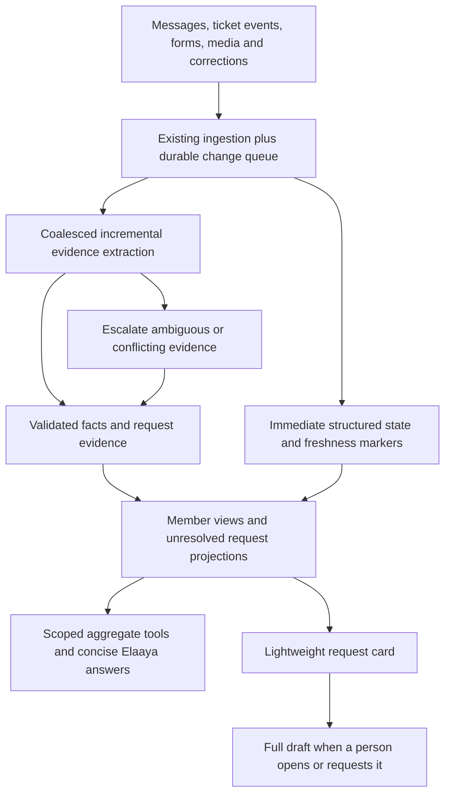

# Elaaya cost and architecture audit — 1 October 2026

The strongest opportunity is to stop repeated broad data exploration for routine operational questions, then cache the context that genuinely needs to be repeated. Prompt shortening alone will not fix the expensive tail.

Revised on 1 October after checking the supplied independent AI analysis against source, fresh aggregate queries and official provider documentation. The accepted target is Sonnet 5.5 for ordinary reasoning, rare Opus 5.5 escalation, and shared incremental evidence for member operations. These are planned changes, not claims about the deployed configuration.

The broader [reliable agent architecture plan](../architecture/elaya-reliable-agent-plan.md) defines the tool/evidence contracts, freshness policy, action safety, schema responsibilities and rollout gates for future growth. This audit remains the source for measured cost findings; the architecture plan adds implementation detail without declaring those changes shipped.

The subsequent [Indulge behaviour contract](../architecture/elaya-behaviour-contract.md) translates the complete founder tone review into a compact shared policy and selective evidence-backed interventions. It explicitly avoids injecting the full source document into every call or adding a mandatory model rewrite chain, so the personality change preserves this plan's efficiency goals.

This is an audit and implementation plan. No production settings, application behavior, prompts, or models were changed by the audit itself. **Sequence steps 1 to 3 were built on 2 October 2026** (the 2026-10-02 changelog entry): the per-request usage ledger and exact pricing in both runtimes (P0), reaction gating (P0), same-turn caching and the shared/personal prompt split (P0/P1), the three background caches (P1), `analytics` off the Opus tier with a per-specialist override switch (P1), the turn budgets and non-progress guards (P1), and the aggregate tools for the two costliest question families (P0). Migration 0254 is not applied and the Python service is not deployed yet, so the ledger has no rows until both happen.

## Evidence and limits

- Repository review covered the Node and Python brains, adapters, routing, persona, history, tool dispatch, WhatsApp normalization, voice bridge, memory learning, background AI services, schedules, settings, existing reporting tools, and eval harness. This is a cross-system AI cost audit, not a line-by-line review of unrelated UI code.
- Read-only Supabase snapshot: **24 September 2026 00:00 UTC through 1 October approximately 08:58 UTC**. The final day is partial; daily figures below use UTC, not the application's IST accounting boundary.
- Read 1,020 messages: **485 user messages and 535 assistant messages**, from **46 distinct sending accounts**. None of those accounts had an eval/test-labelled display name; that does not prove every message was organic production use. Peak daily distinct senders: 28.
- **457 assistant rows** contain Python usage counters. Other assistant rows include scheduled messages and failures; they must not be interpreted as free requests.
- Read **6,152 `sia.extraction_runs` records** and **3,242 `public.media_readings` rows with a read timestamp**. Media rows are records, not necessarily successful paid calls.
- Reviewed a systematic sample of user messages, all recorded route/usage aggregates, and the largest recorded turns. Intent families below are qualitative; specialist counts are the system's routing labels, not a hand-labelled intent census.
- Did not access the Anthropic billing console or its usage/cost export. The reported $100/three days and $20/day cannot be reconciled exactly from current application telemetry.
- Local source and live settings were checked; deployed revision parity was not independently verified. Some ledger gaps may reflect deployment differences.
- Raw chat text and identifiers are deliberately excluded from this report. Temporary local analysis files were used during the audit.

## Current architecture and actual configuration

| Path | Current behavior | Cost implication |
|---|---|---|
| Staff WhatsApp / in-app | Live settings select Python for both | Optimizing only `src/lib/elaya/brain.ts` misses the live staff path |
| Python router | Haiku selects specialist/playbook each turn | Extra call, not included in the recorded main-turn usage |
| Ordinary specialists | `reasoning`: `claude-sonnet-5`, 4,096 output ceiling | Used even for many straightforward replies |
| Analytics + analyst | `heavy`: `claude-opus-5`, 8,192 output ceiling | Topic selection selects expensive reasoning; complexity is not independently assessed |
| Python tool loop | Up to 10 iterations, potentially a closing call | Each round replays accumulated results; parallel tool calls are not bounded by the iteration count |
| Tool loading | Role-scoped catalog, specialist hot set, other tools deferred | Already a useful optimization; retain discovery and role enforcement |
| History | Latest 10 persisted messages, text only | Not unlimited history; lacks reusable structured evidence across turns |
| Memory learning | Node after-turn reader, gated by a broad word regex | Additional Haiku work; ordinary “my/me” questions can pass the gate |
| Customer brain | Separate Node reasoning loop | Keep in the cost inventory even though staff traffic currently uses Python |
| Voice | LiveKit STT/TTS plus Python brain | Separate speech/infrastructure spend; do not hide it in text-token estimates |
| Intake / profiler / ticket drafting | Incremental detection, member extraction, request drafting | Multiple distinct reads can follow the same source conversation |
| Briefing | One generated briefing reused for founders | Already shared; do not multiply its cost by every recipient |
| Media | Reading enabled; backlog switch off; daily configured cap $15 | Cap is a ceiling, not observed daily spend |

Other live settings: daily message cap 200 per user; session expiry 24 hours; intake, profiler, briefing, and voice enabled; alerts disabled. History re-profiling has a separate $60 configured cap. The main chat cap limits messages, not dollars or tokens.

Relevant implementation: `backend/app/api/chat.py`, `backend/app/brain/{router,specialists,loop,persona}.py`, `backend/app/llm/anthropic_adapter.py`, `backend/app/core/elaya_store.py`, `src/lib/elaya/{brain,customer-brain,memory}.ts`, `src/lib/services/llm-providers-service.ts`, and `backend/voice/agent.py`.

## Measured chat usage

The stored Python `usage.in` is accumulated Anthropic **uncached input**, not total context processed. Cache writes and cache reads are discarded. Token totals span all main-loop calls in a turn, not one request's context length.

| Measure | Observed |
|---|---:|
| Recorded main-loop input | 10,879,287 tokens |
| Recorded main-loop output | 674,666 tokens |
| Median input per recorded turn | 5,820 tokens |
| 95th percentile input per recorded turn | 118,302 tokens |
| Input attributable to the largest 20 turns | 34.6% |
| Analytics/analyst turns | 74 / 457, or 16.2% |
| Their share of recorded input | 38.4% |

| Routed specialist | Recorded turns | Input tokens |
|---|---:|---:|
| General | 158 | 2,616,862 |
| Members | 67 | 1,885,784 |
| Analytics | 61 | 3,469,609 |
| Tasks | 60 | 737,826 |
| Leads | 32 | 530,042 |
| Vendors | 26 | 141,693 |
| Freshdesk | 15 | 158,808 |
| Tickets | 14 | 320,895 |
| Analyst | 13 | 710,649 |
| Groups | 11 | 307,119 |

Representative expensive behavior:

| Question/workflow, paraphrased | Observed behavior | Recorded input |
|---|---|---:|
| Client requests for which no task was created | 20 tool calls, scanning groups and repeatedly searching Freshdesk | 308,766 |
| Identify an unrecorded bank transaction | 16 tool calls including repeated SQL; ended at the step limit | 294,115 |
| Birthday/anniversary follow-up | `list_members` plus 27 `get_member_360` calls | 282,789 |
| Which client made the most requests? | 28 tool calls, including repeated per-member overviews | 203,088 |
| New requests since morning | 18 calls scanning multiple groups | 196,546 |
| Who is travelling, where, until when? | Broad search plus large member records; answer acknowledged incomplete coverage | 193,807 |

Questions were associated with the preceding user message in the same conversation. Concurrent turns can make that association ambiguous; tool counts and usage belong to the recorded assistant row regardless. In particular, two costly birthday-related replies close together warrant a concurrency investigation, not a claim of confirmed duplicate execution.

## What users actually need

The sample is dominated by concierge operations, not open-ended creative chat:

1. **Operational exceptions:** who is waiting, unanswered requests, missed updates, overdue work, requests absent from Freshdesk/Sia.
2. **Member facts:** current hotel/trip, birthday/anniversary, renewals, preferences, profile and prior history.
3. **Team/queendom reporting:** what happened today, workload, who replied/resolved most, category counts.
4. **Vendor sourcing and drafting:** find suitable contacts and create a vendor-ready request.
5. **Actions:** create a task, assign work, log a note, reminders, follow-up confirmations.
6. **Broad historical analysis:** topic/category scans across Freshdesk and chats.
7. **Short follow-ups:** yes, continue, now check, greetings, reactions.

The first three should primarily retrieve prepared, permission-scoped facts. Reconstructing an operational report through an unrestricted agent loop each time is both expensive and prone to partial coverage.

## Findings, in priority order

### P0 — Usage accounting cannot explain or enforce the bill

Both adapters return only input/output counters. Python assistant metadata omits the actual model ID and request count; router usage is discarded. Memory-reader usage is not returned to a shared billing ledger. Exceptions after successful calls can lose their usage attribution because persistence happens after the turn.

4,801 of the 6,152 background records have null `cost_usd`; 136 have no model. Deep-read runs mix tiers. Media rows carry a recorded $13.16 across the window, but no `media_reading` runs appeared in the extraction-run sample despite current source attempting those inserts. `saveOutcome` does not inspect those insert errors. Investigate this discrepancy without counting the same media cost twice.

Prices are inconsistent: profiler constants use Sonnet 5's $2/$10, deep-read estimation uses family matches of Sonnet $3/$15 and Opus $15/$75, and media's reasoning tier uses $3/$15. Configurable model routing makes fixed tier prices fragile.

Implement one per-provider-request usage event in both runtimes: model returned by provider, configured model, job/feature, channel, internal turn/job ID, attempt, prompt version, input/cache-write/cache-read/output counters, stop reason, latency, and tool-result bytes. Record router, memory, retries, and successful calls before later failures. Where interrupted usage is unavailable, mark it unknown rather than zero. Use unique provider request IDs where available and deduplicate events.

Price by exact model/version and effective date. Store all token categories; derive price centrally. Reconcile daily totals to provider reports, allowing for time zones, reporting delay, separate projects/keys, speech spend, and unobserved failed requests.

Files: `src/lib/elaya/{provider,adapters/anthropic}.ts`, `backend/app/llm/{provider,anthropic_adapter}.py`, `backend/app/api/chat.py`, `src/lib/services/{elaya-deep-read,media-reader,media-readings-service}.ts`.

### P0 — Tool-result replay is the large uncached tail

The Python adapter places breakpoints on tools and the frozen system block. It places none on conversation/tool-result content. The loop appends every tool result and sends the growing transcript again. Per-result caps are 12,000 characters, or 24,000 for a member 360. There is no corresponding aggregate result budget for a turn.

Add tested incremental message caching within a turn, respecting provider block restrictions and the existing tool/system breakpoints. Keep raw tool-search/thinking blocks valid. This helps expensive multi-round turns, but should accompany fewer and smaller reads.

Across turns, history slides and is rebuilt text-only, while the timestamp changes. Therefore cross-turn transcript caching will not become effective merely by adding a cache flag. Prioritize same-turn reuse; redesign session evidence separately.

Files: `backend/app/brain/loop.py:56`, `backend/app/llm/anthropic_adapter.py:97`, `src/lib/elaya/adapters/anthropic.ts:125`.

### P0 — Routine questions need aggregate tools

Reuse existing `elaya_read` reporting views, verified metrics, `get_live_pulse`, intake outcomes, member facts/events, and current service permission gates. Extend the existing tool registry rather than build another data access layer.

| Needed operation | Proposed result |
|---|---|
| Occasions / renewals over a scope and date range | Compact rows, total count, missing-data count, pagination |
| Current trips / stays | Member, location, date range, evidence reference and freshness |
| Requests without tracked work | Candidate request + matching/excluded ticket evidence, ownership, uncertainty |
| Waiting / unanswered / updates due | Scope, deadline, latest relevant member ask and staff response, source links |
| Requests ranked by member / category / agent | SQL aggregation with explicit denominator and time window |
| Bank reconciliation candidate search | Deterministic amount/date/reference lookup and bounded candidates; escalate ambiguity |

SQL can compute counts, joins and dates. Semantic judgments such as “this message needs action” need incremental extraction or a bounded evidence review; a last-speaker rule alone is not enough. Do not replace a careful classifier with an inaccurate heuristic for savings.

Acceptance: birthdays/counts use one aggregate tool result, not N member dossiers; results account for missing data and scope; the permission checks remain identical to existing tools.

### P0 — Reactions become paid instructions

`src/app/api/webhooks/whatsapp/route.ts:83` converts unsupported incoming types, including reactions, into ordinary text labels. The staff handler treats `[Reaction]` as user text. Eight such user rows exist in the sample, with subsequent paid assistant responses; some occurred around expensive ongoing work.

Preserve event type through normalization. Record reactions for display if needed, but do not invoke the model. Give button/list replies their real selected payloads instead of placeholders. Do not drop a textual “yes” that confirms an authorized action.

### P1 — Shared prompt content is mixed with personal content

Python's system string puts the user's display name/role/domain in its second paragraph, followed by specialist/playbook and the rest of the persona, with notes/memory/issues later. Its single system breakpoint cannot share the common instruction body between different users. The tool-side breakpoint can still hit where eligible; caching is not entirely disabled.

Split into common instructions, role/specialist instructions, and user/session context blocks. Keep stable tool definitions/order and deferred loading. Personal notes, changing known issues, and time should not invalidate the global instruction block. Tools precede system content, so changing the tool prefix can still invalidate system reuse; measure per role/specialist rather than promising one global cache.

Files: `backend/app/brain/persona.py:283`, `backend/app/brain/loop.py:108`, `src/lib/elaya/persona.ts`.

### P1 — Several repeated background prompts are not cached

Profiler, ticket drafting, assessment, lesson writer, playbook drafter, and briefing calls omit `cachePrefix`. Enable it where a sufficiently large stable prefix is reused and savings are measured. Put dates, slots and recipient details in variable context rather than interpolating them into the cached instruction body.

Some existing Haiku jobs set the flag but may have prefixes too short to qualify. Confirm with token counting and returned cache counters; do not pad prompts with useless text to chase a hit-rate metric.

### P1 — Expensive model routing is too broad

Both analytics and analyst default to Opus. Simple counts and routine reporting share this route with genuinely difficult analysis. Ordinary questions should use a cheaper model with prepared data; reserve Opus for justified multi-source reasoning or an explicit escalation.

Use Haiku for validated extraction/classification and simple bounded formatting, Sonnet for ordinary agentic work and nuanced synthesis, and Opus for difficult cases that demonstrate a quality benefit. Route by task complexity and evidence sufficiency, not the word “analytics.” Do not change the shared `heavy` row blindly.

The target versions are `claude-sonnet-5-5` and `claude-opus-5-5`, subject to the migration checks below. Route ordinary analytics to Sonnet; SQL generation alone is not sufficient reason to escalate to Opus. Verified SQL/reporting templates need no expensive planning model.

The Python provider contract also lacks the Node adapter's effort control. Add model-aware controls and evaluate them. Lowering `max_tokens` indiscriminately risks truncation or blank replies; that is not an efficiency strategy.

### P1 — Bound cost and detect lack of progress

A 200-message daily cap does not bound spend when one message can consume hundreds of thousands of input tokens. Introduce per-turn token/dollar envelopes, aggregate tool-result budgets, feature budgets, and an organization budget with reserved capacity for critical live work.

Add duplicate read detection keyed by tool/arguments/data version and repeated SQL-error detection. After repeated non-progress, return a precise limitation or queue a bounded investigation rather than spend all 10 rounds retrying. Writes need idempotency and confirmation-aware handling; never silently replay them.

Use atomic budget reservations before parallel work and settle actual usage afterward. Admission checks must include uncached input, cache writes, reads, and output headroom. A UI-only cap or non-atomic sum can overshoot under concurrency.

Investigate a per-conversation queue/lease for concurrent WhatsApp messages. Adjacent turns can reread the same history and duplicate expensive work even when webhook-message IDs are distinct. Keep the existing webhook dedup constraints.

### P2 — Reuse prepared evidence across questions and jobs

Persist compact evidence with source IDs, permissions/scope, source watermark, coverage and extraction version. Serve repeated “updates till now” requests by reading changes since that watermark, with refresh when the source changes.

Do not share generated answers across users by question text alone. Cache structured results by authorized scope, normalized arguments, relevant source version and time window. Dynamic waits/statuses need short lifetimes or event invalidation; profile facts can live longer. Recheck authorization on every request.

Retain source evidence for sensitive interpretations. Current text-only history often forces rediscovery, but reloading every old raw tool result is also wasteful. Keep selected entity IDs and evidence summaries, not an ever-growing transcript.

## Background workload measured separately

Counts are job records, not guaranteed one-to-one API calls. Null costs below mean unrecorded, not free.

| Job | Records | Recorded input | Recorded output | Main opportunity |
|---|---:|---:|---:|---|
| Member profiler | 1,307 | 5,100,377 | 353,868 | Stable prompt cache; incremental reuse; evaluate smaller extraction model |
| Ticket intake | 3,610 | 4,666,058 | 344,797 | Already Haiku; dedup, eligibility and prepared source windows |
| Ticket creator | 792 | 2,402,615 | 264,934 | Cache instructions; reuse intake evidence; preserve drafting accuracy |
| Assessment | 371 | 1,838,961 | 218,657 | Reassess on relevant change; batch nonurgent work |
| Briefing | 20 | 1,611,949 | 33,320 | Supply compact operational evidence instead of broad transcripts |
| Deep read | 48 | 3,494,561 | 576,910 | Preserve existing reuse, continuation and spend controls; separate backfills |

Additional small categories: alerts, lesson writer, sentinel. Media's separate ledger recorded about $6.09 on September 28, $3.09 on September 29, $3.19 on September 30, and $0.79 on October 1 so far. These are application estimates, include the media pipeline's model/speech mix, and are not an Anthropic invoice.

353 assessment records occurred on September 26: that spike must not be projected as a daily steady-state load. The profiler already has bookmarks and thin-window skipping; intake and media also have queues/dedup. Improve these mechanisms rather than replacing them with a generic caching layer.

For weekly assessments and historic reprocessing, evaluate the provider Batch API where completion delay is acceptable. Live intake, conversation replies, urgent tickets and time-sensitive media must keep their service-level targets.

## Caching mechanics and economics

For the configured models, five-minute cache writes cost 1.25× input, one-hour writes 2×, and reads 0.1×. Minimum prefixes differ: Haiku 4.5 requires 4,096 tokens, Sonnet 5 requires 1,024, Opus 5 requires 512. Entries require identical prefixes. The provider allows four breakpoints and a bounded lookback. Source: [Anthropic prompt caching](https://platform.claude.com/docs/en/build-with-claude/prompt-caching).

Use five-minute caching for close tool-loop rounds. Trial one-hour caching only for stable prefixes with measured reuse beyond five minutes. A cold one-off cached request can cost more. Measure saved dollars including writes, not just hit rate.

Suggested accounting:

```text
cost = (uncached_input * input_rate
      + cache_write_5m * write_5m_rate
      + cache_write_1h * write_1h_rate
      + cache_read * read_rate
      + output * output_rate) / 1,000,000

cache_read_share = cache_read / (uncached_input + cache_write + cache_read)
```

Track this per feature/model and for repeated eligible calls. A single global percentage obscures many short, ineligible jobs.

## Cost projections: what can and cannot be concluded

Current standard list rates per million input/output tokens are Haiku 4.5 $1/$5, Sonnet 5 $2/$10, and Opus 5 $5/$25. Eligible asynchronous batch processing discounts input/output by 50%. Source: [Anthropic pricing](https://platform.claude.com/docs/en/about-claude/pricing), checked 1 October 2026.

Applying those rates to stored chat counters and inferring historical model choice from today's routing gives approximately **$44.59** for the observed main-loop uncached input/output component. This excludes cache writes/reads, routing, memory, failed/unlogged work and other costs. It is a scenario estimate, not a reconstructed bill; historical routing/model changes are unknown.

Within that same scenario, heavy-route turns contribute about **$26.81**. Repricing their identical usage at Sonnet rates would reduce that component by **$16.09**. This is an upper-bound routing opportunity under unchanged token usage, not a recommendation to downgrade every turn or a proven quality-preserving saving.

At 50 users, forecast from measured activity rather than multiplying today's bill by registered headcount. There were already 46 unique sending accounts in this window, but only 4–28 active on individual UTC days.

```text
daily cost = active users × turns per active user × blended cost per completed turn
           + source-driven live jobs + scheduled jobs
           + separately approved backfills + voice/infrastructure
```

Illustrative operating budgets, not measured forecasts:

| Active users | Turns each/day | Target blended chat cost/turn | Chat/day |
|---|---:|---:|---:|
| 50 | 10 | $0.02–$0.04 | $10–$20 |
| 50 | 20 | $0.02–$0.04 | $20–$40 |
| 50 | 50 | $0.02–$0.04 | $50–$100 |

Background/speech costs are additional. $200/day is possible under high activity and expensive workflows, but is not an inevitable consequence of 50 accounts. Validate the target average against real intent mix and quality after the first optimization phases.

## Implementation sequence and release gates

1. **Instrument and prevent obvious waste.** Add complete per-call telemetry, exact pricing, non-text event handling, and visibility for logging failures. Establish feature baselines and reconcile the provider export.
2. **Cache repeated context correctly.** Add same-turn result caching; split stable/personal prompt blocks; enable eligible background caches. Verify identical second-call prefixes produce cache reads, changed scope does not leak data, and tool-search/thinking replay remains valid.
3. **Fix the highest-cost question families.** Add aggregate occasions/renewals, operational exceptions and reporting tools using existing views/services. Add progress guards and bounded evidence retrieval. This is likely the largest durable token reduction.
4. **Evaluate version upgrades, cheaper routing and effort.** Target Sonnet 5.5 for ordinary reasoning/analytics and Opus 5.5 for rare difficult cases. Replay real task families against current behavior. Promote only configurations that preserve factual completeness, grounding, permission boundaries and action confirmation. Run `evals/golden/core.yaml` and `evals/golden/founders.yaml` in controlled accounts; the harness makes paid calls and may write when enabled. Include the migration-specific cases below.
5. **Optimize background processing.** Introduce lightweight request cards with full drafts on demand, shared incremental evidence, per-window media redo checkpoints, change-triggered assessments, batch historical work, and content-based media dedup where safe. Preserve source-specific links even when reusing an identical file reading. Keep live work out of slow batch lanes.
6. **Roll out progressively.** Shadow/read-only evaluation first, then limited users/features with rollback. Compare cost per successful task, not merely per reply. Include latency, repeat questions, incomplete answers and action success.

Suggested initial acceptance goals (targets, not observations): zero model calls for reaction events; aggregate tools for count/occasion questions; provider/model/usage attribution for every completed request; substantial reduction in the current 118k-token p95 without more failures; no access-control or confirmation regressions; spend dashboard separating chat, background, backfills and voice.

Avoid treating every optimization's saving as additive: better tools reduce the replay that caching would otherwise discount. Measure the combined result on the same workload.

## Review of the supplied AI analysis

The new analysis contains useful architectural ideas and independently matching symptoms. Its exact costs, percentages and savings are not adopted without a reproducible window and complete usage accounting.

Follow-up read-only aggregates, September 24 00:00 UTC through approximately October 1 13:06 UTC (later than the original snapshot):

- **822 intake proposals:** 727 request + 5 update proposals expired; 87 request + 2 update proposals open; 1 request accepted. Expiration means the card went untouched, not that the customer request went unhandled in Freshdesk. This supports demand-driven drafting, not removing request detection.
- **3,480 timestamped media rows:** 3,247 done, 232 skipped, 1 dead. Recorded estimated cost **$14.03**. Largest classes include 951 chat screenshots, 508 product photos, 483 place photos and 368 bills. These later counts must not replace or be mixed with the original snapshot silently.
- **5,030 Freshdesk conversation rows marked `vendor_extracted_at`** since the same start. This includes processing skips; it is not an exact API-call count. The extractor returns vendors/read status but drops model usage. It does log operational counts, so “logs nothing” is inaccurate; “no reliable token/cost ledger” is accurate.

| Supplied proposal or claim | Decision |
|---|---|
| Shared extraction feeding profiles and unresolved requests | Adopt with source versions, correction handling, freshness and independent consumer checkpoints |
| Full ticket draft only when needed | Adopt; save a lightweight request/evidence card immediately, generate/reuse the draft when opened for action |
| Profiler calls AI for all 400 members every 10 minutes | Reject; schedule checks for eligible incremental work, not a full-customer model sweep |
| Profiler only reads after six quiet hours | Incomplete; size-bounded windows, intake-triggered `profileGroupNow`, media redo and history imports also matter |
| Delay the live shared reader 20–45 minutes | Reject as a universal rule; current intake settles after **45 seconds**, with a separate **20-minute burst segmentation gap** |
| One read per conversation, forever | Replace with one reusable extraction per eligible source revision; amendments and new evidence require updates |
| Deep Sonnet read for every lasting fact | Reject as automatic behavior; validate simple high-confidence facts directly and escalate uncertainty/conflicts |
| Always use one fully loaded tool set per role | Benchmark first; this can increase context and tool confusion. Preserve deferred discovery and compare a stable small hot set against the current specialist hot sets |
| One-hour cache justified by only 37 long gaps | Not established; gaps must be measured per identical model/workspace/prefix, not across all messages |
| Caching requires Sonnet 5.5 mid-conversation instructions | Reject; existing models can cache same-turn repeated context. Migration can help but is a separate change |
| Skip router for “hi” / “ok” | Only after confirmation and conversation-state resolution; short replies can authorize actions or continue expensive work |
| Reduce every turn from 10 to 6 rounds | Reject as a blanket change; use task-aware cost/result budgets and progress checks, with safe completion of writes |
| Batch profiler and nightly labels universally | Only where freshness permits. Ticket-linked profile refresh is live; nightly labels must be ready for the morning report |
| Skip every Freshdesk chat screenshot | Reject; some contain otherwise unavailable evidence. Reuse equivalent accessible text when confirmed |
| Vendor regex drops 60–70% of calls | Unproven and potentially low recall. Keep ambiguous notes and multilingual/supplier context; audit rejected samples |
| $130–160/week and roughly half saved | Unverified estimate, not a measured baseline or promise. Original telemetry limitations still apply |
| Zero customer-bot replies in eight days | Not independently established in this follow-up; retain the path in telemetry even if currently idle |

## Target architecture: live state plus reusable evidence

The member record can change through more than a new WhatsApp message or ticket update: onboarding forms, human corrections, membership/renewal dates, finance links, late media extraction, imports, deletions/revocations and time passing can all change what an answer should say.



Implement this by extending the existing ingestion, queue/bookmark, `member_facts`, `member_events`, intake and reporting services. Avoid creating a competing second source of truth.

1. **Immediately update structured state without an LLM.** Ticket status/owner, latest message timestamps, response timers, membership dates and known links come from existing structured sources. A timer produces a candidate requiring attention, not a semantic claim that a request remains unresolved.
2. **Coalesce new evidence by member/group.** Keep the current short live settle window initially; evaluate it against response targets. Add a maximum wait so continuous activity cannot starve processing. Keep slower durable-fact consolidation separate from urgent request detection.
3. **Extract bounded changes, not the whole history.** Reuse the cheap reader for candidate requests, updates, cancellations, evidence-backed facts and tone where evaluation supports a joint schema. Handle staff-only completion messages too: the current intake early return for “no member message” cannot serve as the new universal completion detector. Multiple independent requests in one burst must not collapse into the first.
4. **Validate and project.** Each fact/request carries source references, confidence, observed/effective times, extraction version and source revision. Cancellations supersede bookings; corrections supersede earlier facts; deleted evidence triggers repair. Reuse trusted structured fields directly. Escalate ambiguous matches, contradictions and consequential claims, not every fact.
5. **Maintain an unresolved-request projection per authorized scope.** Include member, request, owner, linked Sia/Freshdesk work, state, next action, deadline, last relevant reply, evidence and freshness/coverage. A staff reply is not automatically resolution. Late media and reopened tickets can reopen or revise an item. Reconcile periodically with source systems so dropped events do not create permanent blind spots.
6. **Answer with compact tools.** A member finder supports date/occasion/travel/interest queries; targeted member sections avoid returning a full 360 for one field. Operations tools return counts plus ranked exceptions and pagination. Bank matching returns candidate evidence and uncertainty, never an invented allocation.

Queue correctness is part of cost control: idempotent source-event IDs; a processing lease per partition; a source-version/hash plus schema/prompt version; separate committed watermarks for ingestion, extraction and projections; bounded retries and a dead-letter/reconciliation lane. A changed source invalidates affected projections. When extraction finishes against an old revision, retain its audit record but do not overwrite newer facts. Never mark unprocessed evidence covered.

This supports near-live operational state and slower nuanced consolidation without charging an LLM for every keystroke. The phrase “read once” means avoiding redundant reads of unchanged evidence; it does not prohibit legitimate reinterpretation.

## New implementation details worth retaining

**On-demand ticket drafts.** `ticket-intake.ts` currently flushes profile context and calls `draftTicketCore` before storing a request card. Split detection/evidence from full drafting. Preserve notifications, proposal visibility and source-message links. On opening the creation flow, authorize the viewer, check whether Freshdesk/Sia already tracks the request, then reuse a draft keyed by evidence revision or generate it once. Concurrent opens must share a claim; draft failure must leave the request visible with a manual creation path. Revalidate source changes before acceptance. Do not merely remove the draft call while leaving the UI/schema dependent on it.

**Media redo checkpoints.** `runMediaRedo` marks readings reprofiled only when the whole group's selected work succeeds. A failure or deadline can therefore repeat previously successful windows. It does not reread every message in the entire group: it selects timestamp clusters with surrounding context. Track success by bounded window/evidence revision, map covered files to it, and retry only failed/uncovered work. Handle truncation/pagination and zero generated windows explicitly; `allOk` alone is not proof of complete coverage.

**Shared attachment understanding.** Vendor extraction supplies attachment bytes directly to its model, while the media pipeline independently reads eligible Freshdesk attachments. Reuse a content-hash/version reading where its output is sufficient, retain source access checks, and reread only when vendor-specific evidence is missing. Existing general media readings deliberately mask sensitive identifiers; they cannot simply replace the vendor extractor's authorized contact-tokenization flow. Preserve its privacy boundary and do not weaken masking for broad consumers.

**Media prioritization.** Read files promptly when tied to a live request or unresolved evidence need; defer low-priority files and read on demand. A caption is a useful signal but not a requirement: an uncaptioned boarding pass can be essential. Avoid an expensive AI classification solely to decide whether to make the original expensive read. Use metadata, known duplicates, request context, then a bounded uncertain-file lane. Resize only with legibility checks for bills/small text; keep the source available and evaluate OCR/evidence recall.

**Vendor prefilter.** The existing early exit only skips empty text with no files. A conservative deterministic filter can remove clear acknowledgements/administrative noise, but a vendor name can occur without a phone, price or supplier keyword. Preserve uncertain candidates, relevant attachments and ticket context; measure supplier/job recall on a reviewed sample before widening skips. Exact weekly spend remains unknown until instrumentation lands.

**Change-aware assessments.** The weekly judgement is a bounded synthesis of member data, facts, events, health, tickets and anticipations from a 180-day window, not a full reread of every raw chat. Keep the existing separate hourly SQL pulse. Skip unchanged assessments using relevant input fingerprints plus time-based invalidation: an approaching renewal, aging unresolved request or inactivity can change risk without a new message. Use asynchronous batches only with acceptable completion deadlines and per-member idempotent settlement.

**Voice speculative calls.** The current worker specifies turn detection but does not explicitly configure preemptive generation; each custom LLM stream invokes the stateful chat endpoint, which can persist messages and execute actions. Official LiveKit documentation lists preemptive generation enabled by default and a maximum attempt setting of three. That supports a real risk, not a measured claim of three extra calls per sentence. Verify the deployed `livekit-agents~=1.8.3` runtime, explicitly disable speculation for this stateful endpoint unless a read-only speculative protocol is introduced, and test interrupted speech, changed transcripts, transport retries and cancellation. Add a committed voice-turn idempotency key. Source: [LiveKit turn options](https://docs.livekit.io/reference/agents/turn-handling-options/).

## Model migration and budget boundaries

Sonnet 5.5's documented model ID is `claude-sonnet-5-5`, at $2/$10 per million input/output tokens, with a 512-token cache minimum and high default API effort. Opus 5.5 is `claude-opus-5-5`, at $4/$20, with medium default effort and $0.20/million cache reads. Its cache-read multiplier is **0.05×**, so do not carry the old Opus 5 0.1× formula into the new pricing table. Sources: [Sonnet 5.5](https://platform.claude.com/docs/en/models/sonnet-5-5/overview), [Opus 5.5 migration changes](https://platform.claude.com/docs/en/models/opus-5-5/whats-new-opus-5-5).

Evaluate low/medium effort by workload rather than assuming low is safe for every lookup. Preserve full tool-search/thinking content through Python loops and audit the Node adapter's reduced replay representation. Test tool-free closing calls, output truncation, structured parsers, progress streaming, confirmations and model switches. New 5.5 response behavior can move inter-tool progress into thinking blocks. Do not hot-swap the model halfway through a turn whose raw blocks belong to another model. Snapshot config at turn admission, canary the upgrade and keep a rollback mapping. The existing cache repair does not depend on this migration.

Use separately identifiable credentials for development/evals and production workloads where useful. Keys provide attribution; provider-enforced monthly controls documented here are organization/workspace limits, not an assumed independent spend limit on every key. Cache entries are isolated by workspace, so splitting every feature into a workspace can sacrifice reuse. Keep application-level atomic daily/feature budgets regardless. Source: [Anthropic workspaces](https://platform.claude.com/docs/en/manage-claude/workspaces).

No percentage saving is accepted as guaranteed. Compare completed-task cost and evidence recall on the same representative workload, and separately track urgent-request latency, unanswered-request recall, member-fact correction handling, draft adoption, vendor recall, repeated processing and voice duplicate turns.
