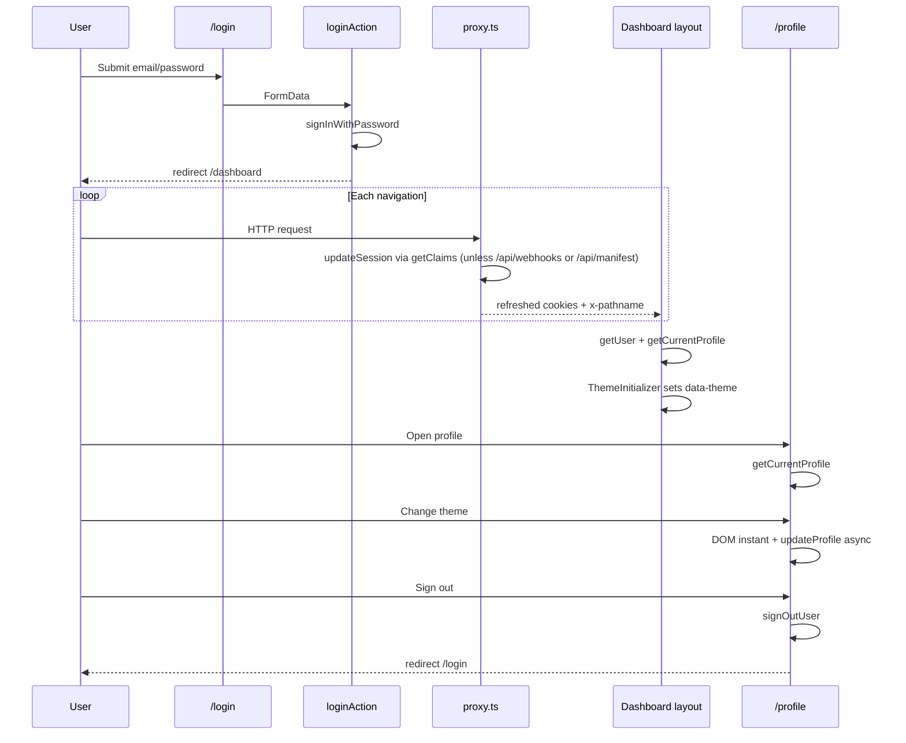

# Auth Pages & Session — Page Spec

> **Purpose:** spec for the pre-auth surfaces (`/login`, `/forgot-password`, `/update-password`), the root redirect, the auth callback, and the end-to-end session flow.
> **Audience:** engineers. · **Source-of-truth scope:** the `(auth)` route group + session flow as experienced by the user. The session *architecture* (proxy, clients, route gates, RBAC) lives in `../architecture/auth-and-rbac.md`; `/profile` lives in `profile.md`; visual law for the canvas-dark auth surface: `../design/DESIGN-DNA.md` §3.7.
> **Last verified:** 2026-06-24 (invite-by-email onboarding + callback-client pass); 2026-06-15 (OTP-code password reset pass); 2026-06-11 restructure.

## 1. Purpose

How users enter Serene: email+password login, password-reset request (6-digit OTP code by
email), new-password set (after verifying the code), and **invite-by-email onboarding** (an
admin-invited user clicks the email link, lands authenticated via `/auth/callback`, and sets
their first password). The auth pages are the one surface that is dark by design — canvas
palette, no paper, no app chrome.

## 2. Who sees it

Public (unauthenticated) routes — no session gate in the `(auth)` layout. Authenticated users
hitting `/` are redirected to `/dashboard`; deactivated users are gated twice (at
`loginAction` and in the dashboard layout).

## 3. Data sources

| Layer | Key items |
| ----- | --------- |
| Actions | `auth.ts` — `loginAction` (+ `is_active` check; the documented non-authorization profile read), `requestPasswordResetAction` (sends a 6-digit OTP code; never reveals email existence — S-09), `verifyResetOtpAction` (verifies the code → establishes the recovery session), `updatePasswordAction` (the shared step-2 for **both** reset and invite), `signOut`. (No invite-specific action exists — invite session establishment is client-side in `callback-client.tsx`, not a server action.) |
| Invite callback (live) | `/auth/callback` → `src/app/(auth)/auth/callback/page.tsx` + `callback-client.tsx` — **a CLIENT page** (built 2026-06-16). THE invite landing: the invite `redirectTo` (`inviteUser` in `lib/actions/profiles.ts`) points here as `/auth/callback?next=/update-password`. Handles three flows — implicit-grant **hash** (`#access_token=…`, the actual invite path the browser client consumes on mount; the server can't read a hash fragment), PKCE (`?code=` → `exchangeCodeForSession`), and OTP (`?token_hash=&type=` → `verifyOtp`) — then `router.replace(next)` (default `/update-password`, sanitised to a same-origin relative path). |
| Legacy callback (compat) | `GET /api/auth/callback` (`route.ts`) — exchanges `?code` (PKCE) or `?token_hash` (`verifyOtp`) for a session. **Kept for backward compatibility only; it never receives the invite token** (a hash fragment a server route can't read) and is **dead code for the OTP-code password reset**. |
| Validation | `validations/auth.ts` — `loginSchema`, `forgotPasswordSchema`, `verifyResetOtpSchema`, `updatePasswordSchema`; errors via `form-errors.ts` |
| Session | proxy + `updateSession()` + client factories — `../architecture/auth-and-rbac.md` §7 |

## 4. Components

- `LoginForm`, `ForgotPasswordForm`.
- `UpdatePasswordForm` — **three branches** (not two): `invited` (skip the code, render `PasswordStep invited` directly), `!verified` (`CodeStep`), `verified` (`PasswordStep`). Shared chrome is the extracted helpers `AuthCardShell`, `ErrorBanner`, and `EyeToggle` (all local to `update-password-form.tsx`).
- `InvalidLinkCard` (the real component — takes an `expired?` prop) lives in `update-password/page.tsx`; `MissingEmailCard()` is just a thin wrapper that returns `<InvalidLinkCard />` (no `expired` flag).
- `AuthCallbackClient` + `CallbackPending` (the "Signing you in…" fallback) + a **local** `InvalidLinkCard` all live in `callback-client.tsx` / `page.tsx` — the invite-landing surface.
- `PasswordStrengthBar` (4-segment danger→success).

All draw from the canvas/sidebar palette — `--theme-paper*`, `.serene-input`, and light
`--color-*-light` tokens are forbidden on auth surfaces (dark-surface semantic tokens instead).

## 5. States

- **Loading:** button-level pending states (width-preserving spinner swap) — no skeletons on auth.
- **Empty:** n/a.
- **Error:** inline message bars; fields never cleared; auth errors never reveal account existence.

## 6. Invariants

Deep dive §10 — `/api/webhooks/*` **and** `/api/manifest` never run `updateSession()`;
`x-pathname` set on every refreshed response; deactivated users double-gated; OTP reset
completes at `/login`; an invite lands authenticated via `/auth/callback` and completes at
`/dashboard`; one browser client; zero-flash theme.

## 7. Open items

`last_seen_at` presence tracking is schema-ready but **not wired** (no code writes it) — a
future proxy/action must rate-limit to once per minute when implemented.

---

## 8. Deep dive

> Section numbering preserved from the original intelligence document. The former §3 (Supabase
> client files), §4 (proxy session layer), and §7 (`/profile`) now live in
> `../architecture/auth-and-rbac.md` and `profile.md`.

### 1. Module Overview

Three distinct layers make up how users enter, stay in, and manage their identity inside Serene:

1. **Pre-auth pages** — unauthenticated surfaces (`/login`, `/forgot-password`, `/update-password`, and the invite landing `/auth/callback`) inside the `(auth)` route group. No sidebar, no dashboard shell, canvas background with ambient motion layers. (`/auth/callback` is public but transient — it forwards once the session is live; it's not a page the user lingers on.)
2. **Session infrastructure** — `src/proxy.ts` (Next.js 16 proxy), `src/lib/supabase/middleware.ts` (`updateSession()` — uses `auth.getClaims()`, a local ES256 verify against a process-cached JWKS, not `getUser()`), and the two Supabase client factories (`client.ts` / `server.ts`). Keeps the Supabase session cookie fresh on navigations.
3. **Profile self-management** — `/profile` inside `(dashboard)`. Any authenticated user edits **only their own** `profiles` row. Admins edit other users at `/admin/users/[id]`, not here.

#### Route group structure

| Group | Path prefix | Layout | Session behaviour |
| ----- | ----------- | ------ | ----------------- |
| `(auth)` | `/login`, `/forgot-password`, `/update-password`, `/auth/callback` | `src/app/(auth)/layout.tsx` — centered card on canvas, no app chrome | No session gate in layout; pages are public. `/auth/callback` may *establish* a session client-side, then forward |
| `(dashboard)` | `/dashboard`, `/profile`, `/leads`, … | `src/app/(dashboard)/layout.tsx` — sidebar + floating paper surface | **Hard gate (4 stages):** `getUser()` null → `/login`; `getCurrentProfile()` null → `/login`; `!is_active` → `/login`; `!canAccessRoute(profile, pathname)` → `/dashboard` |

Root layout (`src/app/layout.tsx`) sets default `data-theme="earth"`, font variables on `<html>`, and global CSS. Dashboard layout applies the user’s saved theme before paint via `ThemeInitializer`.

---

### 2. Root Route — `src/app/page.tsx`

```ts
export default async function RootPage() {
  const supabase = await createClient();
  const { data: { user } } = await supabase.auth.getUser();

  if (user) redirect("/dashboard");
  redirect("/login");
}
```

**What it checks:** `getUser()` — a real session probe on `/` using the server Supabase client.

**Redirect target:** `/dashboard` when a session exists; `/login` otherwise.

**Implication:** A user with a valid cookie who visits `/` is sent straight to `/dashboard`. Only unauthenticated visitors land on `/login`. The deeper session/profile/route protection for authenticated work still happens in `(dashboard)/layout.tsx`; `/` is just a fast top-level gate.

---

### 5. Pre-Auth Pages

> **Visual language is canvas-dark, not paper.** All three auth pages render *on the canvas*
> (`--theme-canvas`), never on the paper surface. Cards, inputs, links, and text all draw from the
> **canvas/sidebar palette** — never `--theme-paper`, `.serene-paper-surface`, or `.serene-input`. The full
> token-level spec lives in **`DESIGN-DNA.md` → "Auth Surface (canvas-dark)"**; §5e below is the
> module summary. Established 2026-06-02; brand-header dot added thereafter.

#### 5a. `(auth)` layout — `src/app/(auth)/layout.tsx`

**Provides (composed scene, back to front — all layers `pointer-events-none` / `aria-hidden`; rebuilt 2026-06-11, see `(auth)/CLAUDE.md`):**

- Full-viewport centered shell on the root div, which now carries the **`.layout-canvas`** class — grain SVG + Earth's `--theme-canvas-gradient-*` washes painted as one background (other themes: grain only). This supersedes the per-page noise-div removal below. `relative min-h-dvh flex items-center justify-center overflow-hidden`, background `var(--theme-canvas)` set inline to prevent a white flash before CSS loads.
- Two off-centre radial glow divs using `--theme-canvas-glow` (primary `ellipse 80% 60% at 62% 38%`, transparent at 70%; secondary `ellipse 55% 45% at 18% 78%`, transparent at 68%, `opacity: 0.55`). Centred glow is a spotlight; off-centre is a window.
- **Engraved mandala** (`.serene-auth-mandala-wrap` > `.serene-auth-mandala` + `.serene-auth-mandala-lit` > `.serene-auth-mandala-beam`) — an 8-fold Seed-of-Life rosette (logo geometry) whose circles all pass through one point hidden behind the card. One shared SVG alpha mask; a conic beam rotates once per 120s **inside** the statically-masked lit layer (the mask never rotates — 8-fold geometry is not rotation-invariant). Transform-only.
- Two CSS orb divs (`globals.css`) — `.serene-auth-orb-a` (680px, upper-right, `serene-orb-float-a` 24s) and `.serene-auth-orb-b` (560px, lower-left, `serene-orb-float-b` 30s). Accent-tinted radial gradients, `will-change: transform`, transform-only — M-06 compliant.
- **No** sidebar, top bar, or paper content card from the dashboard shell.

`prefers-reduced-motion`: drift/sweep are killed and the card entrance collapses to an opacity fade.

**Still removed (2026-06-02, kept removed):** the two diagonal accent lines (`.serene-auth-line-1/2`). The old per-page SVG noise-texture div is also gone — its job is now done by `.layout-canvas` painting grain as one background.

**If session already present:** The auth layout does **not** redirect. A logged-in user can still open `/login`. Successful login always `redirect("/dashboard")` from the action; visiting `/login` manually while authenticated shows the login form unless the user navigates away.

#### 5b. `/login`

| Item | Detail |
| ---- | ------ |
| **Page** | `src/app/(auth)/login/page.tsx` → `LoginForm` (`login-form.tsx`) |
| **Fields** | `email`, `password` — password field **has** an Eye/EyeOff visibility toggle (`showPassword` state, `lucide-react` `Eye`/`EyeOff`, **15px / strokeWidth 1.5**, `type="button"`, `tabIndex={-1}`, absolute-right, colour `--theme-sidebar-text`) |
| **Submit copy** | "Sign In" / "Signing in…" (pending). `Button variant="primary"` full-width + `--shadow-accent-glow` |
| **Action** | `loginAction` in `src/lib/actions/auth.ts` via `useActionState` |
| **Supabase** | `signInWithPassword({ email, password })` using **server** client (`createClient()` from `server.ts`) |
| **Deactivation gate** | After a successful `signInWithPassword`, the action calls `getCurrentProfile()`; if `profile.is_active === false` it immediately `signOut()`s and returns `formErrors.accountDeactivated` ("Your account has been deactivated. Please contact your administrator.") — a deactivated user can never establish a usable session at the login step |
| **Success** | `redirect("/dashboard")` |
| **Errors** | Bad email/password or Supabase auth failure → `formErrors.invalidCredentials` ("The email or password you entered is incorrect."); deactivated account → `formErrors.accountDeactivated`. No separate "unconfirmed email" branch in code |
| **Remember me** | None — Supabase cookie persistence handles session length |
| **Forgot link** | `/forgot-password` |

**Validation:** the action uses a **local** `loginSchema` defined inline in `auth.ts` — `email` required + format (`email_invalid`), `password` **min 1 char** (`required`). Any parse failure collapses to `formErrors.invalidCredentials` (it never tells the user which field failed). The exported `loginSchema` in `src/lib/validations/auth.ts` (password min 8) is **not** the one `loginAction` uses — the action has its own min-1 schema so existing short passwords can still sign in.

#### 5c. `/forgot-password`

| Item | Detail |
| ---- | ------ |
| **Page** | `forgot-password/page.tsx` → `ForgotPasswordForm` |
| **Field** | `email` |
| **Action** | `requestPasswordResetAction` |
| **Supabase** | `resetPasswordForEmail(email)` — **no `redirectTo`**. The recovery email template renders `{{ .Token }}` = a **6-digit code**, not a link. |
| **Success UX** | Inline success copy — **no redirect**. User reads the code from email, then opens `/update-password?email=<email>` to enter it. |
| **Email enumeration** | **Always returns success** after valid email format — never reveals whether the address exists (Rule S-09). |
| **Invalid email format** | `formErrors.email` |

**What the user receives:** a Supabase recovery email containing a 6-digit OTP **code** (`{{ .Token }}`) — **no link**. The user types this code on `/update-password`. (Security rationale: a code can't be pre-burned by corporate link-scanners — Google Safe Links et al. — that would otherwise consume the single-use reset token before the user clicks.)

#### 5d. `/update-password` — two entry modes (invite session vs OTP code)

`/update-password/page.tsx` is a server component that branches on whether a session already
exists. The page calls `supabase.auth.getUser()` **first**:

1. **Live session present → invite mode.** Renders `<UpdatePasswordForm invited />`. This is the
   invite path: `/auth/callback` already exchanged the invite token and set the session before
   forwarding here, so there is no code to type — the OTP step is skipped entirely.
2. **No session → OTP-code recovery.** Falls to the `?email` param check: missing →
   `MissingEmailCard` (which renders `InvalidLinkCard`, "request a new one"); present →
   `<UpdatePasswordForm email={params.email} />` (the two-step code → password flow).

There is **no** recovery-session page gate in mode 2 (the old expired-link `getUser` gate is gone —
an OTP code has no link to expire).

| Item | Detail |
| ---- | ------ |
| **OTP arrival (mode 2)** | User reads the 6-digit code from email, then manually opens `/update-password?email=<email>`. No callback, no session at arrival. |
| **Invite arrival (mode 1)** | User clicks the invite email button → `/auth/callback` establishes the session → forwards to `/update-password`. Arrives **already authenticated**. |
| **Param gate (page, mode 2 only)** | Reached only when there is no session. Checks that `?email` exists — missing → `MissingEmailCard` → `InvalidLinkCard`. |
| **Step 1 — code (mode 2)** | `CodeStep`: enter the 6-digit code → `verifyResetOtpAction` → `supabase.auth.verifyOtp({ email, token, type: 'recovery' })`. **Establishes the recovery session.** Submit copy: **"Verify Code" / "Verifying…"**. |
| **Step 2 — password (both modes)** | `PasswordStep`: `password`, `confirmPassword` → `updatePasswordAction` (server) → `updateUser({ password })` after Zod. The **shared step-2 for both reset and invite**. In invite mode it is the only step; in reset mode it is reachable only after Step 1 succeeded. Submit copy: **"Update Password" / "Updating…"**. |
| **Success (mode-dependent)** | Invite → "your account is ready" copy + a **"Continue to Dashboard"** link to **`/dashboard`**. Reset → "you can now sign in" copy + a **"Sign In"** link to **`/login`**. Neither auto-redirects. |
| **Strength bar** | **Present** in `PasswordStep` (both modes) — `<PasswordStrengthBar password={newPassword} />` under the new-password field. (The `/profile` `PasswordChangeForm` also uses it; this page is **not** an exception.) |
| **Schemas** | `verifyResetOtpSchema` validates a **6-digit code** (Step 1; `token` regex `^\d{6}$`). `updatePasswordSchema` (`src/lib/validations/auth.ts`) — `password` min 8 / max 72, `confirmPassword` min 1, `passwordMismatch` refine on `confirmPassword` (Step 2). On parse failure the action maps `passwordMismatch` → `formErrors.passwordMismatch`, everything else → `formErrors.passwordTooShort`; a Supabase `updateUser` error → `formErrors.generic`. |
| **OTP errors** | Invalid **or** expired code both map to `formErrors.otpInvalid` — the page never reveals which (S-09 disclosure discipline). |

**Invite session establishment is client-side, not a callback in this file.** For the OTP reset
path the recovery session is established by `verifyResetOtpAction` (`verifyOtp({ type: 'recovery' })`).
For the invite path the session is established earlier, in `callback-client.tsx`
(`/auth/callback`), by the browser client consuming the implicit-grant hash — see §5d-i below.
The legacy server route `src/app/api/auth/callback/route.ts` is dead code for both flows (it can't
read the invite hash, and reset no longer uses a link).

#### 5d-i. Invite-by-email onboarding (the `/auth/callback` landing)

The end-to-end invite flow (fixed 2026-06-16, changelog 2026-06-16):

1. Admin invites from `/admin/users` → `inviteUser` (`lib/actions/profiles.ts`) calls
   `inviteUserByEmail` with `redirectTo: ${NEXT_PUBLIC_SITE_URL}/auth/callback?next=/update-password`.
   The invite metadata carries `full_name` / `role` / `domain` / **`job_title`**.
2. The signup trigger `handle_new_user()` (migration `20260616000125_handle_new_user_job_title.sql`,
   applied to prod) inserts the `profiles` row and now also copies `job_title`
   (`NULLIF(... ,'')`) — previously dropped for invited users (the password-mode `createUser` path
   set it via a follow-up `updateProfileFields`, so only invites lost it).
3. The user clicks the email button → lands on **`/auth/callback`** (the client page). The Supabase
   implicit grant returns the session in the URL **hash** (`#access_token=…&type=invite`); only
   client JS can read `window.location.hash`, which is why this is a client page, not a route
   handler. `callback-client.tsx` is robust to all three flows: hash (poll `getSession()` up to
   ~2s for the browser client to persist it), PKCE (`exchangeCodeForSession`), OTP
   (`verifyOtp({ token_hash, type })`). On success it `router.replace(next)` (default
   `/update-password`, sanitised to a same-origin relative path); any error / expired link renders
   the local `InvalidLinkCard` ("ask your administrator to send a fresh invitation").
4. `/update-password` sees the live session → invite mode → set the password → "Continue to
   Dashboard" (`/dashboard`). One click from the email button to inside the app.

#### 5e. Auth visual language (canvas-dark) — module summary

Every auth surface — `LoginForm`, `ForgotPasswordForm`, `UpdatePasswordForm` (via `AuthCardShell`),
both `InvalidLinkCard`s, and the `/auth/callback` page — shares one shell. Canonical token spec:
**`DESIGN-DNA.md` → "Auth Surface (canvas-dark)"**. CSS classes live in `src/app/globals.css`.

**Outer wrapper (every form):** `relative w-full mx-4`, `maxWidth: 26rem`, `zIndex: var(--z-raised)`
— lifts the card above the layout's glows/orbs.

**Card — `.serene-auth-card`** (jewel-box shell, see `(auth)/CLAUDE.md`):

| Property | Value |
| -------- | ----- |
| Background | `var(--theme-sidebar-hover-bg)` (dark, not paper), under a top-centre lamplight wash |
| Border | gradient hairline (accent-kissed top arc → `--theme-sidebar-border`, painted border-box under a transparent border) |
| Radius | `var(--radius-xl)` |
| Shadow | `var(--shadow-3)` + an accent underglow bloom |
| Padding (inline) | `var(--space-10)` top/bottom; `px-6 sm:px-8` |
| Entrance | one-time rise + fade (`--duration-page` `--ease-out-expo`, shared by all forms) + a 60ms direct-children stagger |

**Unified brand header** (identical on all forms + both `InvalidLinkCard`s):

- A **`.serene-auth-logo-medallion`** — a 72px circular hairline ring (30% accent) + halo (the
  mandala's innermost ring on the surface) wrapping `next/image` `/logo.webp` at `48×48`,
  `borderRadius: var(--radius-sm)` (`priority` on the form shell).
- `<h1>`: `--font-serif`, `--text-3xl`, **`--weight-light`**, `--tracking-tighter`, `--leading-tight`,
  colour `--theme-canvas-text`, centred — text **`Serene`** followed by
  `<span className="page-title-dot">.</span>` (the accent blink dot).
- Container `flex flex-col items-center gap-3`, `mb-10` on the form shell / `mb-8` on `InvalidLinkCard`.
- **No subtitle.**

> ⚠️ The brand-header **`page-title-dot`** is the one place the dot appears off a primary nav page.
> It post-dates the 2026-06-02 `(auth)/CLAUDE.md` note that shows the header without it — code is the
> source of truth here.

**Inputs — `.serene-input-auth`:** `--theme-canvas` bg, `1px solid --theme-sidebar-border`,
`--theme-canvas-text` text, `--radius-sm`, `--space-3/--space-4` padding, `--text-sm`. Placeholder
`--theme-sidebar-text`. Focus: border `--theme-accent` + `box-shadow: 0 0 0 3px var(--theme-accent-surface)`.
Password fields add `paddingRight: var(--space-10)` for the toggle.

**Labels:** `className="label-micro"` **with an inline override** `color: var(--theme-sidebar-text)` —
`label-micro` renders dark (paper-tuned) by default and must be lightened on the dark card.

**Links — `.serene-auth-link`:** `--text-xs`, `color-mix(--theme-accent 65%, transparent)` at rest →
full `--theme-accent` on hover. Used for "Forgot your password?" and "Back to sign in".

**Error banners (dark-surface tokens — never the light `-light` variants):**

```text
color:           var(--color-danger-dark-text)
backgroundColor: var(--color-danger-dark-fill)
border:          1px solid var(--color-danger-dark-border)
radius:          var(--radius-xs)
padding:         var(--space-2) var(--space-3)
fontSize:        var(--text-xs)
role:            "alert"
```

**Primary "result" links** (success panels + `InvalidLinkCard` "Request New Link"): full-width block
`var(--theme-accent)` bg / `var(--theme-accent-fg)` text, `--radius-sm`, `--space-3/--space-4` padding,
`--weight-semibold`, `--tracking-wide` — styled inline (not a `<Button>`) because they are `<Link>`s.

**Submit buttons:** `Button variant="primary"` full-width with `boxShadow: var(--shadow-accent-glow)`,
`loading={isPending}`. Per-step copy: Login "Sign In/Signing in…"; Forgot **"Send Reset Code/Sending…"**;
`CodeStep` **"Verify Code/Verifying…"**; `PasswordStep` "Update Password/Updating…". The `PasswordStep`
**success** link copy is mode-dependent: invite → "Continue to Dashboard" (`/dashboard`); reset →
"Sign In" (`/login`) — styled inline as a `<Link>`, not a `<Button>`.

**Eye/EyeOff toggle (login + update-password):** absolute-right, `translateY(-50%)`, transparent
`<button type="button" tabIndex={-1}>`, icon `15px` / `strokeWidth 1.5`, colour `--theme-sidebar-text`.
On `/update-password` a shared `<EyeToggle>` helper drives both new + confirm fields off one `showNew`
state.

**Forbidden on auth forms:** `.serene-paper-surface`, `.serene-input`, `--theme-paper*` text/bg tokens, and
the light `--color-danger-light/-text` error variants. Those are paper-surface tokens.

---

### 6. `(dashboard)` Layout — `src/app/(dashboard)/layout.tsx`

#### Session gate

The layout runs a **four-stage gate** in order:

```ts
const { data: { user } } = await supabase.auth.getUser();
if (!user) redirect("/login");

const profile = await getCurrentProfile();
if (!profile) redirect("/login");
if (!profile.is_active) redirect("/login");

const pathname = (await headers()).get("x-pathname") ?? "/";
if (!canAccessRoute(profile, pathname)) redirect("/dashboard");

const initialNotifications = await getNotifications(profile.id);
```

| Failure mode | Behaviour |
| ------------ | --------- |
| No auth user | `redirect("/login")` |
| Auth user but no `profiles` row (or RLS blocks read) | `redirect("/login")` |
| Deactivated user (`is_active = false`) | `redirect("/login")` — the layout **does** enforce `is_active`, as a second line of defence behind the login-action deactivation gate |
| Authenticated + active, but route not permitted for the user's domain | `redirect("/dashboard")` (not `/login`) — `canAccessRoute(profile, pathname)` evaluated against the `x-pathname` header the proxy set |

`getCurrentProfile()` → `getUser()` then `getProfileById(user.id)`. RLS `profiles_select` allows any authenticated user to read all profiles.

`canAccessRoute` is a pure function (`src/lib/utils/route-access.ts`) reading `ALWAYS_ALLOWED_PREFIXES` + `DOMAIN_ROUTE_MAP` from `src/lib/constants/route-permissions.ts`. The pathname comes from the `x-pathname` response header set in `src/proxy.ts` — without that header the guard would default to `"/"`.

Also prefetches `getNotifications(profile.id)` for the sidebar bell.

#### Zero-flash theme — `ThemeInitializer`

**Current implementation:** `src/components/layout/ThemeInitializer.tsx` — a **client** component rendered at the top of the dashboard layout:

```tsx
const safeTheme = ["earth", "air", "water", "fire", "cosmos"].includes(profile.theme)
  ? profile.theme
  : "earth";

<ThemeInitializer theme={safeTheme} />
```

```ts
useLayoutEffect(() => {
  document.documentElement.setAttribute("data-theme", theme);
}, [theme]);
```

| Topic | Detail |
| ----- | ------ |
| **Reads** | `profile.theme` from server-rendered `getCurrentProfile()` |
| **Writes** | `data-theme` on `<html>` |
| **Fallback** | Invalid or missing theme → `"earth"` |
| **Why not a deferred client-only effect** | `useLayoutEffect` runs synchronously after DOM commit, **before** the browser paints — avoids one frame of wrong tokens |
| **Historical note** | Older builds used an inline `<script>` in this layout; the behaviour goal is unchanged (paint-free theme), the mechanism is now `ThemeInitializer` |

**Source of truth for theme:** `profiles.theme` in Postgres — **not** localStorage. `ThemeSelector` updates DB via `updateProfile`; layout + initializer apply on every navigation.

#### Font variables — root layout

`src/app/layout.tsx`:

- `Inter` → CSS variable `--font-geist-sans`
- `Playfair_Display` → `--font-playfair`
- Applied as `className` on `<html>` alongside default `data-theme="earth"`
- Consumed in `src/styles/design-tokens.css` as `--font-sans` / `--font-serif`

#### Dashboard chrome

- `ThemeInitializer` rendered first (sets `data-theme` before paint), then the shell.
- Outer shell: `<div className="layout-shell flex">` with inline `gap: var(--space-3)`, `height: 100dvh`, `overflow: hidden`.
- `Sidebar` with `profile` + `initialNotifications`, followed by `ToastProvider` at shell root.
- Canvas gutter column (`flex: 1`, `var(--theme-canvas)` background, `padding: 12px 12px 12px 0`) wraps the inner paper column.
- Inner paper column: `var(--theme-paper)`, `var(--radius-xl)`, `var(--shadow-paper)`, `overflowY: auto` / `overflowX: hidden` scrollable content holding `{children}`.

---

### 8. Actions

#### `updateProfile`

| Item | Detail |
| ---- | ------ |
| **Who** | Own profile, or admin/founder editing any user (admin forms reuse this action) |
| **Fields** | `full_name`, `username`, `job_title`, `phone`, `theme`, `timezone` (all optional except `id`) |
| **Phone** | `normalizeToE164` when provided |
| **Sanitize** | `sanitizeText` on `full_name`, `job_title` |
| **revalidatePath** | `/profile`, `/admin/users`, `/admin/users/${id}` |
| **Returns** | `ActionResult<Profile>` — `{ data, error }`, never throws |

#### `updateProfileAvatar`

| Item | Detail |
| ---- | ------ |
| **Who** | Own profile, or admin/founder |
| **Writes** | `avatar_url` (public URL after client upload) |
| **Validation** | Zod `.url()`; no bucket-prefix enforcement in code |
| **revalidatePath** | `/profile` |

#### `signOutUser`

| Item | Detail |
| ---- | ------ |
| **Who** | Any authenticated user |
| **Supabase** | `auth.signOut()` via server client |
| **Redirect** | `/login` |

#### Auth actions (`src/lib/actions/auth.ts`) — reference

| Export | Role |
| ------ | ---- |
| `loginAction` | Pre-auth sign-in |
| `signOut` | Sign out + `/login` (duplicate of profile sign-out) |
| `requestPasswordResetAction` | Forgot-password email — sends a 6-digit OTP code |
| `verifyResetOtpAction` | Verifies the OTP code → establishes the recovery session |
| `updatePasswordAction` | Post-verification password set |

---

### 9. Session Flow — End-to-End



**Ordered lifecycle (login path, six steps):**

1. User visits `/login` → `loginAction` → `signInWithPassword` → deactivation check (`is_active`) → session cookie set → `redirect("/dashboard")`. (A deactivated account is signed back out here with `accountDeactivated`.)
2. Dashboard layout runs the 4-stage gate (`getUser` → `getCurrentProfile` → `is_active` → `canAccessRoute`); renders shell with `ThemeInitializer(theme)`.
3. Every subsequent matched request → `proxy.ts` → `updateSession()` (`auth.getClaims()` — local ES256 verify, not `getUser()`) refreshes session cookies **and sets `x-pathname`** (`last_seen_at` **not** updated in code today). `/api/webhooks/*` and `/api/manifest` are bypassed entirely.
4. User visits `/profile` → server renders with `profile.theme` → `ThemeInitializer` applies `data-theme` before paint.
5. User changes theme → instant `setAttribute` on `<html>` + async `updateProfile({ theme })` → persisted in `profiles.theme`.
6. User clicks Sign out → `signOutUser` → cookie cleared → `/login`.

**Invite onboarding path (alternative entry, no `loginAction`):** admin invite → email link → `/auth/callback` (client) establishes the session from the implicit-grant hash → forwards to `/update-password` (invite mode) → `updatePasswordAction` sets the first password → "Continue to Dashboard" (`/dashboard`). No server action mints the invite session — `callback-client.tsx` does it browser-side. See §5d-i.

---

### 10. Known Invariants (must never be violated)

| Invariant | Source |
| --------- | ------ |
| `/api/webhooks/*` **and** `/api/manifest` must never run `updateSession()` — routing the dynamic PWA manifest through session refresh would break installability | `src/proxy.ts` early return (`WEBHOOK_PREFIX` + `MANIFEST_PREFIX`) + matcher exclusion (also excludes `manifest.webmanifest` / `sw.js` / `offline.html` / `icons/` / `apple-icon`) |
| Proxy must set `x-pathname` on every refreshed response — the dashboard layout's route guard depends on it | `src/proxy.ts` |
| Proxy session refresh uses `auth.getClaims()` (local ES256 verify against a process-cached JWKS), never `getUser()` (a ~50–150ms auth-server round trip) | `src/lib/supabase/middleware.ts` |
| Deactivated users (`is_active = false`) are gated **twice**: at `loginAction` (sign out + `accountDeactivated`) and in the dashboard layout (`redirect("/login")`) | `loginAction`, `(dashboard)/layout.tsx` |
| Dashboard layout must run `canAccessRoute(profile, pathname)`; a disallowed route → `redirect("/dashboard")` (never `/login`) | `(dashboard)/layout.tsx` + `route-access.ts` |
| Root `/` redirects authenticated users to `/dashboard`, unauthenticated to `/login` | `src/app/page.tsx` |
| `last_seen_at` must be rate-limited to once per minute **when implemented** — not on every request | original spec intent — **not yet in proxy** |
| Theme source of truth is `profiles.theme`, not localStorage | Dashboard layout + `ThemeSelector` |
| Theme null / invalid → always `"earth"` | Dashboard layout `safeTheme` guard |
| `email` is read-only on `/profile` — source of truth is `auth.users` | `ProfileDetailsForm` |
| `PasswordChangeForm` uses browser client only — not a server action | `PasswordChangeForm.tsx` |
| Zero-flash theme must run before paint (`ThemeInitializer` / `useLayoutEffect`, not `useEffect`) | `ThemeInitializer.tsx` |
| Avatar upload: 2 MB max validated client-side before upload | `ProfileAvatarSection.tsx` |
| Forgot-password must not reveal whether email exists | `requestPasswordResetAction` |
| Password reset uses a 6-digit OTP **code** (no link, no `redirectTo`) — recovery session is established by `verifyResetOtpAction`'s `verifyOtp({ type: 'recovery' })`, never at a callback | `requestPasswordResetAction`, `verifyResetOtpAction`, recovery email template |
| The live invite landing is the **client** page `/auth/callback` (reads the implicit-grant hash; the server can't). The legacy `/api/auth/callback` route is kept for backward compat only — dead code for both invite and reset | `src/app/(auth)/auth/callback/callback-client.tsx`, `src/app/api/auth/callback/route.ts` |
| The invite `redirectTo` points at `/auth/callback?next=/update-password` (never `/api/auth/callback`) | `inviteUser` in `lib/actions/profiles.ts` |
| `handle_new_user()` copies `job_title` from invite metadata (`NULLIF(... ,'')`) — invited users keep the job title set at invite time | migration `20260616000125_handle_new_user_job_title.sql` |
| Invalid and expired reset codes both surface as `formErrors.otpInvalid` — the page never reveals which | `verifyResetOtpAction` + `update-password-form.tsx` |
| `/update-password` has **two entry modes**: a live session → invite mode (`<UpdatePasswordForm invited />`, no OTP step); else the `?email` param gate (→ `MissingEmailCard` → `InvalidLinkCard` when absent). No recovery-session page gate in OTP mode | `update-password/page.tsx` |
| Invite onboarding completes at `/dashboard` ("Continue to Dashboard"); OTP reset completes at `/login` ("Sign In") | `update-password-form.tsx` `PasswordStep` |
| One browser Supabase client — `createClient()` from `client.ts` only | Rule 05 |
| One server Supabase client per request — `server.ts` only in services/actions | Rule 05 |
| Notification sound preference: `serene:notifications:sound:v1` in localStorage — separate from theme DB field; no `/profile` control | `useNotificationSound.ts` |
| Password reset completes at `/login` after success, not `/dashboard` | `UpdatePasswordForm` success link |
| `/update-password` shows `PasswordStrengthBar` under the new-password field — it is **not** an exception to the strength-bar pattern | `update-password-form.tsx` |

---

