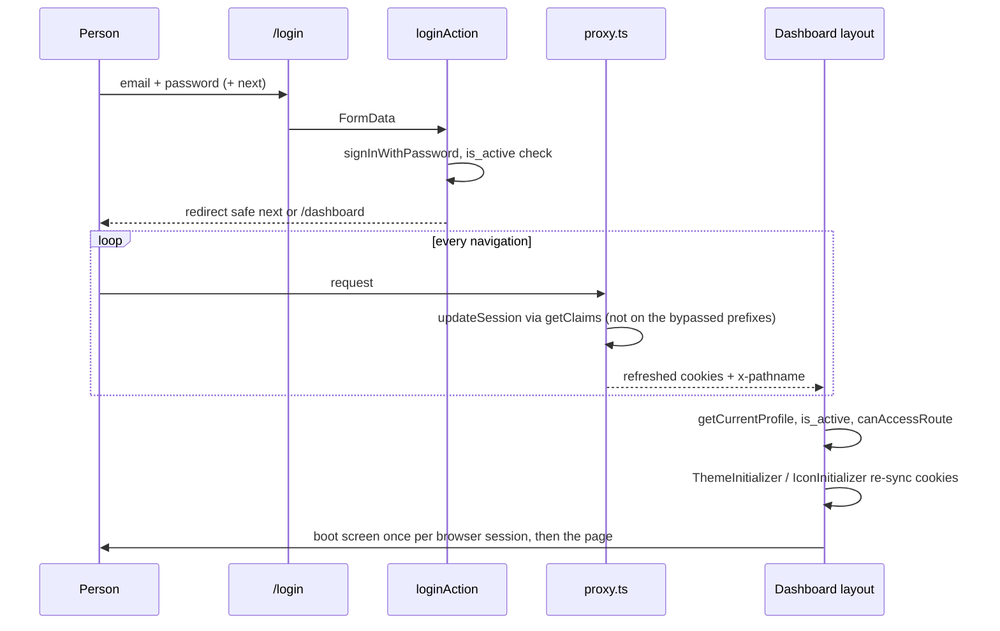

# Auth Pages and Session: Page Spec

> **Purpose:** spec for the pre-auth surfaces (`/login`, `/forgot-password`, `/update-password`, the invite landing `/auth/callback`, and the OAuth consent screen `/oauth/consent`), the root redirect, and the session flow as a person experiences it, from sign-in to the first paint of the app.
> **Audience:** engineers. · **Source-of-truth scope:** the `(auth)` route group, `src/app/page.tsx`, `lib/actions/auth.ts`, `lib/actions/oauth-consent.ts`, `lib/utils/return-path.ts`, and the session steps of the dashboard layout. The session *architecture* (proxy, Supabase clients, route gates, RBAC) lives in `../architecture/auth-and-rbac.md`; `/profile` in `./profile.md`; the MCP connector the consent screen serves in `../integrations/mcp.md`; the visual law in `../design/DESIGN-DNA.md` and `src/app/(auth)/CLAUDE.md`.
> **Last verified:** 2026-09-26 against `src/app/(auth)/**`, `src/app/page.tsx`, `src/app/layout.tsx`, `src/app/(dashboard)/layout.tsx`, `src/proxy.ts`, `src/lib/supabase/middleware.ts`, `src/lib/actions/{auth,oauth-consent,profiles}.ts`, `src/lib/services/{profiles-service,oauth-server-service}.ts`, `src/lib/utils/return-path.ts`, `src/components/layout/AppBootScreen.tsx`, `src/app/globals.css` (auth classes), `supabase/config.toml`, and migrations 0125, 0201.

## 1. Purpose

How people enter Serene:

- **Sign in** with email and password (`/login`), optionally returning to a safe same-site path
  (`?next=`).
- **Reset a password** with a 6-digit code sent by email (`/forgot-password` → `/update-password`).
- **Accept an invite:** an admin-invited person clicks the email link, lands signed in through
  `/auth/callback`, and chooses their first password.
- **Connect an AI app** (Claude, ChatGPT and others) through the consent screen `/oauth/consent`,
  the page Serene shows for its Supabase OAuth server (the MCP connector, 2026-09-19).

The app has **no sign-up screen**. Every account is created by an admin (`./user-management.md`).

## 2. Who sees it

The `(auth)` routes are public: the `(auth)` layout has no session gate. A signed-in person can
still open `/login`. `/` sends a signed-in person to `/dashboard` and everyone else to `/login`.
`/oauth/consent` needs a session: without one it sends the browser to `/login?next=<the consent
URL>` and comes back after sign-in. Deactivated accounts are stopped three times: at `loginAction`,
by the auth-side ban (they cannot sign in or refresh), and in the dashboard layout.

## 3. Data sources

| Layer | Key items |
| ----- | --------- |
| Actions | `auth.ts` (four exports): `loginAction` (validates, signs in, refuses a deactivated profile, redirects to the safe `next` or `/dashboard`), `requestPasswordResetAction` (sends the code, always redirects to `/update-password?email=…`), `verifyResetOtpAction` (the code → a recovery session), `updatePasswordAction` (the password step for both reset and invite). `oauth-consent.ts`: `answerOAuthConsentAction` (Allow or Deny) |
| Services | `oauth-server-service.ts`: `getOAuthConsentRequest`, `answerOAuthConsent` (session client). `profiles-service.ts`: `getCurrentProfile` (the layout and the consent page) |
| Utils | `lib/utils/return-path.ts`: `safeReturnPath(value)`, THE "where to go after login" guard |
| Invite landing | `src/app/(auth)/auth/callback/page.tsx` + `callback-client.tsx`: a **client** page that turns the invite link into a session |
| Legacy route | `src/app/api/auth/callback/route.ts`: exchanges `?code` or `?token_hash`. Kept for old links only; the invite and the reset never use it |
| Validation | `validations/auth.ts`: `forgotPasswordSchema`, `verifyResetOtpSchema`, `updatePasswordSchema` (plus an exported `loginSchema` that `loginAction` does not use, §8.2). Errors via `form-errors.ts` |
| Session plumbing | `src/proxy.ts` + `updateSession()` (`auth.getClaims()`), the server and browser client factories: `../architecture/auth-and-rbac.md` |

## 4. Components

| Component | File | Notes |
| --------- | ---- | ----- |
| `LoginForm` | `login/login-form.tsx` | Email, password with show/hide, a hidden `next` field |
| `ForgotPasswordForm` | `forgot-password/forgot-password-form.tsx` | Email only |
| `UpdatePasswordForm` | `update-password/update-password-form.tsx` | Three branches: `invited` (password step only), not yet verified (`CodeStep`), verified (`PasswordStep`). Local helpers `AuthCardShell`, `ErrorBanner`, `EyeToggle` |
| `InvalidLinkCard` | `update-password/page.tsx` | Takes `expired?`; `MissingEmailCard()` just returns it |
| `AuthCallbackClient` | `auth/callback/callback-client.tsx` | "Signing you in…" while it works, a local `InvalidLinkCard` on failure |
| `ConsentForm` | `oauth/consent/consent-form.tsx` | Who is asking, what they may do, Allow / Deny; or an error card |
| `PasswordStrengthBar` | `components/ui/PasswordStrengthBar.tsx` | Four segments, danger to success |

All of them share the auth card shell and the brand header (§8.7).

## 5. States

- **Loading:** button-level pending states (the spinner keeps the button's width). No skeletons on
  auth pages. `/auth/callback` shows "Signing you in…".
- **Empty:** not applicable.
- **Error:** inline banners; fields never cleared; auth errors never reveal whether an account
  exists (S-09). A bad or expired consent link shows an error card that says to start again from
  the app.

## 6. Invariants

Deep dive §8.11. The short list: `/api/webhooks/*`, `/api/manifest`, `/api/elaya/bridge`,
`/api/mcp` and `/.well-known/*` never run `updateSession()`; `x-pathname` is set on every
refreshed response; deactivated accounts are stopped at sign-in, at the auth layer and in the
layout; a reset ends at `/login`, an invite at `/dashboard`; every "go here after sign-in" value
passes `safeReturnPath`; one browser Supabase client; the saved theme and appearance paint on the
first byte.

## 7. Open items

- **Public sign-up setting.** No app code calls `signUp`, but the local `supabase/config.toml` has
  `enable_signup = true` (and `[auth.email] enable_signup = true`), and `handle_new_user()` copies
  `role`, `domain`, `sia_role` and `queendom_id` straight from the metadata the caller supplies. If
  the hosted project allows new sign-ups, anyone holding the public anon key could create an
  account and choose its role. Checked 2026-09-26: the hosted project reports
  `disable_signup: true`, so sign-up is off today. The trigger has NOT been hardened; the durable
  fix is to stop it trusting caller metadata for authorization fields (tracked in `../TODO.md`).
- **The OAuth server switch.** Connecting an AI app needs the Supabase OAuth server enabled on the
  hosted project with authorization path `/oauth/consent` and dynamic client registration on. It
  is on in production (the discovery document answers with a registration endpoint, checked
  2026-09-26); the local config has it off (`../integrations/mcp.md`).
- `/auth/callback` sanitises its own `next` with an inline check instead of `safeReturnPath`
  (same rule, a second copy).
- `last_seen_at` exists on `profiles` but nothing writes it.
- The access-token lifetime is the default 60 minutes (`jwt_expiry = 3600` locally). The
  2026-09-16 note recommends about 15 minutes on the hosted project to shorten the window of a live
  token after a user is removed at the auth layer. TODO: verify.

---

## 8. Deep dive

### 8.1 Root route (`src/app/page.tsx`)

`getUser()` on the server client: a session → `redirect('/dashboard')`, otherwise
`redirect('/login')`. The dashboard page itself may then send an admin or founder on a phone to the
mobile layer `/m` (`../modules/mobile-ops.md`).

### 8.2 `/login`

| Item | Detail |
| ---- | ------ |
| Page | `login/page.tsx` (metadata title "Sign in") reads `?next`, passes it through `safeReturnPath`, and hands the result to `LoginForm`, which keeps it in a hidden field |
| Fields | email, password with a show/hide toggle |
| Action | `loginAction` via `useActionState` |
| Validation | a local schema inside the action: email format, password at least 1 character, so older short passwords still sign in. Any failure collapses to `formErrors.invalidCredentials`; it never says which field |
| Sign-in | `signInWithPassword` on the server client. A wrong email or password → `formErrors.invalidCredentials` |
| Deactivated | after a good sign-in the action reads the profile; `is_active = false` → `signOut()` and `formErrors.accountDeactivated`. The auth-side ban (§8.9) usually refuses the sign-in before this |
| Success | `redirect(safeReturnPath(formData.get('next')) ?? '/dashboard')`: the hidden field is checked again, because it is as untrusted as the query string |

`safeReturnPath(value)` accepts only a string that starts with one `/`, never `//` or `/\`, has no
line breaks, and is at most 2,048 characters. Anything else returns `null` and the caller uses its
default.

### 8.3 `/forgot-password`

| Item | Detail |
| ---- | ------ |
| Field | email |
| Action | `requestPasswordResetAction` |
| Sends | `resetPasswordForEmail(email)` with **no** `redirectTo`. The recovery email template renders `{{ .Token }}`, a 6-digit code, not a link |
| Then | **always** `redirect('/update-password?email=<email>')`, whether or not the address exists (S-09). The code step opens with the email already filled |
| Bad format | `formErrors.email` |

A code, not a link: corporate link scanners (Google Safe Links and similar) cannot burn a code the
way they pre-open a one-time link.

### 8.4 `/update-password`: two ways in

The page calls `getUser()` first.

1. **A live session → invite mode.** Renders `<UpdatePasswordForm invited />`: the password step
   only. `/auth/callback` already created the session.
2. **No session → reset by code.** Without `?email` → `MissingEmailCard` (the `InvalidLinkCard`,
   "request a new one"). With it → `<UpdatePasswordForm email=… />`, the two steps.

| Step | Detail |
| ---- | ------ |
| Code (reset only) | `CodeStep` → `verifyResetOtpAction` → `verifyOtp({ email, token, type: 'recovery' })`, which creates the recovery session. `verifyResetOtpSchema`: `^\d{6}$`. A wrong **or** expired code → `formErrors.otpInvalid`; the page never says which. Button: "Verify Code" / "Verifying…" |
| Password (both) | `PasswordStep` → `updatePasswordAction` → `updateUser({ password })`. `updatePasswordSchema`: 8 to 72 characters, confirmation must match. A mismatch → `formErrors.passwordMismatch`; any other parse failure → `formErrors.passwordTooShort`; an Auth error → `formErrors.generic`. `PasswordStrengthBar` under the field. Button: "Update Password" / "Updating…" |
| Done | Invite → "your account is ready" and **Continue to Dashboard** (`/dashboard`). Reset → "you can now sign in" and **Sign In** (`/login`). No auto-redirect |

### 8.5 Invite onboarding (`/auth/callback`)

1. An admin invites from `/admin/users/new` → `inviteUser` → `inviteUserByEmail` with
   `redirectTo: <NEXT_PUBLIC_SITE_URL>/auth/callback?next=/update-password` and metadata
   `full_name`, `role`, `domain`, `job_title`, `sia_role`, `queendom_id`.
2. The signup trigger `handle_new_user()` writes the profile, copying `job_title` (0125) and the
   seat fields (0201).
3. The person clicks the email button and lands on `/auth/callback`. Supabase returns the session
   in the URL **hash** (`#access_token=…&type=invite`), which only browser code can read, so this is
   a client page, not a route handler. `callback-client.tsx` handles three shapes: the hash (it
   polls `getSession()` for about two seconds while the browser client stores it), PKCE (`?code=` →
   `exchangeCodeForSession`) and OTP (`?token_hash=&type=` → `verifyOtp`). On success it
   `router.replace(next)` (default `/update-password`, checked to be a same-site path). On failure
   it shows its `InvalidLinkCard` ("ask your administrator to send a fresh invitation").
4. `/update-password` sees the session → invite mode → choose a password → Continue to Dashboard.

### 8.6 `/oauth/consent` (the MCP connector's consent screen)

When an AI app asks to connect to Serene's MCP server (`/api/mcp`), Supabase's OAuth server sends
the person's browser here with `?authorization_id=`.

1. The id must match `^[A-Za-z0-9._~-]{8,200}$`, else an error card ("This connection link is not
   valid. Start again from the app you are connecting.").
2. No session → `redirect('/login?next=/oauth/consent?authorization_id=…')`. The login page's
   `safeReturnPath` lets this same-site path through, so the person comes straight back after
   signing in.
3. `getOAuthConsentRequest(id)` (session client, `auth.oauth.getAuthorizationDetails`): already
   consented to this app → redirect straight back to it; expired or already answered → an error
   card; otherwise the `ConsentForm` shows the app and the person's name, and three plain promises:
   it reads only what your role can already see; phone numbers and emails stay masked and nothing
   is changed or sent; every call is logged under your name and you can disconnect it from your
   profile.
4. **Allow / Deny** → `answerOAuthConsentAction`: Zod → `requireProfile()` →
   `approveAuthorization` or `denyAuthorization` as the signed-in person → redirect to the URL the
   OAuth server returns (back to the app).

Nothing here decides what the app may read: once connected, the app calls Elaya's role-gated read
tools as that person, through the same gates and PII mask (`../integrations/mcp.md`). A person
lists and disconnects their apps on `/profile` (`./profile.md` §8.7). The page uses the auth card
chrome. `src/proxy.ts` does not refresh sessions on `/api/mcp` or `/.well-known/*` (bearer tokens,
never cookies), but it does on `/oauth/consent`, which is an ordinary page.

### 8.7 The auth card, and how it looks

All auth surfaces share the `(auth)` layout (`src/app/(auth)/layout.tsx`): a full-height centred
shell on `--theme-canvas` with the `.layout-canvas` class, two off-centre glows, the engraved
Seed-of-Life mandala with a slow rotating beam, and two drifting orbs. Every layer is decorative
(`pointer-events-none`, `aria-hidden`), transform-only, and stilled under reduced motion.

**The auth pages are no longer dark by design.** Since the neumorphic restyle (2026-07-03) the
old canvas tokens are bridged to the soft-UI layer (`--theme-canvas` → `--neu-canvas`,
`--theme-canvas-text` → `--neu-text-primary`), and the auth classes read neumorphic tokens
directly: `.serene-auth-card` is `--neu-surface` with an `--neu-edge` hairline and
`--neu-shadow-raised-lg`; `.serene-input-auth` is the inset field (`--neu-input-bg`,
`--neu-shadow-input`); `.serene-auth-link` is `--neu-accent-deep`. So the sign-in screen is cream
in light mode and charcoal in dark, following the device's saved appearance cookie. The
error banner still uses the `--color-danger-dark-*` names, which the bridge also re-points.

The brand header on every form and card: `.serene-auth-logo-medallion` (a 72px ring) around
`/logo-bg-removed.webp` at 48px (the renamed, background-free mark, 2026-09-26), then "Serene" in
the serif display with the page-title dot. No subtitle.

On a touch screen every text field is at least 16px (a `pointer: coarse` rule), so iOS does not
zoom the page on a tap (2026-09-26 mobile pass).

Token-level spec: `../design/DESIGN-DNA.md` and `src/app/(auth)/CLAUDE.md`. That CLAUDE.md still
describes the pre-neumorphic dark card in places; the CSS in `src/app/globals.css` is the truth.

### 8.8 After sign-in: the dashboard layout

`src/app/(dashboard)/layout.tsx` runs a three-step gate, in order:

```ts
const profile = await getCurrentProfile();          // null with no session
if (!profile) redirect("/login");
if (!profile.is_active) redirect("/login");
const pathname = (await headers()).get("x-pathname") ?? "/";
if (!canAccessRoute(profile, pathname)) redirect("/dashboard");
```

- `getCurrentProfile()` is `cache()`-memoised and, since 2026-09-16, checks identity with
  `auth.getClaims()` (the token's signature verified locally against the cached JWKS) instead of
  `getUser()` (an auth-server round trip on every navigation). Role, domain and `is_active` still
  come only from the `profiles` row (Rule 09).
- A disallowed route sends the person to `/dashboard`, never `/login`. `canAccessRoute` is pure
  (`src/lib/utils/route-access.ts`); the path comes from the `x-pathname` header the proxy sets.

Then the layout mounts, in order: `ThemeInitializer` (theme and appearance) and `IconInitializer`
(the cookie re-syncs), `AppBootScreen`, and the shell inside `SuggestionFeedbackProvider` and
`NotificationsProvider` (one Realtime inbox for the whole session): the `Sidebar`, the toast stack,
the ⌘K `CommandPaletteProvider`, the floating `ElayaWidget` **only when `hasElayaAccess(profile)`**,
and `UsagePresence` (the active-time heartbeat, `./usage.md`). The global controls (domain selector
and bell) live in each page's title row through `PageControls`.

**The boot screen plays once per browser session** (2026-09-16). `AppBootScreen` renders the Serene
mark drawing itself, sealing with its centre circle and turning slowly, over a "SERENE / BY
INDULGE" lockup (2026-09-25). The first hard load of a tab or an installed-app launch sets
`serene:boot-seen` in `sessionStorage`; later hard loads in the same session skip it. The cover
still renders on the server, so a true cold start never flashes. With storage blocked it falls back
to playing every time. Client navigations never replay it; pages rely on their `loading.tsx`.

**First paint of theme and appearance.** The root layout (`src/app/layout.tsx`) reads the
`serene-theme` and `serene-appearance` cookies and stamps `data-theme` (fallback `earth`) and, for
dark, `data-neu="dark"` on `<html>` from the first byte. For `system` it adds a tiny pre-paint
script that checks `prefers-color-scheme`. It also sets the page title template ("%s · Serene"),
the per-icon manifest link, and a viewport with `viewport-fit=cover` and `interactiveWidget:
resizes-content` (the Android keyboard shrinks the shell instead of covering a composer). Fonts:
Inter as `--font-geist-sans`, Playfair Display as `--font-playfair`.

### 8.9 Deactivation, end to end

1. `toggleUserActive` → `setProfileActive` flips `profiles.is_active` (the kill switch: the next
   request redirects).
2. The same call bans the auth user (`ban_duration` 100 years; lifted with `none` on
   reactivation), so the session cannot refresh and a fresh sign-in is refused. Best-effort and
   logged; the row flip is the guarantee.
3. `loginAction` also refuses a deactivated profile, and the dashboard layout redirects one.

### 8.10 Session flow


```mermaid
sequenceDiagram
  participant U as Person
  participant L as /login
  participant A as loginAction
  participant P as proxy.ts
  participant D as Dashboard layout
  U->>L: email + password (+ next)
  L->>A: FormData
  A->>A: signInWithPassword, is_active check
  A-->>U: redirect safe next or /dashboard
  loop every navigation
    U->>P: request
    P->>P: updateSession via getClaims (not on the bypassed prefixes)
    P-->>D: refreshed cookies + x-pathname
  end
  D->>D: getCurrentProfile, is_active, canAccessRoute
  D->>D: ThemeInitializer / IconInitializer re-sync cookies
  D->>U: boot screen once per browser session, then the page
```

Alternative entries: the **invite** (email link → `/auth/callback` → `/update-password` invite
mode → `/dashboard`, no `loginAction`), the **reset** (`/forgot-password` → code →
`/update-password` → `/login`), and the **consent** (`/oauth/consent` → maybe `/login?next=…` →
back to consent → Allow → the AI app).

Sign-out is `signOutUser` in `lib/actions/profiles.ts`, the only sign-out action, used by the
`/profile` Session card, the Sidebar and the mobile drawer.

### 8.11 Known invariants

| Invariant | Where |
| --------- | ----- |
| `/api/webhooks/*`, `/api/manifest`, `/api/elaya/bridge`, `/api/mcp` and `/.well-known/*` never run `updateSession()`: webhooks and the bridge have no cookie, the manifest must stay installable, the MCP routes use bearer tokens | `src/proxy.ts` early return + matcher (which also excludes `manifest.webmanifest`, `sw.js`, `offline.html`, `icons/`, `apple-icon`) |
| The proxy sets `x-pathname` on every refreshed response | `src/proxy.ts` |
| Session refresh uses `auth.getClaims()`, never `getUser()` | `src/lib/supabase/middleware.ts`, `getCurrentProfile` |
| Deactivated accounts are stopped at `loginAction`, by the auth ban, and in the dashboard layout | `loginAction`, `setProfileActive`, `(dashboard)/layout.tsx` |
| A disallowed route → `/dashboard`, never `/login` | `(dashboard)/layout.tsx` |
| Every return path after sign-in passes `safeReturnPath` (page and action) | `login/page.tsx`, `loginAction` |
| `/` → `/dashboard` with a session, else `/login` | `src/app/page.tsx` |
| The password reset is a 6-digit code, no link, no `redirectTo`; the recovery session comes only from `verifyResetOtpAction` | `requestPasswordResetAction`, `verifyResetOtpAction` |
| `requestPasswordResetAction` always redirects to the code step, whether or not the email exists | `lib/actions/auth.ts` |
| A wrong and an expired code both read `formErrors.otpInvalid` | `verifyResetOtpAction` |
| The invite lands on the client page `/auth/callback` (`redirectTo …/auth/callback?next=/update-password`), never `/api/auth/callback` | `inviteUser`, `callback-client.tsx` |
| `/update-password`: a live session → invite mode; else the `?email` gate | `update-password/page.tsx` |
| Invite ends at `/dashboard`; reset ends at `/login` | `PasswordStep` |
| The consent answer runs as the signed-in person (session client), never the service role | `oauth-server-service.ts` |
| One browser Supabase client (`lib/supabase/client.ts`); one server client per request (`lib/supabase/server.ts`) | Rule 05 |
| Theme and appearance truth is `profiles`; the cookies are SSR mirrors; an unknown value → `earth` / `light` | root + dashboard layouts |
| `PasswordStrengthBar` sits under every new-password field (`/update-password`, `/profile`) | both forms |
